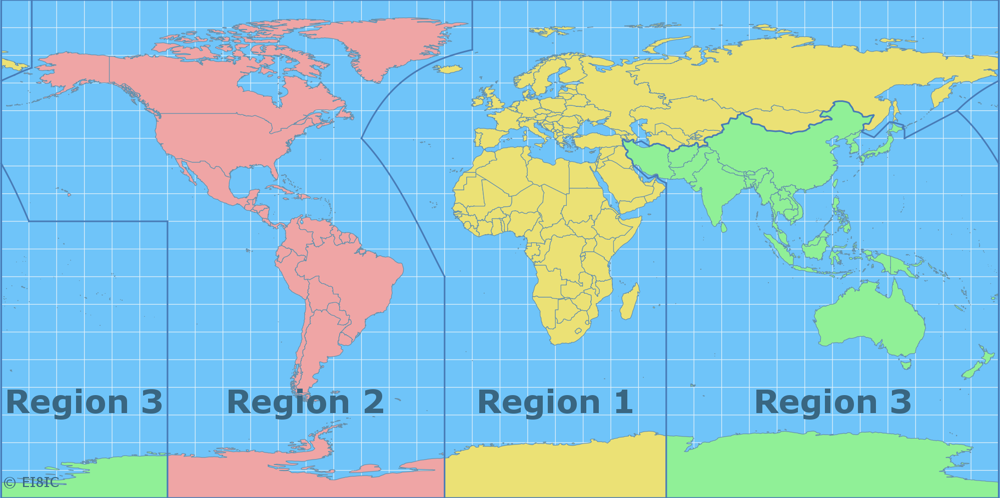

# 中国无线电协会业余电台操作证书考试题库集锦 B类

---

> + 无额外说明情况下，各个题目收集自[CRAC官网题库20211022版本](http://www.crac.org.cn/userfiles/file/20211022/20211022155018_8471.zip)；若有其他来源，会在该题目标题后的括弧中单独对来源进行注明
> + LK#### 为题库中题目编号索引，其数值不一定连续；考试时出题顺序及每道题目的选项顺序都有可能打乱
> + &LK#### 题目编号前缀了“&”表示此题目出现在A类题库中
> + **正确答案都是每道题目的A选项**
> + 对于容易出错的题目或选项进行了 ***高亮*** 提示
> + 为方便学习理解，部分题目后面进行了注释。注意解释内容非官方给定，其准确性仅供参考
>   > 例如这是某题目后的解释文本  
> + 欢迎pull request，补充题目，修正注释，共同完善题库。若大家在其他地方发现了没包含在这里的新题（各地考试系统题库跟CRAC不完全一样，有些微差别），还望务必补充过来，感谢！
> + 目前编纂人：BD8BZY，BG7ZAG

## &LK0001

我国现行法律体系中专门 ***针对无线电管理*** 的最高法律文件及其立法机关是：

+ [A]中华人民共和国 ***无线电管理条例，国务院和中央军委***  
+ [B]中华人民共和国无线电管理办法，工业和信息化部  
+ [C]中华人民共和国电信条例，国务院  
+ [D]中华人民共和国业余无线电台管理办法，工业和信息化部  

> 无线电管理选军委 ↑ ，业余无线电台的选工信部 ↓ 

## &LK0002
我国现行法律体系中专门 ***针对业余无线电台管理*** 的最高法律文件及其立法机关是：
+ [A] ***业余无线电台管理办法***，***工业和信息化部***  
+ [B]个人业余无线电台管理暂行办法，国家体委和国家无委  
+ [C]业余无线电台管理暂行规定，国家体委和国家无委  
+ [D]中华人民共和国电信条例，国务院  

## &LK0003
我国的无线电主管部门是：
+ [A]各级无线电管理机构
+ [B]各级体育管理机构
+ [C]各地业余无线电协会
+ [D]各地电信管理局
> 不要选错成电信管理局。
> 题库中所有的协会都是非政府机构，一般不会进行主管，最多协助管理、协助申请。

## &LK0004
我国依法负责对业余无线电台实施监督管理的机构是：
+ [A]国家无线电管理机构和地方无线电管理机构
+ [B]在国家或地方民政部门注册的业余无线电协会
+ [C]国家体育管理机构和地方体育管理机构
+ [D]国家和地方公安部门

## &LK0005
《业余无线电台管理办法》所说的“地方无线电管理机构”指的是：
+ [A]省、自治区、直辖市无线电管理机构
+ [B]地方业余无线电协会或者类似组织机构
+ [C]地市县（区）及以下各级无线电管理机构
+ [D]各地方与无线电设备生产销售和无线电应用有关的行政管理机构

## &LK0011
国家鼓励和支持业余无线电台开展下列活动：
+ [A]无线电通信技术研究、普及活动以及突发重大自然灾害等紧急情况下的应急通信活动
+ [B]休闲娱乐性交谈
+ [C]机动车辆行车服务性通信活动
+ [D]作为日常公益活动的通信工具

## &LK0012
关于业余电台管理的正确说法是：
+ [A]依法设置的业余无线电台受国家法律保护
+ [B]业余无线电爱好者的一切行为都受国家法律保护
+ [C]通过法律手段限制业余无线电台的设置
+ [D]在业余电台与其他业务电台遇到干扰纠纷时无条件优先保护其他业务电台

## &LK0104
无线电频率的使用必须得到各级无线电管理机构的批准，基本依据是“无线电 ***频谱资源*** 属于国家所有”，出自于下列法律的第二百五十二条： 
+ [A]中华人民共和国 ***民法典***
+ [B]中华人民共和国宪法
+ [C]中华人民共和国刑法
+ [D]中华人民共和国电信法
> 频谱资源属于物权，由民法约束

## &LK0007
我国对无线电管理术语“业余业务”、“卫星业余业务”和“业余无线电台”做出具体定义的法规文件是:
+ [A]中华人民共和国无线电 ***频率划分规定***
+ [B]中华人民共和国无线电管理条例
+ [C]中华人民共和国电信条例
+ [D]无线电台执照管理规定
> 注意不要选成无线电管理条例

## &LK0008
业余电台的法定用途为：
+ [A]供业余无线电爱好者进行自我训练、相互通信和技术研究
+ [B]供公民在业余时间进行与个人生活事务有关的通信
+ [C]供公民在业余时间进行休闲娱乐
+ [D]供私家车主或者相应组织作为行车安全保障和途中消遣工具

## &LK0111
无线电业余业务是供业余无线电爱好者作下列用途的无线电通信业务：
+ [A]自我训练、相互通信和技术研究
+ [B]救灾抢险、车队联络和技术学习
+ [C]娱乐休闲、报告路况和公益服务
+ [D]技术教学、民兵训练和公益通信

## LK0183
关于无线电通信的正确说法：
+ [A]无线电通信是指利用无线电波进行的符号、信号、文字、图像、声音或其他信息的传输、发射或接收。
+ [B]无线电通信包括利用光在内的所有电磁波所进行的各种通信
+ [C]利用无线电波进行的符号、信号、文字、图像、声音以外的信息传输不属于无线电通信
+ [D]产生无线电波并用其加热属于无线电通信的一种应用

## LK0187
无线电波是指：
+ [A]频率为3,000GHz以下的在空间传播的电磁波
+ [B]频率为3,000GHz以下的所有电磁波
+ [C]频率为30 Hz至30GHz的在空间传播的电磁波
+ [D]频率为3,000 Hz至3,000 MHz的电磁波

## &LK0026
个人申请 ***设置*** 具有发信功能的业余无线电台的年龄条件是：
+ [A]年满 ***十八周岁***
+ [B]年满十六周岁
+ [C]年满十四周岁
+ 具备《业余无线电台操作证书》者申请设置业余无线电台不受年龄限制

> 设台有18岁的年龄限制；考取操作证没有年龄限制，参见下面LK0027题

## &LK0041
申请设置业余无线电台应当具备的条件有：
+ [A]熟悉无线电管理规定、具备国家规定的操作技术能力、发射设备符合国家技术标准、法律和行政法规规定的其他条件
+ [B]加入指定协会、具备当地无线电管理机构规定的操作技术能力、发射设备符合国家技术标准、法律和行政法规规定的其他条件
+ [C]熟悉无线电管理规定、具备国家规定的操作技术能力、发射设备符合国家技术标准、当地无线电管理机构委托的受理机构设置的其他条件
+ [D]熟悉无线电管理规定、具备当地无线电管理机构委托的考试机构设置的操作技术能力标准、发射设备符合国家技术标准、法律和行政法规规定的其他条件

## &LK0042
使用业余无线电台应当具备的条件有：
+ [A]熟悉无线电管理规定、具备国家规定的操作技术能力并取得相应操作技术能力证明
+ [B]使用具有发信功能的业余无线电台的，应当年满十八周岁
+ [C]具备国家或地方无线电管理机构核发的业余无线电台执照
+ [D]熟悉无线电管理规定、实际上具备国家规定的操作技术能力但不必需取得相应的证明

## &LK0010
按照《业余电台管理办法》规定，申请设置使用配备有多台业余无线电发射设备的业余无线电台，应该：
+ [A]视为一个业余电台，指配一个电台呼号，但所有设备均应经过核定并将参数载入电台执照
+ [B]视为一个业余电台，指配一个电台呼号，其中只需有一台设备加以核定并将参数载入电台执照
+ [C]每台设备视为一个业余电台，各指配一个电台呼号，并都应经过核定并将参数载入电台执照
+ [D]视为一个业余电台，指配一个电台呼号，每个频段选择一台设备加以核定并将参数载入电台执照

## &LK0028
申请设置下列业余无线电台时应在《业余无线电台设置（变更）申请表》 的“台站种类”选择“特殊”类：
+ [A]中继台、信标台、空间台
+ [B]移动操作的车载台
+ [C]用于业余卫星通信的地面业余无线电台
+ [D]需要到外地移动操作的手持台

## &LK0029
申请设置信标台、空间台和技术参数需要超出管理办法规定的特殊业余电台的办法为：
+ [A]在《业余无线电台设置（变更）申请表》 的“台站种类”选择“特殊”类，由地方无线电管理机构受理和初审后交国家无线电管理机构审批
+ [B]先按设置一般业余电台的办法申请，然后再到本地无线电管理机构办理变更执照核定内容
+ [C]按照设置一般业余电台的办法申请即可，然后根据需要操作就可以
+ [D]必须由地方业余无线电协会作为申请单位，经本地无线电管理机构办理批准设台

## &LK0032
设置通信范围涉及两个以上的省、自治区、直辖市或者涉及境外的一般业余无线电台，审批机构是下列中：
+ [A]国家无线电管理机构或其委托的设台地的地方无线电管理机构
+ [B]设台地地方无线电管理机构
+ [C]国家无线电管理机构委托的设台地地方无线电民间组织
+ [D]设台地的地方无线电民间组织

## &LK0033
按照在省、自治区、直辖市范围内通信所申请设置的业余无线电台，如想要将通信范围扩大至涉及两个以上的省、自治区、直辖市或者涉及境外，或者要到设台地以外进行异地发射操作，须办理下列手续：
+ [A]事先向核发执照的无线电管理机构申请办理变更手续，按相关流程经国家无线电管理机构或其委托的设台地的地方无线电管理机构批准后，换发业余无线电台执照
+ [B]反正已经有了电台执照，可先扩大操作起来，等执照有效期届满时再申请办理变更手续，换发业余无线电台执照
+ [C]只要不会被发现，可以不申请办理变更手续，悄悄越限操作
+ [D]反正已经有了电台执照，只需向核发执照的无线电管理机构通报变更情况即可，不必申请办理变更和换发执照

## &LK0044
业余无线电台执照有效期届满后需要继续使用的，应当在下列期限内向核发执照的无线电管理机构申请办理延续手续：
+ [A]有效期届满 ***一个月前***
+ [B]有效期届满二十天前
+ [C]有效期届满一个月之内
+ [D]有效期届满三个月之内

## &LK0045
因改进或调整业余发射设备使业余无线电台的技术参数超出其业余无线电台执照所核定的范围时，应当办理下列手续：
+ [A]及时向核发执照的无线电管理机构申请办理变更手续，换发业余无线电台执照
+ [B]等执照有效期届满时向核发执照的无线电管理机构申请办理变更手续，换发业余无线电台执照
+ [C]只要设备型号和产品序列号没有改变，不必申请办理变更手续
+ [D]只需及时向核发执照的无线电管理机构通报变更情况，进行备案即可

## &LK0046
终止使用业余无线电台的，应当向下列机构申请注销执照：
+ [A]核发业余无线电台执照的无线电管理机构
+ [B]国家无线电管理机构
+ [C]受国家无线电管理机构委托的地方业余无线电民间组织
+ [D]受国家无线电管理机构委托的全国性业余无线电民间组织

## &LK0024
业余无线电台专用无线电发射设备的重要特征是：
+ [A]发射频率不得超出业余频段
+ [B]发射频率必须覆盖所有业余频段
+ [C]发射方式必须包含调频
+ [D]必须具有数字对讲方式

## &LK0025
业余无线电发射设备的下列指标必须符合国家的相关规定：
+ [A] ***频率容限*** 和 ***杂散域发射功率***
+ [B]频率调制频偏和调制度
+ [C]频率容限和带外发射
+ [D]指配频带和必要带宽

## &LK0038
业余无线电台使用的发射设备必须符合下列条件：
+ [A]商品设备应当具备《无线电发射设备型号核准证》，自制、改装、拼装设备应通过国家相关技术标准的检测
+ [B]必须具备《无线电发射设备型号核准证》
+ [C]商品设备应当具备《无线电发射设备型号核准证》，自制、改装、拼装设备不受限制
+ [D]国产商品设备应当具备《无线电发射设备型号核准证》，国外商品设备符合国际流行技术标准即可

## &LK0039
对业余无线电台专用无线电发射设备进行型号核准的依据为：
+ [A]国家 ***《无线电频率划分规定》*** 中有关无线电发射设备技术指标的规定
+ [B]地方无线电管理机构制订的技术标准
+ [C]经国家认证的检测单位所制订的技术标准
+ [D]国家关于专业无线电通信发射设备的技术标准

## &LK0040
业余无线电台专用无线电发射设备的发射频率必须满足的条件是：
+ [A]发射频率不能超越业余业务或者卫星业余业务频段
+ [B]发射频率包含所有业余业务或者卫星业余业务频段
+ [C]发射频率包含至少一个业余业务或者卫星业余业务频段
+ [D]发射频率可以在业余频段和非业余频段之间选择

## &LK0116
业余电台的无线电发射设备应符国家规定的下列主要技术指标：
+ [A]符合 ***频率容限***、符合 ***杂散发射最大允许功率电平***
+ [B]杂散发射不低于最大允许功率电平、电源电压及频率符合国家电网标准、采用标准天线阻抗
+ [C]杂散发射不低于最大允许功率电平、频率漂移不低于频率容限、电源利用效率满足节能要求
+ [D]工作频率范围足够宽、杂散发射不低于最大允许功率电平、带宽大于允许最低值
> 这也是设备验机的关键参数

## &LK0117
频率容限是发射设备的重要指标，通常用下述单位来表示：
+ [A] ***百万分之几（或者赫兹）***
+ [B]dB
+ [C]瓦
+ [D]百分之几（或者兆赫）
> 或者说ppm：part per million

## &LK0118
杂散域发射功率是发射设备的重要指标，通常用下述单位来表示：
+ [A]绝对功率dBm、低于载波发射功率的分贝值dBc、低于PEP发射功率的相对值dB
+ [B]绝对功率（瓦）
+ [C]百分之几
+ [D]千赫（或者赫芝）

## &LK0137
杂散发射是指必要带宽之外的一个或多个频率的发射，其发射电平可降低而不致影响相应信息的传输。一台发射机，工作频率为145.000MHz，但在435.000MHz的频率上也有发射。这种发射属于：
+ [A]杂散发射
+ [B]带外发射
+ [C]谐波发射
+ [D]带内发射

## &LK0139
业余无线电专用发射设备必须满足的主要技术指标要求包括：
+ [A]频率容限和杂散辐射不超过限值，发射频率不超出国家规定的业余频率
+ [B]频率容限不低于限值，杂散辐射不超过限值，发射频率不超出国家规定的业余频率
+ [C]频率容限和杂散辐射不超过限值，发射频率包括国家规定的业余频率
+ [D]发射功率不低于功率限额，输出阻抗符合工业标准

## &LK0047
业余无线电台使用的频率应当符合下述规定：
+ [A]《中华人民共和国无线电频率划分规定》
+ [B]ITU《无线电规则》第IV节“频率划分表”
+ [C]IARU三区“频率规划”
+ [D]一般业余无线电书籍所叙述的频率
> 国家正式法规的才行，国外的、行业约定的都不算

## &LK0048
业余无线电台在业余业务、卫星业余业务作为次要业务使用的频率或者与其他主要业务共同使用的频率上发射操作时，应当注意：
+ [A]遵守无线电管理机构对该频率的使用规定
+ [B]首先守听频率是否已由其他业务电台占用，如听不到，即可按照先来先用的原则放心使用
+ [C]只要遵守了《中华人民共和国无线电频率划分规定》的有关规定即可放心使用
+ [D]可以任意使用，但在遇到其他业务电台使用时要主动避让

## &LK0049
关于业余频率的使用，正确的叙述是：
+ [A]业余无线电台在无线电管理机构核准其使用的频段内，享有平等的频率使用权
+ [B]任何业余无线电台在任何频段都享有平等的频率使用权
+ [C]业余无线电台在无线电管理机构核准其使用的频段内，不同类别的业余电台享有不同优先程度的频率使用权
+ [D]依法成立的地方业余无线电民间组织的业余电台，在其常用的台网频率上享有比其他个人设置的业余电台优先的使用权

## &LK0113
在无线电管理中，由国家 ***将某个特定的频带列入频率划分表***，规定该频带可在指定的条件下供业余业余业务或者卫星业余业务使用，这个过程称为：
+ [A] ***划分***
+ [B]分配
+ [C]指配
+ [D]授权
> 动作是划分入某个表，所以选“划分”

## &LK0114
在无线电管理中，将无线电频率或频道规定由 ***一个或多个部门***，在指定的区域内供地面或空间无线电通信业务在指定条件下使用，这个过程称为：
+ [A] ***分配***
+ [B]划分
+ [C]指配
+ [D]授权
> 给部门为“分配”

## &LK0115
在无线电管理中，将无线电频率或频道 ***批准给具体的业余无线电台*** 在规定条件下使用，这个过程称为：

+ [A] ***指配***
+ [B]划分
+ [C]分配
+ [D]授权

> 具体给到某个台为“指配”

> 总的来说：划分频率、分配部门、指配电台

## LK0119
必要带宽（necessary bandwidth）是指：对给定的发射类别而言，其恰好足以保证在相应速率及在指定条件下具有所要求质量的信息传输的所需带宽。业余电台单边带话音通信SSB、低速莫尔斯电码通信CW、调频话音通信FM和残余边带业余电视VSB ATV的必要带宽分别是： 
+ [A] ***3000Hz、400Hz、12.5kHz、5MH以上***
+ [B]3000Hz、400Hz、5MHz以上、12.5kHz
+ [C]5MHz、3000Hz、400Hz、12.5kHz
+ [D]12.5kHz、5MHz以上、400Hz、2700Hz

## &LK0140
在频率划分表中，一个频带被标明划分给多种业务时，这些业务被分为下述类别：
+ [A] ***主要业务和次要业务***
+ [B]业余业务和非业余业务
+ [C]民用业务和军用业务
+ [D]安全业务和一般业务
> 主次表达的是频率使用的优先级

## &LK0141
在频率划分表中，当一个频段划分给业余业务或卫星业余业务和多个其他业务，并且业余业务和卫星业余业务作为次要业务时，业余无线电台应该遵循的规则是：
+ [A]不得对主要业务电台产生有害干扰
+ [B]可要求保护不受来自主要业务电台的有害干扰
+ [C]不得对来自同一业务或其他次要业务电台的有害干扰提出保护要求
+ [D]容许因设备技术问题对主要业务电台产生短时间有害干扰

## &LK0142
在频率划分表中，当一个频段划分给业余业务或卫星业余业务和多个其他业务，并且业余业务和卫星业余业务作为次要业务时，业余无线电台遵循的规则是：
+ [A]不得对 ***来自主要业务电台***的有害干扰提出保护要求
+ [B]可要求保护不受来自主要业务电台的有害干扰
+ [C]不得对来自同一业务或其他次要业务电台的有害干扰提出保护要求
+ [D]容许因设备技术问题对主要业务电台产生短时间有害干扰
> 优先保证主要业务

## &LK0143
在频率划分表中，当一个频段划分给业余业务或卫星业余业务和多个其他业务，并且业余业务和卫星业余业务作为次要业务时，业余无线电台遵循的规则是：
+ [A]可要求保护不受来自 ***同一业务或其他次要业务电台***的有害干扰
+ [B]可要求保护不受来自主要业务电台的有害干扰
+ [C]不得对来自同一业务或其他次要业务电台的有害干扰提出保护要求
+ [D]容许因设备技术问题对主要业务电台产生短时间有害干扰
> 平等业务下可被保护不受有害干扰。别选错成B项，参见上一题。

## LK0173
分配给业余业务的某频段的频率下限为F1，业余电台实际可以工作的发信频率应为：
+ [A]F1+信号下边带的频率宽度
+ [B]F1
+ [C]F1-信号下边带的频率宽度
+ [D]F1-2×信号下边带的频率宽度
> C、D选项都低于允许频率下限了；B选项没有说明频宽

## LK0174
分配给业余业务的某频段的频率上限为F2，业余电台实际可以工作的发信频率应为：
+ [A]F2-信号上边带的频率宽度
+ [B]F2
+ [C]F2+信号上边带的频率宽度
+ [D]F2-2×信号上边带的频率宽度
> B选项没有说明频宽；C选项超出了允许频率上限；A、D相比较A更佳一些。

## LK0231
为了满足我国《无线电频率划分规定》“电台的技术特性”关于无线电通信“把带宽保持在技术状态和该项业务的性质所允许的最低值上”的要求，业余电台操作者应了解各种通信方式的必要带宽。决定必要带宽的因素是：
+ [A]所要传输的信息速率越高、整个通信系统的噪声干扰越大，必要带宽越宽
+ [B]发射设备的功率越大，必要带宽越宽
+ [C]接收设备的灵敏度越高，必要带宽越宽
+ [D]通信距离越近，必要带宽越宽
> 解释下A选项中关于噪声干扰的问题。  
> 根据香农定理（有噪信道编码定理），对于某个固定速率的信号，提升信道容量（增大必要带宽）可以降低信号误码率，也就是提升了信号的增益。这也是扩频等抗干扰技术的理论基础。

## &LK0144
我国分配给业余业务和卫星业余业务 ***专用*** 的频段有：
+ [A]7MHz、14MHz、21MHz、28MHz、***47GHz*** 频段
+ [B]7MHz、14MHz、21MHz、28MHz、144MHz频段
+ [C]3.5MHz、14MHz、21MHz、28MHz、10GHz频段
+ [D]7MHz、14MHz、28MHz、144MHz、430MHz频段
> 注意47GHz

## LK0145
我国分配给业余业务和卫星业余业务与其他业务共用、并且业余业务和卫星业余业务作为主要业务之一的30MHz以下频段有：
+ [A]1.8MHz、3.5MHz、14.25MHz、18.068MHz、24.89MHz频段
+ [B]3.5MHz、7MHz、14.25MHz、21MHz、24.89MHz频段
+ [C]3.5MHz、10.1MHz、14.25MHz、18.068MHz、29.7MHz频段
+ [D]1.8MHz、10.1MHz、14.25MHz、18.068MHz、21.45MHz频段
> 题目技巧：除了A选项外，其他选项缺少了160米(1.8MHz)、80米(3.5MHz)频段。

## &LK0146
我国在VHF和UHF范围内分配给业余业务和卫星业余业务与其他业务共用并设业务类别为主要业务与次要业务，以下那些频率分配给业余业务和卫星业余业务 ***与其他业务共用*** 并且业余业务和卫星业余业务作为 ***主要业务***：
+ [A]50MHz、144MHz
+ [B]144MHz、430MHz
+ [C]50MHz、430MHz
+ [D]220MHz、430MHz
> 注意50Mhz

## &LK0147
我国分配给业余业务和卫星业余业务 ***与其他业务共用***、并且业余业务和卫星业余业务作为 ***唯一主要业务***的频段的个数以及在3GHz以下的该类频段分别为：
+ [A] ***3个，144-146MHz***
+ [B]4个，7.0-7.2MHz
+ [C]5个，50-54MHz
+ [D]5个，28-29.7MHz
> 注意“唯一主要业务”
> 3GHz对应3个

## &LK0148
我国分配给业余业务和卫星业余业务 ***与其他业务共用***、并且业余业务和卫星业余业务 ***作为次要业务*** 的1200MHz以下频段有：
+ [A] ***135.7kHz、10.1MHz、430MHz***
+ [B]3.5MHz、7MHz、50MHz
+ [C]3.5MHz、18.068MHz、144MHz
+ [D]10.1MHz、24.89MHz、430MHz
> 注意“与其他业务公用，…为次要业务”

## &LK0157
俗称的6米业余波段的频率范围以及业余业务和卫星业余业务的使用状态分别为：
+ [A] ***50-54MHz，主要业务***
+ [B]50-52MHz，次要业务
+ [C]51-54MHz，专用
+ [D]52-56MHz，次要业务
> 太阳黑子高峰年份的春夏季里，在电离层传播窗口期内，6米段数瓦功率都可能通联几千公里。这是A照除了卫星以外的另一个DX通联方式。注意国家将这个段作为主要业务划给了业余无线电。

## &LK0158
俗称的2米业余波段的频率范围以及我国业余业务和卫星业余业务的使用状态分别为：
+ [A] 144-148MHz；其中144-146MHz为 ***唯一主要业务***，146-148MHz为与其他业务 ***共同作为主要业务***
+ [B]144-146MHz；专用
+ [C]144-148MHz；其中144-146MHz为专用，146-148MHz为次要业务
+ 144-148MHz；次要业务
> 虽然144M段业余无线电为主要业务，但注意以146为边界的“唯一主要”跟“共同主要”的区分。另外类似于6米段，在有传播条件的情况下，2米也可能实现数千公里的DX通联。

## &LK0159
俗称的0.7米业余波段的频率范围以及业余业务和卫星业余业务的使用状态分别为：
+ [A] ***430-440MHz，次要业务***
+ [B]430-440MHz，主要业务
+ [C]430-440MHz，专用
+ [D]420-470MHz，次要业务
> U段业余无线电为次要业务

### &LK0160
在我国和多数其他国家的频率分配中，业余业务在430-440MHz频段中作为次要业务与其他业务共用。这个频段中我国分配的 ***主要业务***是：
+ [A] ***无线电定位和航空无线电导航***
+ [B]固定业务
+ [C]移动业务
+ [D]水上移动和航空移动

## &LK0171
VHF业余无线电台在144MHz频段 ***进行本地联络时应避免占用*** 的频率为：
+ [A] ***144-144.035MHz和145.8-146MHz***
+ [B]144.035-145.8MHz
+ [C]144.050-144.053MHz和145.100-145.750MHz
+ [D]144.035-144.053MHz和145.550-145.750MHz
> 144-144.035是给EME月面反射用的；145.8-146是给业余卫星通联用的

## &LK0172
UHF业余无线电台在430MHz频段 ***进行本地联络时应避免占用*** 的频率为：
+ [A] ***431.9-432.240MHz和435-438MHz*** 
+ [B]430-431.9MHz和432.240-435MHz
+ [C]431-432MHz和438-440MHz
+ [D]430-431.2MHz和435-436MHz
> 431.9～432.240也是给EME月面反射用的；435～438是给业余卫星通联用的

## &LK1031
430MHz业余频段中留给 ***业余卫星通信*** 使用，话音及其他通信方式不应占用的频率段为：
+ [A] ***435MHz至438MHz***
+ [B]432MHz至434MHz
+ [C]438MHz至439MHz
+ [D]433MHz至435MHz

## &LK1032
144MHz业余频段中留给 ***业余卫星通信*** 使用，话音及其他通信方式不应占用的频率段为：
+ [A] ***145.8MHz至146MHz***
+ [B]144.8MHz至145MHz
+ [C]144.2MHz至144.5MHz
+ [D]145.4MHz至144.6MHz
> 这个段也是给业余卫星通联用的

## LK0220
我国无线电频率划分表划分给业余业务使用的最接近无线宽带WiFi频率的频带为2,300-2,450MHz，属于无线电频谱的下列频带（波段）：
+ [A]特高频（分米波）
+ [B]甚高频（米波）
+ [C]高频（短波）
+ [D]超高频（厘米波）

| 频带 | 名称| 频率范围 | 波段
|  :-----   |  :-----|    :-----     |  :-----  |
| 低频 | LF(Low frequency)               |  30KHz-300KHz  |  长波/千米波
| 中频 | MF(Medium Frequency)            |  300KHz-3MHz   |  中波/百米波
| 高频 | HF(High frequency)              |  3MHz-30MHz    |  短波/十米波
| 甚高频 | VHF(Very high frequency)      |  30MHz-300MHz  |   米波
| 特高频 | UHF(Ultra high frequency)     |  300MHz-3GHz   |   分米波
| 超高频 | SHF(Super high frequency)     |  3GHz-30GHz    |   厘米波
| 极高频 | EHF(Extremely high frequency) |  30GHz-300GHz  |   毫米波
| 至高频 | THF(terahertz)                |  300GHz-3THz   |   亚毫米波

## LK0221
我国无线电频率划分表划分给业余业务使用的最接近无线宽带WiFi频率的频带为2,300-2,450MHz，属于无线电频谱的下列频带（波段）：
+ [A]UHF
+ [B]VHF
+ [C]HF
+ [D]SHF

## LK0222
我国无线电频率划分表划分给业余业务使用的最接近C波段卫星电视广播频率的频带是5.650-5.850GHz，属于无线电频谱的下列频带（波段）：
+ [A]超高频（厘米波）
+ [B]特高频（分米波）
+ [C]极高频（毫米波）
+ [D]甚高频（米波）

## LK0223
我国无线电频率划分表划分给业余业务使用的最接近C波段卫星电视广播频率的频带是5.650-5.850GHz，属于无线电频谱的下列频带（波段）：
+ [A]SHF
+ [B]UHF
+ [C]EHF
+ [D]VHF

## LK0224
我国无线电频率划分表划分给业余业务使用的最接近Ku波段卫星电视广播频率的频带10-10.5GHz，属于无线电频谱的下列频带（波段）：
+ [A]超高频（厘米波）
+ [B]特高频（分米波）
+ [C]极高频（毫米波）
+ [D]甚高频（米波）

## LK0225
我国无线电频率划分表划分给业余业务使用的最接近Ku波段卫星电视广播频率的频带10-10.5GHz，属于无线电频谱的下列频带（波段）：
+ [A]SHF
+ [B]UHF
+ [C]EHF
+ [D]VHF

## LK0226
我国无线电频率划分表划分给业余业务使用的最高频带为241GHz-250GHz，属于无线电频谱的下列频带（波段）：
+ [A]极高频（毫米波）
+ [B]超高频（厘米波）
+ [C]至高频（丝米波或亚毫米波）
+ [D]特高频（分米波）

## LK0227
我国无线电频率划分表划分给业余业务使用的最高频带为241GHz-250GHz，属于无线电频谱的下列频带（波段）：
+ [A]EHF
+ [B]SHF
+ [C]THF
+ [D]UHF

## LK0212
我国无线电频率划分表划分给业余业务使用的最低频带为135.7-137.8 kHz，属于无线电频谱的下列频带（波段）：
+ [A]低频（长波）
+ [B]甚低频（甚长波）
+ [C]特低频（特长波）
+ [D]超低频（超长波）

## LK0213
我国无线电频率划分表划分给业余业务使用的最低频带为135.7-137.8 kHz，属于无线电频谱的下列频带（波段）：
+ [A]LF
+ [B]VLF
+ [C]ULF
+ [D]SLF

## LK0214
我国无线电频率划分表划分给业余业务使用的1,800kHz-2,000kHz属于无线电频谱的下列频带（波段）：
+ [A]中频（中波）
+ [B]甚高频（米波）
+ [C]低频（长波）
+ [D]高频（短波）

## LK0215
我国无线电频率划分表划分给业余业务使用的1,800kHz-2,000kHz属于无线电频谱的下列频带（波段）：
+ [A]MF
+ [B]HF
+ [C]VHF
+ [D]LF

## LK0216
我国无线电频率划分表划分给业余业务使用的28MHz-29.7MHz属于无线电频谱的下列频带（波段）：
+ [A]高频（短波）
+ [B]中频（中波）
+ [C]甚高频（米波）
+ [D]低频（长波）

## LK0217
我国无线电频率划分表划分给业余业务使用的28MHz-29.7MHz属于无线电频谱的下列频带（波段）：
+ [A]HF
+ [B]MF
+ [C]VHF
+ [D]LF

## LK0218
我国无线电频率划分表划分给业余业务使用的50MHz-54MHz属于无线电频谱的下列频带（波段）：
+ [A]甚高频（米波）
+ [B]高频（短波）
+ [C]超高频（厘米波）
+ [D]特高频（分米波）

## LK0219
我国无线电频率划分表划分给业余业务使用的50MHz-54MHz属于无线电频谱的下列频带（波段）：
+ [A]VHF
+ [B]HF
+ [C]SHF
+ [D]UHF

## LK0150
国际业余无线电界把WARC-76增加分配给业余业务和卫星业余业务的三个HF频段俗称为WARC频段，它们的频率范围是：
+ [A] ***10.1-10.15MHz、18.068-18.168MHz、24.89-24.99MHz***
+ [B]10.068-10.168MHz、18.1-18.15MHz、24.89-24.99MHz
+ [C]10.1-10.15MHz、18.89-18.99MHz、24.068-24.168MHz
+ [D]10.89-10.88MHz、18.1-18.15MHz、24.068-24.168MHz
> WARC(World Administrative Radio Conference)，也就是世界无线电行政会议，是国际电信联盟（ITU）组织的世界无线电通信大会（World Radiocommunication Conference, WRC）的前身。1993年之前叫WARC，在1992年于日内瓦举行的一次委员会上国际电信联盟重组，这个会议随后成为WRC。
> 
> 题目里面的WARC-76未找到出处，怀疑有误，应该为WARC-79，指代的是1979年的WARC会议，会后定义出了题目中的这三个业余无线电频段：10.1-10.15MHz、18.068-18.168MHz、24.89-24.99MHz。这三个频段也被俗称为WARC频段。

## LK0151
俗称的40米业余波段，其在ITU1、2、3区的频率范围以及业余业务和卫星业余业务的使用状态分别为：
+ [A] ***7.0-7.2MHz、7.0-7.3MHz、7.0-7.2MHz，专用***
+ [B]7.0-7.3MHz、7.0-7.3MHz、7.0-7.3MHz，专用
+ [C]7.0-7.3MHz、7.0-7.3MHz、7.0-7.2MHz，专用
+ [D]7.0-7.1MHz、7.0-7.2MHz、7.0-7.3MHz，专用

> 美国在2区，所以2区比1、3区多0.1MHz的使用范围

## LK0152
俗称的160米业余波段的频率范围以及业余业务和卫星业余业务的使用状态分别为：
+ [A] ***1800-2000kHz，主要业务***
+ [B]1800-1900kHz，次要业务
+ [C]1900-2000kHz，主要业务
+ [D]1700-1900kHz，专用业务

## LK0153
俗称的80米业余波段的频率范围以及业余业务和卫星业余业务的使用状态分别为：
+ [A] ***3.5-3.9MHz，主要业务***
+ [B]3.5-3.9MHz，次要业务
+ [C]3.5-4.0MHz，主要业务
+ [D]3.5-3.6MHz，专用业务

## LK0154
俗称的20米业余波段的频率范围以及业余业务和卫星业余业务的使用状态分别为：
+ [A] ***14-14.25MHz为专用，14.25-14.35为主要业务***
+ [B]14-14.15MHz为专用，14.15-14.25为主要业务
+ [C]14-14.35MHz为专用，14.35-14.45为主要业务
+ [D]14-14.35MHz，专用

## LK0155
俗称的15米业余波段的频率范围以及业余业务和卫星业余业务的使用状态分别为：
+ [A] ***21-21.45MHz，专用***
+ [B]21-21.45MHz，主要业务
+ [C]21-21.35MHz，专用
+ [D]21-21.45MHz，次要业务

## LK0156
俗称的10米业余波段的频率范围以及业余业务和卫星业余业务的使用状态分别为：
+ [A] ***28-29.7MHz，专用***
+ [B]28-29.7MHz，主要业务
+ [C]28-29.6MHz，专用
+ [D]28-30MHz，次要业务

## LK0162
短波业余电台应避免在IARU信标工作频率±500Hz的范围内发射电波。这些频率是：
+ [A] ***14.100MHz、18.110MHz、21.150MHz、24.930MHz、28.200MHz***
+ [B]7.100MHz、10.070MHz、14.100MHz、21.100MHz、28.200MHz
+ [C]7.150MHz、14.110MHz、18.150MHz、21.150MHz、28.150MHz
+ [D]14.150MHz、18.100MHz、21.200MHz、24.930MHz、28.200MHz

## LK0163
不能用于通话的HF业余频段为：
+ [A] ***10MHz业余频段***
+ [B]18MHz业余频段
+ [C]14MHz业余频段
+ [D]1.8MHz业余频段
> 10.1MHz～10.15MHz属于WARC频段，一般只能使用CW、RTTY、data等模式，不能使用语音通话。

## LK0164
我国短波业余电台在7MHz频段进行LSB通话时可以实际占用的频率为：
+ [A] ***7.030-7.200MHz***
+ [B]7.000-7.100MHz
+ [C]7.023-7.200MHz
+ [D]7.000-7.200MHz

## LK0165
短波业余电台在14MHz频段进行USB通话时可以实际占用的频率为：
+ [A] ***14.100-14.350MHz***
+ [B]14.030-14.350MHz
+ [C]14.000-14.250MHz
+ [D]14.070-14.250MHz

## LK0166
短波业余电台在18MHz频段进行USB通话时可以实际占用的频率为：
+ [A] ***18.1105-18.168MHz***
+ [B]18.110-18.170MHz
+ [C]18.068-18.186MHz
+ [D]18.1005-18.180MHz

## LK0167
短波业余电台在21MHz频段进行USB通话时可以实际占用的频率为：
+ [A] ***21.125-21.45MHz，除去21.1495-21.1505***
+ [B]21.125-21.45MHz
+ [C]21-21.45MHz
+ [D]21-21.35MHz

## LK0168
短波业余电台在24MHz频段进行USB通话时可以实际占用的频率为：
+ [A] ***24.9305-24.99MHz***
+ [B]24.928-24.988MHz
+ [C]24.890-24.98MHz
+ [D]24.9205-24.99MHz

## LK0169
短波业余电台在29MHz频段进行USB通话时可以实际占用的频率为：
+ [A] ***28.3-29.3MHz***
+ [B]28-29.7MHz
+ [C]28.250-29.7MHz
+ [D]28.2-29.6MHz

## LK0170
短波业余电台在29MHz频段进行FM通话时可以实际占用的频率为：
+ [A] ***29.51-29.7MHz***
+ [B]29.3-29.7MHz
+ [C]28.3-29.510MHz z
+ [D]28-29.7MHz

## LK0263
为什么不能在低于1.2GHz的业余频段进行常规的ATV通信？
+ [A] ***ATV通信需占5MHz以上带宽，较低业余频段不足以容纳***
+ [B]多数话音通信集中在较低频段，易对ATV通信产生严重干扰
+ [C]多数话音通信集中在较低频段，而ATV画面发射时间通常较长，所以要主动避让
+ [D]频率越高，ATV传输画面的质量越稳定
> ATV是指Amateur television，业余电视，也叫fast-scan TV (FSTV)，快扫描电视，对应于SSTV慢扫描电视。

## LK0272
按照有关规定，144MHz和430MHz频段业余中继台的上下行频差应分别为：
+ [A] ***0.6MHz、5MHz***
+ [B]2MHz、10MHz
+ [C]5MHz、5MHz
+ [D]7.5MHz、10MHz

## LK1033
28MHz业余频段中留给业余卫星通信、话音及其他通信方式不应占用的频率段为：
+ [A] ***29.3MMz至29.51MHz***
+ [B]28.3MHz至28.61MHz
+ [C]28.7MHz至28.95MHz
+ [D]29.15MHz至29.35MHz

## &LK0077
《业余无线电台管理办法》规定业余无线电台设置、正确使用业余无线电台呼号的办法规是：
+ [A]业余无线电台应当在每次通信建立及结束时，主动报出本台呼号，在发射过程中至少每十分钟报出本台呼号一次；对于通信对方，也应使用对方电台的呼号加以标识
+ [B]业余电台在和熟悉的通信对象联络、已经从信号特征确认双方业余电台身份时，可以省略呼号的发送
+ [C]业余电台在通信中可以用姓名、代号、适当的别名或者法规定呼号的部分数字和字母代替完整的业余电台呼号作为电台的标识
+ [D]业余电台在通信中可以用自造的呼号作为无线电管理机构指配的业余电台呼号的补充，一起作为电台的标识

## &LK0078
业余无线电台应当在每次通信建立及结束时，主动报出本台呼号，在发射过程中至少每十分钟报出本台呼号一次。这里的“呼号”是指：
+ [A] ***完整的***电台呼号，如在设台地以外的地点进行异地发射操作，还应在前面加上字母B、操作地分区号和 ***符号“/”***
+ [B]可以是完整的电台呼号，也可以是完整电台呼号的任何一部分
+ [C]可以是完整的电台呼号，也可以是电台呼号的分区号加后缀
+ [D]一般指无线电管理机构指配的电台呼号，但也可以是对方能够理解的民间自创呼号、代号、代码等
> 注意为完整呼号

## &LK0080
业余无线电台呼号的指配流程是：
+ [A]无线电管理机构核发业余无线电台执照时，同时指配业余无线电台呼号
+ [B]在向无线电管理机构委托的受理服务机构提交设台申请窗口后，由服务机构指配呼号
+ [C]无线电管理机构核发业余无线电台执照后，由申请人再向其申请指配呼号
+ [D]业余无线电台设台人在提交设台申请的同时提出所要求指配的呼号，经服务机构同意后，报无线电管理机构正式指配

## &LK0081
业余无线电爱好者对业已指配给自己的电台呼号不满意，是否可以申请另行指配业余无线电台呼号？
+ [A]不可以。核发业余无线电台执照的无线电管理机构已经为申请人指配业余无线电台呼号的，不另行指配其他业余无线电台呼号
+ [B]更新所设置的业余无线电台类别时可以申请另行指配业余无线电台呼号
+ [C]可以申请另行指配业余无线电台呼号，但须缴纳额外的费用
+ [D]业余无线电台执照有效期届满、设台人向核发执照的无线电管理机构申请办理延续手续时可以申请另行指配业余无线电台呼号

## &LK0082
各地业余无线电台呼号前缀字母和后缀字符的可用范围的确定方法是：
+ [A]由国家无线电管理机构编制和分配
+ [B]地方无线电管理机构根据当地呼号资源的使用情况自行分配
+ [C]地方无线电民间组织提出建议，当地无线电管理机构批准
+ [D]由业余无线电爱好者根据需求提出建议，当地无线电管理机构批准

## &LK0083
业余无线电爱好者是否可要求设台地所在地方无线电管理机构给予指配超出业已分配给该地方的前缀字母和后缀字符可用范围的业余无线电台呼号？
+ [A]不能，特殊业余无线电台呼号只能由国家无线电管理机构指配
+ [B]可以，但只限于与在当地所举办的大型国际或国家级活动有关的特殊电台
+ [C]可以，但只限于与当地政府组织的大型科技活动有关的特殊电台
+ [D]可以，但只限于当地业余无线电台参加国际重要业余无线电活动的特殊情况

## &LK0089
经地方无线电管理机构批准设置的业余无线电台，设台地迁入其他省、自治区或者直辖市时，应办理的手续为：
+ [A]先到原核发执照的无线电管理机构办理申请注销原业余无线电台，再到迁入地的地方无线电管理机构办理申请设置业余无线电台的手续
+ [B]持原电台执照直接到迁入地的地方无线电管理机构申请办理变更手续
+ [C]持原电台执照直接到原核发执照的无线电管理机构申请办理变更手续
+ [D]不需要办理任何手续

## &LK0090
经国家无线电管理机构批准设置的业余无线电台，设台地迁入其他省、自治区或者直辖市时，应办理的手续为：
+ [A]先到原核发执照的无线电管理机构申请办理注销手续，缴回原电台执照，领取国家无线电管理机构已批准设台的证明，凭证明到迁入地的地方无线电管理机构完成申请变更手续，领取新电台执照
+ [B]持原电台执照直接到迁入地的地方无线电管理机构申请办理变更手续
+ [C]持原电台执照直接到原核发执照的无线电管理机构申请办理变更手续
+ [D]不需要办理任何手续

## &LK0091
设台地迁入其他省、自治区或者直辖市时，业余电台呼号的指配方法为：
+ [A]由设台人选择：方法一，注销原电台呼号，指配迁入地的新电台呼号；方法二，申请在迁入地继续指配原来的电台呼号
+ [B]必须继续指配原来的电台呼号
+ [C]必须指配迁入地的新电台呼号
+ [D]可以在保留原电台呼号的同时申请指配迁入地的新电台呼号

## &LK0092
设台地迁入其他省、自治区或者直辖市时，申请在迁入地继续指配原来的电台呼号的手续为：
+ [A]先到原核发执照的无线电管理机构申请办理注销手续，缴回原电台执照，取得由迁入地指配原业余无线电台呼号的书面同意，再到迁入地的地方无线电管理机构办理相应的手续、重新指配原电台呼号，领取新的电台执照
+ [B]不需办理任何手续即可把原电台呼号带到迁入地继续使用
+ [C]只需到原核发执照的无线电管理机构申请申请办理为迁移后的电台继续使用原电台呼号的全部手续
+ [D]只需到迁入地的地方无线电管理机构申请申请办理为迁移后的电台继续使用原电台呼号的全部手续

## &LK1072
在实际通信中，是否可以把本台呼号的地区号码加后缀视作《业余电台管理办法》所说的“本台呼号”？
+ [A]不可以。不完整呼号不具有呼号的属性，不能视作呼号
+ [B]在熟悉的友台之间呼叫和联络中可以把不完整呼号视作“呼号”
+ [C]在VHF/UHF频段进行本地呼叫和联络时可以把不完整呼号视作“呼号”
+ [D]在HF频段进行国内呼叫和联络时可以把不完整呼号视作“呼号”

## &LK0079
由国家无线电管理机构批准设台的北京火腿的电台呼号为BH1AAA，把电台带到西安去使用，则本台呼号应该为：
+ [A]B9/BH1AAA
+ [B]BH1AAA/9
+ [C]B1/BH9AAA
+ [D]BH1AAA/B9

## &LK0084
某业余无线电爱好者，自己所设置的业余无线电台呼号为BH1ZZZ。现该爱好者到业余无线电台BH9YYY做客并在该台进行发射操作。应当使用的呼号为：
+ [A]BH9YYY或者B9/BH1ZZZ
+ [B]BH1ZZZ或者B9/BH1ZZZ
+ [C]BH1ZZZ/9或者BH1ZZZ/BH9
+ [D]BH9/BH1ZZZ或者BH1ZZZ

## &LK0086
某业余无线电爱好者，自己所设置的业余无线电台呼号为BH1ZZZ。现该爱好者将自己的业余无线电台带到湖南进行 ***异地发射***操作。应当使用的呼号为：
+ [A] ***B7/BH1ZZZ***
+ [B]BH1ZZZ
+ [C]BH1ZZZ/B7
+ [D]BH7/BH1ZZZ
> 注意异地发射的前缀为两位，B是固定表示中国，7等数字代表国内分区的数字，中间的H表达电台种类，但在这里是不要的

## &LK0087
某业余无线电爱好者，自己所设置的业余无线电台呼号为BH1ZZZ。现该爱好者到业余无线电台BH3YYY做客并并在该台进行发射操作。这种发射操作在业余无线电台管理中称为：
+ [A]客席发射操作
+ [B]异地发射操作
+ [C]违章发射操作
+ [D]移动发射操作

## &LK0088
某业余无线电爱好者，自己所设置的业余无线电台呼号为BH1ZZZ。现该爱好者将自己的业余无线电台带到广东进行发射操作。这种发射操作在业余无线电台管理中称为：
+ [A]异地发射操作
+ [B]客席发射操作
+ [C]违章发射操作
+ [D]临时发射操作

## &LK0093
BH1ZZZ由北京迁入河北省，并办妥了由河北无线电管理机构指配使用原电台呼号的全部手续，领取了新的业余无线电台执照。该台在日常通信时应使用呼号：
+ [A]B3/BH1ZZZ
+ [B]固定台址发射操作用BH1ZZZ，移动发射操用B3/BH1ZZZ
+ [C]可任选使用呼号B3/BH1ZZZ或者BH1ZZZ
+ [D]BH1ZZZ

## LK0127
发射类别（class of emission）是指用标准符号标示的某发射的一组特性，例如主载波调制方式，调制信号，被发送信息的类型以及其他适用的信号特性。表示 ***CW报*** 的发射类别是：
+ [A] ***A1A***
+ [B]J3E
+ [C]F2B
+ [D]G2B
> WARC制定了无线电波发射类别的表示方法，并于1982年1月1日正式开始实施。
> 发射类别通常由三位符号组成，首个符号为调制方式，第二个符号为信号性质，第三个符号为信息类型。
> 
> 第一个符号（主载波的调制方式）
> * A   双边带
> * B   独立边带    
> * C   残留边带
> * D   AM/FM/PM的混合
> * F   调频
> * G   调相
> * H   单边带全载波
> * J   单边带抑制载波
> * K   ASK幅移键控
> * L   PWM脉冲宽度调制
> * M   PPM脉冲位置调制
> * N   非调制载波
> * P   未调制的脉冲序列
> * Q   以相位或频率调制的脉冲序列
> * R   单边带减幅载波
> * V   组合的脉冲调制
> * W   上述方式的任意组合
> * X   未包含在上述情况内
>
> 第二个符号（调制主载波的信号性质）
> * 0   无调制信号
> * 1   不用副载波调制，但包含量化或数字信息的单个频道
> * 2   采副载波调制，但包含量化或数字信息的单个频道
> * 3   包含模拟信息的单个频道
> * 7   包含量化或数字信息的双频道或多频道
> * 8   包含模拟信息的双频道或多频道
> * 9   包含量化或数字信息的单频道或多频道与包含模拟信息的单频道或多频道的混合系统
> * X   未包含在上述情况内
>
> 第三个符号（信息的类型）
> * A   电报 - 用于人工收听接收
> * B   电报 - 用于自动接收
> * C   传真
> * D   数据传输、遥测、遥令
> * E   电话（包括声音广播）
> * F   电视（视频）
> * N   无信息发送
> * W   上述情况的组合
> * X   未包含在上述情况内
>
> 具体到这个题目“CW报”，选择第三位为人工电报的“A”。

## LK0128
发射类别（class of emission）是指用标准符号标示的某发射的一组特性，例如主载波调制方式，调制信号，被发送信息的类型以及其他适用的信号特性。表示 ***单边带话的发射*** 类别是：
+ [A] ***J3E***
+ [B]A1A
+ [C]F2B
+ [D]G2B
> 怀疑这里的“单边带话”是指单边带语音通话，所以选择单边带的模拟信号，也就是第二位为“3”。

## LK0129
发射类别（class of emission）是指用标准符号标示的某发射的一组特性，例如主载波调制方式，调制信号，被发送信息的类型以及其他适用的信号特性。表示用 ***单边带话传输的RTTY信号*** 的发射类别是：
+ [A] ***F2B***
+ [B]A1A
+ [C]J3E
+ [D]G2B
> RTTY采用频移键控（FSK），因此其第一位是代表调频的“F”。

## LK0130
发射类别（class of emission）是指用标准符号标示的某发射的一组特性，例如主载波调制方式，调制信号，被发送信息的类型以及其他适用的信号特性。表示用 ***单边带话传输的PSK31信号*** 的发射类别是：
+ [A] ***G2B***
+ [B]A1A
+ [C]J3E
+ [D]F2B
> PSK31采用相移键控（PSK），因此其第一位是代表调相的“G”。

## LK0132
发射类别（class of emission）是指用标准符号标示的某发射的一组特性，例如主载波调制方式，调制信号，被发送信息的类型以及其他适用的信号特性。表示 ***调频话的发射类别是*** ：
+ [A] ***F3E***
+ [B]F3F
+ [C]J3E
+ [D]F2B
> 调频话：调频，第一位为“F”，模拟，第二位为“3”，通话，第三位为“E”。

## &LK0056
某业余电台操作者听到业余专用频率上出现某种显然出自非业余电台的人为干扰发射，于是按下话筒向该发射者宣传无线电管理法规知识。对这种做法的评论应该是：
+ [A]错误；违反“业余无线电台的通信对象应当限于业余无线电台”规定。
+ [B]正确；但有点条乱，不予提倡
+ [C]正确；抓机遇宣传法规，应该提倡
+ [D]正确；但需注意态度耐心、用语文明

## &LK0057
在业余无线电台中转发广播电台、互联网聊天、电话通话、其他电台的联络信号，这类行为的性质是：
+ [A]错误行为；违反“业余无线电台的通信对象应当限于业余无线电台”规定，因为通信中产生信息的一方不是通信业余无线电台本身
+ [B]正确行为；既然可以联络，不必要限制向话筒送什么内容
+ [C]如果转发的目的是进行技术调试、用转发信号作为测试信号的话，就是正常行为
+ [D]不算错误但也不值得提倡

## &LK0058
业余电台在通信中为其他人或者单位、组织转达信息。对这种做法的评论应该是：
+ [A]违法行为；违反“业余无线电台的通信对象应当限于业余无线电台”的规定
+ [B]只要所转达的信息在内容上不违反《业余电台管理办法规》的禁止规定就是合法行为
+ [C]只要转达信息是无偿的，就是合法行为
+ [D]只要所转达的信息是有利于社会的公益信息，就是合法行为

## &LK0059
某业余无线电协会在发射操作中向其会员播发公益性通知和技术训练讲座，但未得到相应无线电管理机构的批准。对这种做法的评论应该是：
+ [A]违法行为；违反“未经核发业余无线电台执照的无线电管理机构批准，业余无线电台不得以任何方式进行广播或者发射通播性质的信号”的规定
+ [B]只要所播发的通知或讲座有利于当地业余无线电爱好者技术水平的提高，不能算违法行为
+ [C]只要所播发的通知或讲座有利于当地业余无线电应急通信训练，不能算违法行为
+ [D]只要所播发的通知或讲座是涉及宣传业余电台管理知识的，不能算违法行为

## &LK0060
关于业余无线电台在通信过程中使用的语言，正确的做法为：
+ [A]任何时候都应当使用明语及业余无线电领域公认的缩略语和简语
+ [B]可以使用虽然不是所有火腿通用、但在某些火腿圈子内部有一定可懂度的新编缩略语或暗语
+ [C]语言要创新，可以使用自创的特殊缩略语，虽开始时象是暗语，用多了就会变明语
+ [D]可提倡使用稀有语言或方言，尽量使特定通信对象以外的业余无线电台听不懂，以减少他台呼叫和插入的机会

## &LK0061
业余无线电台实验新的编码、调制方式、数字通信协议或者交换尚未公开格式的数据文件，正确做法是：
+ [A]事先尽可能采取各种办法向信号可能覆盖范围内的业余无线电爱好者公开有关技术细节，并提交给核发其业余无线电台执照的地方无线电管理机构
+ [B]事先尽可能采取各种办法向信号可能覆盖范围内的业余无线电爱好者公开有关技术细节，但不必提交给核发其业余无线电台执照的地方无线电管理机构
+ [C]应事先提交给核发其业余无线电台执照的地方无线电管理机构，但不必向其他业余无线电爱好者公开有关技术细节
+ [D]不必事先公开或者提交给核发其业余无线电台执照的地方无线电管理机构，以后再说

## &LK0062
由国家无线电管理机构审批的业余无线电台在设台地以外的地点进行异地发射操作时，应该注意：
+ [A]既要符合业余电台执照所核定的各项参数约束，又要遵守操作所在地的地方无线电管理机构的相关规定
+ [B]遵守的限制以业余电台执照所核定的各项参数和核发其业余电台执照的地方无线电管理机构的规定为准，与操作所在地的规定无关
+ [C]遵守的限制以操作所在地的地方无线电管理机构的相关规定为准，与核发电台执照的地方无线电管理机构的规定无关
+ [D]有了电台执照就是万事大吉，不必认真了解和遵守什么具体规定

## &LK0063
具备国家无线电管理机构规定的操作技术能力并具有法律规定有效证明文件、但还没有获准设置自己的业余电台的人是否可以到业余电台进行发射操作？答案是：
+ [A]可以。使用所操作业余电台的呼号，由该业余电台的设台人对操作不妥而造成的有害干负责
+ [B]可以。因为自己没有呼号，只能在通信中使用临时自编的呼号，或用姓名代替呼号
+ [C]不可以
+ [D]青少年可以，成人不可以

## &LK0064
尚未考得《业余电台操作证书》的人在接受业余电台培训中实习发射操作应遵守的条件是什么？
+ [A]必须已接受法规等基础培训、必须由电台负责人现场辅导、必须在执照核定范围以及国家规定的操作权限内、进行短时间体验性发射操作实习
+ [B]只要业余电台设置人或者其技术负责人能确认实际上已经具备操作技术能力，可以独立进行发射操作，并能为其操作不善造成的后果负责，可以独立发射操作
+ [C]尚未取得关于具备操作技术能力有效证明文件的人任何情况下都不可以进行发射操作
+ [D]尚未取得关于具备操作技术能力有效证明文件者如为青少年，可以在集体业余电台独立操作，如为成人则任何情况下都不可以进行发射操作

## &LK0065
业余无线电台设置人应对其无线电发射设备担负的法定责任为：
+ [A]应当确保其无线电发射设备处于正常工作状态，避免对其他无线电业务造成有害干扰
+ [B]应当确保其无线电发射设备随最先进型号更新，为其他业余电台树立求新的榜样
+ [C]应当确保其无线电发射设备达到最大发射功率，以克服其他无线电业务的干扰
+ [D]应当确保其无线电发射设备经常处于工作状态，以提高业余频率的实际占用度

## &LK0066
业余无线电爱好者使用业余无线电收信设备应遵守的规定为：
+ [A]不得接收与业余业务和卫星业余业务无关的信号
+ [B]只要不造成对其他业务的无线电干扰，接收无线电信号没有限制
+ [C]只要不被查出来，可以接收任何无线电信号
+ [D]只要出于个人对信息的兴趣而不涉及赢利，可以接收任何无线电信号

## &LK0067
业余无线电爱好者无意接收到非业余业务和卫星业余业务的信息时，应遵守的规则为：
+ [A]不得传播、公布
+ [B]只可以在业余无线电台间共享，不得在其他场合公开
+ [C]只可以用非无线电方式在业余无线电爱好者之间交流，不得以无线电方式转发
+ [D]既然自己可以收到，别人也一定可以收到，当然可以传播、公布或者利用

## &LK0068
业余无线电台是否可以发射从广播电台收到的信号、音像节目的录音，或者故意转送电台周围的声音？
+ [A]不可以，不得发送与业余业务和卫星业余业务无关的信号
+ [B]可以，因为该类信息没有保密性
+ [C]可以，用于显示自己发射设备的信号质量
+ [D]可以，用于提起其他有业余无线电台操作员精神，防止乏困

## &LK0069
国家对于利用业余无线电台从事发布、传播违反法律或者公共道德的信息的行为的态度是；
+ [A]禁止
+ [B]不提倡
+ [C]容忍
+ [D]不可以发布传、播违法信息。但违反公共道德的信息属于水平问题，不鼓励就是了

## &LK0070
出租车安装业余电台并用来传递有关载客的信息，这种行为的性质是：
+ [A]违法行为，违反了严禁利用业余无线电台从事从事商业或者其他营利活动的规定
+ [B]不太好，因为占用了其他业余电台通信的频率
+ [C]只要不影响其他业余电台的正常通信就可以
+ [D]只要管理部门不来查处就可以

## &LK0071
利用业余无线电台通信来促销业余无线电产品或者推动与业余无线电活动有关的其他商业性活动，对这类行为的态度应该是：
+ [A]禁止
+ [B]不提倡但也不禁止，毕竟有利于业余无线电活动发展
+ [C]只要是业余无线电民间组织是获利方，即使从事商业或其他营利活动，应支持
+ [D]如果设台人或者设台单位本身是以这类经营为生的，应适当理解和容忍

## &LK0072
利用自己的业余电台强信号故意压制其他业余电台的正常通信，或者在业余无线电频率上转播音乐或广播节目，这些行为的性质属于：
+ [A]违法行为，违反了严禁阻碍其他无线电台通信的规定
+ [B]不妥行为，没有考虑到他人的乐趣
+ [C]正常现象，社会上一些人素质就是如此，应该谅解
+ [D]不文明行为，对其他业余电台不够礼貌

## &LK0073
业余无线电活动是否有序开展，会影响整个社会的无线电通信的安全和有效，使用不当甚至会导致生命财产损失。业余无线电爱好者在这方的法定责任是：
+ [A]业余无线电台设置、使用人应当加强自律
+ [B]个人没有责任，只能依靠管理部门的监督检查和违法查处
+ [C]个人没有责任，只能依靠业余无线电民间组织充当“协管”
+ [D]有了电台执照，日常一切言行当然可以带到电台通信中，无责任可言

## &LK0181
国际电联规定的确定发射电台辐射功率的原则为：
+ [A]发射电台只应辐射为保证满意服务所必要的功率
+ [B]发射电台应辐射尽量大的功率以提供尽量好的信号质量
+ [C]HF频段发射电台应辐射尽量大的功率，VHF频段发射电台应辐射尽量小的功率
+ [D]VHF/UHF频段发射电台应辐射尽量大的功率，HF频段发射电台应辐射尽量小的功率

## &LK0247
业余电台通信受到违法电台或者不明电台的有害干扰。正确的做法是：
+ [A] ***不予理睬***，收集有关信息并向无线电管理机构举报
+ [B]在频率上向其宣传无线电管理法，要求其停止干扰
+ [C]立即报告无线电管理机构进行干涉
+ [D]用大功率信号对其进行压制
> 注意按照要求，频道上如遇有害干扰，按要求是必须不予理睬。C选项可能因含有“干涉”字眼导致不对。

## &LK1010
按照我国规定，购置使用公众对讲机不需取得批准。业余无线电爱好者需要与公众对讲机用户通信时应该：
+ [A]业余无线电台 ***不能用于与公众对讲机通信***
+ [B]将业余无线电台设置到公众对讲机的频率，以不大于业余无线电台执照核定的发射功率与之通信
+ [C]将业余无线电台设置到公众对讲机的频率，以不大于0.5W的发射功率与之通信
+ [D]将业余无线电台设置到公众对讲机的频率，但只能进行由业余无线电台到公众对讲机的单向发信
> 注意按规定，持照的业余无线电台不得用于公众对讲机通讯

## &LK0034
业余中继台的设置和技术参数等应满足下列关键条件：
+ [A]符合国家以及设台地的地方无线电管理机构的规定
+ [B]符合设台地的地方业余无线电民间组织的规划
+ [C]仅需符合设台地的地方无线电管理机构的规划及相关规定
+ [D]符合申请人关于设置中继台的客观需求和技术考虑

## &LK0035
业余中继台必备的技术措施为：
+ [A]设专人负责监控和管理工作，配备有效的遥控手段，保证造成有害干扰时及时停止发射
+ [B]技术加密措施，防止未经设台人允许的业余无线电台启用中继
+ [C]尽量提高发射功率，以便压制覆盖区内的其他强信号干扰
+ 设热备份系统，保证不间断工作

## &LK0036
某团体依法设置了一部业余中继台。其正确做法是：
+ [A]向其覆盖区域内的所有业余无线电台提供平等的服务，并将使用业余中继台所需的各项技术参数公开
+ [B]中继台是设台者出资建设和维护的，因此仅供经设置者允许的业余电台使用
+ [C]中继台是设台者出资建设和维护的，因此仅供本团体成员优先使用，空闲时方供其他业余电台使用
+ [D]为保证中继台正常运行，要求覆盖区内所有业余电台缴纳维护成本，否则不准使用

## &LK0037
选择144MHz或430MHz业余模拟调频中继台同频段收发频差的原则是：
+ [A]采用业余无线电标准频差，即144MHz频段600kHz，430MHz频段5MHz
+ [B]尽量采用非标准频差以阻止一般业余无线电台占用
+ [C]采用经常变换频差的办法减少占用度
+ [D]可以在国家《无线电频率划分规定》所规定业余频率范围内任意选择
> 中继台的频差设置，原则上应该标准、固定、公知

## &LK0053
关于业余无线电台的应急通信，正确的叙述是：
+ [A]在突发重大自然灾害等紧急情况下，业余无线电台才可以和非业余无线电台进行规定内容的通信
+ [B]在日常应急通信训练中，业余无线电台可以和各种非业余无线电台进行通信
+ [C]在日常应急通信训练中，业余无线电台可以和地方公益性救援团体的非业余无线电台进行通信
+ [D]在日常应急通信训练中，业余无线电台可以和地方公益性救援团体的非业余无线电台进行通信，但须经当地业余无线电协会同意

## &LK0054
业余无线电台允许与非业余无线电台通信的条件是：
+ [A]在突发重大自然灾害等紧急情况下，内容限于与抢险救灾直接相关的紧急事务或者应急救援相关部门交办的任务
+ [B]在当地政府或非盈利机构组织的公益活动中，内容限于与公益事务或者相关的活动组织机构交办的任务
+ [C]在青少年科技教育活动中，仅可与青少年非业余无线电台通信，内容限于与青少年科技教育直接有关的事务
+ [D]在无线电技术研究中，仅可与具备其他业务电台执照的对象通信，内容限于技术实验所需的信号

## &LK0055
关于业余无线电台的应急通信，正确的叙述是：
+ [A]在 ***突发重大自然灾害等紧急情况下***，业余无线电台的通信内容可以涉及应急救援相关部门交办的任务
+ [B]在平时的任何时侯，业余无线电台的通信内容可以涉及任何政府组织和非盈利机构交办的任务
+ [C]平时在专门的应急通信训练活动中，业余无线电台的通信内容可以涉及应急救援相关部门和组织机构交办的任务
+ [D]在日常公益性社会活动中，业余无线电台的通信内容可以涉及各种公益机构交办的任务
> 注意C选项是不对的。

## &LK0075
法规和国际业余无线电惯例要求业余电台日志记载的必要基本内容是：
+ [A] ***通信时间、通信频率、通信模式、对方呼号、双方信号报告***
+ [B]通信对方姓名、对方所在国家或城市、通信模式、双方信号报告
+ [C]通信时间、通信频率、双方收发信设备和天线、对方台址
+ [D]通信时间、通信模式、对方信号报告、对方台址、对方天气

## &LK0076
法规和国际业余无线电惯例要求业余电台日志记载的必要基本内容是：
+ [A] ***DATE、TIME、FREQ、MODE、CALL（对方）、RST（双方）***
+ [B]DATE、FREQ、QTH（对方）、RIG（对方）、RST（双方）、WX（对方）
+ [C]DATE、TIME、MODE、CALL（对方）、QTH（对方）、RST（双方）
+ [D]CALL（通信对方）、T IME、FREQ、RIG（对方）、RST（双方）、PWR（双方）
> 这是上题LK0075的对应英文。

## LK0177
负责协调国际无线电管理的政府间组织是：
+ [A]国际电信联盟
+ [B]国际业余无线电联盟
+ [C]联合国大会
+ [D]联合国科教文组织
> 国际电信联盟就是ITU(International Telecommunication Union)。    
> 国际业余无线电联盟是IARU(International Amateur Radio Union)。

## &LK0275
业余中继台的使用原则是：
+ [A]除必要的短暂通信外，应保持业余中继台具有足够的空闲时间，以便随时响应突发灾害应急呼叫
+ [B]应使中继台尽量处于接近饱和的忙碌状态，提高使用效率
+ [C]鼓励业余无线电民间组织（协会）通过中继台向当地会员发布通知
+ [D]鼓励青少年学生通过中继台交流解题方法和学习心得

## &LK1011
填写和邮寄QSL卡片时的正确做法有：
+ [A]迫切需要方卡回寄卡片时，应直接向对方地址邮寄卡片并附加 ***SASE***
+ [B]填写错误时应划去或使用涂改液覆盖错误内容并加以改正
+ [C]自己的邮寄地址与电台的发射地点不同时，应在QTH栏目内填明详细邮寄地址
+ [D]通过卡片管理局寄出卡片并希望对方回卡时，应在卡片上注明PSE QSL DIRECT
> SASE是预填好收件人地址的信封

### LK1041
如果收到国外寄来的QSL卡片中夹带有一张或多张IRC，应该：
+ [A]尽快检查电台日志确认联络的真实性，并通过邮局直接向对方地址寄出自己的QSL卡片
+ [B]不必确认联络的真实性，尽快通过邮局直接向对方地址寄出自己的QSL卡片
+ [C]尽快检查电台日志确认联络的真实性，并通过国内的QSL卡片管理局寄出自己的QSL卡片
+ [D]不必理会
> 这里的IRC指的是International Reply Coupon（国际回信券），相当于对方已经预垫邮资，这时应当尽快通过邮局回寄。

## &LK1042
关于QSL卡片的正确用法是：
+ [A]不是作为联络或收听证明而交换QSL卡片时，应填上 ***“Eye ball QSO”*** 等有关说明，不应赠送空白卡片
+ [B]空白QSL卡片可以当做照片或者名片，任意赠送、交换、散发
+ [C]出于火腿互相帮助的目的，虽然对方没有联络到自己，也可以发去确认联络的QSL卡片
+ [D]如果在联络中没有听清对方呼号，可以在寄发QSL卡片的对方台名栏中填写对方操作员姓名
> Eyeball在英文俚语中是见面打量的意思，Eyeball QSO是ham们面对面给对方QSL的做法

## &LK1096
如果你知道另一个电台的呼号，想要在中继上呼叫他，你应该怎么做？
+ [A] ***呼叫对方的呼号，并报出自己的呼号***
+ [B]呼叫“break break”，然后说出对方的呼号
+ [C]呼叫“CQ”三次，然后说出对方的呼号
+ [D]等待，直到你要呼叫的电台呼叫CQ后，立刻回答他
> 呼叫别人要先报对方呼号，并让人知道谁在喊TA

## &LK0074
业余无线电台设置、使用人应当接受下列机构对业余无线电台及其使用情况的监督检查：
+ [A]无线电管理机构或者其委托单位的监督检查
+ [B]业余无线电民间组织的独立监督检查
+ [C]单位或所在居委会、村民委员会、物主委员会的监督检查
+ [D]国家计量监督部门的监督检查

## &LK0094
对擅自设置、使用业余无线电台的单位或个人，国家无线电管理机构或者地方无线电管理机构可以根据其具体情况给予下列处罚：
+ [A]警告、查封或者没收设备、没收非法所得；情节严重的，可以并处一千元以上，***五千元*** 以下的罚款
+ [B]劝告拆除非法设置的电台；情节严重的，可以并处警告、查封或者没收设备
+ [C]责令停止使用非法设置的电台；情节严重的，可以并处警告、查封或者没收设备
+ [D]责令停止使用非法设置的电台并作出书面检查；情节严重的，可以并处一千元以下的罚款
> 选最高处罚

## &LK0095
业余电台干扰无线电业务的，国家无线电管理机构或者地方无线电管理机构可以根据其具体情况给予设置业余无线电台的单位或个人下列处罚：
+ [A]警告、查封或者没收设备、没收非法所得；情节严重的，可以并处一千元以上，***五千元*** 以下的罚款
+ [B]劝告拆除非法设置的电台；情节严重的，可以并处警告、查封或者没收设备
+ [C]责令停止使用非法设置的电台；情节严重的，可以并处警告、查封或者没收设备
+ [D]责令停止使用非法设置的电台并作出书面检查；情节严重的，可以并处一千元以下的罚款
> 选最高处罚

## &LK0096
业余电台随意变更核定项目、发送和接收与业余无线电无关的信号的，国家无线电管理机构或者地方无线电管理机构可以根据其具体情况给予设置业余无线电台的单位或个人下列处罚：
+ [A]警告、查封或者没收设备、没收非法所得；情节严重的，可以并处一千元以上，***五千元*** 以下的罚款
+ [B]劝告拆除非法设置的电台；情节严重的，可以并处警告、查封或者没收设备
+ [C]责令停止使用非法设置的电台；情节严重的，可以并处警告、查封或者没收设备
+ [D]责令停止使用非法设置的电台并作出书面检查；情节严重的，可以并处一千元以下的罚款
> 选最高处罚

## &LK0097
超出核定范围使用频率或者有其他违反频率管理有关规定的行为的，无线电管理机构可以根据其具体情况给予设置业余无线电台的单位或个人下列处罚：
+ [A]责令限期改正，可以处警告或者 ***三万元*** 以下的罚款
+ [B]责令限期改正，可以处警告或者一千元以上，五千元以下的罚款
+ [C]责令限期改正，可以处警告或者一千元以下的罚款
+ [D]责令限期改正，情节严重的，可以并处警告、查封或者没收设备
> 选最高处罚

## &LK0098
对涂改、仿制、伪造、倒卖、出租、出借业余无线电台执照，或者以其他形式非法转让业余无线电台执照的，无线电管理机构可以给予下列处罚：
+ [A]应当责令限期改正，可以处警告或者 ***三万元*** 以下的罚款
+ [B]应当责令限期改正，可以处警告或者一千元以上，五千元以下的罚款
+ [C]应当责令限期改正，可以处警告或者一千元以下的罚款
+ [D]应当责令限期改正，情节严重的，可以并处警告、查封或者没收设备
> 选最高处罚

## &LK0099
对盗用、出租、出借、转让、私自编制或者违法使用业余无线电台呼号的，无线电管理机构可以给予下列处罚：
+ [A]应当责令限期改正，可以处警告或者 ***三万元*** 以下的罚款
+ [B]应当责令限期改正，可以处警告或者一千元以上，五千元以下的罚款
+ [C]应当责令限期改正，可以处警告或者一千元以下的罚款
+ [D]应当责令限期改正，情节严重的，可以并处警告、查封或者没收设备
> 选最高处罚

## &LK0100
对以不正当手段取得业余无线电台执照的，无线电管理机构可以给予下列处罚：
+ [A]责令限期改正，可以处警告或者 ***三万元*** 以下的罚款
+ [B]责令限期改正，可以处警告或者一千元以上，五千元以下的罚款
+ [C]责令限期改正，可以处警告或者一千元以下的罚款
+ [D]责令限期改正，情节严重的，可以并处警告、查封或者没收设备
> 选最高处罚

## &LK0101
对向负责监督检查的无线电管理机构隐瞒有关情况、提供虚假材料或者拒绝提供反映其活动情况的真实材料的，无线电管理机构可以给予下列处罚：
+ [A]责令限期改正，可以处警告或者 ***三万元*** 以下的罚款
+ [B]责令限期改正，可以处警告或者一千元以上，五千元以下的罚款
+ [C]责令限期改正，可以处警告或者一千元以下的罚款
+ [D]责令限期改正，情节严重的，可以并处警告、查封或者没收设备
> 选最高处罚

## &LK0102
对违法使用业余无线电台造成严重后果的，无线电管理机构可以给予下列处罚：
+ [A]应当责令限期改正，可以处警告或者 ***三万元*** 以下的罚款
+ [B]应当责令限期改正，可以处警告或者一千元以上，五千元以下的罚款
+ [C]应当责令限期改正，可以处警告或者一千元以下的罚款
+ [D]应当责令限期改正，情节严重的，可以并处警告、查封或者没收设备
> 选最高处罚

## &LK0103
违反国家规定，擅自设置、使用无线电台（站），或者擅自占用频率，经责令停止使用后拒不停止使用，干扰无线电通信正常进行，造成严重后果的的，可被判犯扰乱无线电通信管理秩序罪，处三年以下有期徒刑、拘役或者管制，并处或者单处罚金。这个规定出自于下列法规律：
+ [A]中华人民共和国 ***刑法***
+ [B]中华人民共和国民法通则
+ [C]中华人民共和国无线电管理条例
+ [D]中华人民共和国电信法
> 入刑了肯定是刑法

## &LK0105
无线电管制是指在下列范围内依法采取的对无线电波的发射、辐射和传播实施的强制性管理：
+ [A]在 ***特定时间和特定区域*** 内
+ [B]在全国范围、所有时间内
+ [C]在特定范围、所有时间内
+ [D]在例行范围和例行时间内
> 管制肯定不太可能是全国全域全时间的

## &LK0106
无线电管制是指在特定时间和特定区域内，依法采取的下列性质的管理：
+ [A]对无线电波的发射、辐射和传播实施的强制性管理
+ [B]对无线电波的发射、辐射实施的指导和行业自律性管理
+ [C]对无线电发射设备的生产、销售实施的强制性管理
+ [D]对无线电发射设备的生产、销售实施的指导和行业自律性管理

## &LK0107
在特定时间和特定区域内实施无线电管制时，与业余无线电有关的管理措施包括：
+ [A]限制或者禁止业余无线电台（站）的使用，以及对特定的无线电频率实施技术阻断等
+ [B]限制或者禁止业余无线电台设备的生产和销售
+ [C]限制、但不会禁止业余无线电台（站）的使用
+ [D]依法设置的业余电台不在管制范围之内

## &LK0108
决定实施无线电管制的机构为：
+ [A]在全国范围内或者跨省、自治区、直辖市实施，由 ***国务院和中央军事委员会*** 决定。在省、自治区、直辖市范围内实施，由省、自治区、直辖市 ***人民政府和相关军区*** 决定
+ [B]在全国范围内或者跨省、自治区、直辖市实施，由国家无线电管理机构决定。在省、自治区、直辖市范围内实施，由相关地方无线电管理机构决定
+ [C]在地、市、县实施，由地、市、县人民政府决定
+ [D]在单位、居民区实施，由单位上级业务主管机构和区人民政府共同决定

## &LK0109
违反无线电管制命令和无线电管制指令的，由下列机构依法进行处罚：
+ [A]国家无线电管理机构或者省、自治区、直辖市无线电管理机构；违反治安管理规定者由公安机关处罚
+ [B]城管、工商、交通联合执法
+ [C]当地业余无线电协会
+ [D]所在军区派出的专门机构

## &LK0110
业余电台违反无线电管制命令和无线电管制指令的，可以依法规受到下列处罚：
+ [A] ***责令改正；拒不改正的，关闭、查封、暂扣或者拆除相关设备；情节严重的，吊销电台执照；违反治安管理规定的，由公安机关处罚***
+ [B] 处警告或者三万元以下的罚款
+ [C] 处警告或者一千元以上，五千元以下的罚款 
+ [D] 责令改正；并开除业余无线电协会会籍、罚没无线电通信设备
> 选最高处罚

## LK0015
B类业余无线电台允许发射的发射频率为：
+ [A]各业余业务和卫星业余业务频段
+ [B]各VHF和UHF频段
+ [C]限于HF范围内的各业余业务和卫星业余业务频段
+ [D]30-3000MHz范围外的各业余业务和卫星业余业务频段

## LK0018
B类业余无线电台允许发射的最大发射功率为不大于：
+ [A]30MHz以下业余频段不大于100瓦，30MHz以上业余频段不大于25瓦
+ [B]100瓦
+ [C]25瓦
+ [D]30MHz以上业余频段不大于100瓦，30MHz以下业余频段不大于25瓦

## &LK0020
负责组织A类和B类业余无线电台所需操作技术能力的验证的机构是：
+ [A]国家无线电管理机构和地方无线电管理机构（或其委托单位）
+ [B]地方无线电管理机构（或其委托单位）
+ [C]地方教育、体育机构及其相关民间组织
+ [D]地方业余无线电协会

## LK0815
自制业余无线电发射设备，在经无线电检测机构检测合格并取得电台执照之前，调试时天线输出端应连接（或串联必要的仪表后连接）：
+ [A]假负载
+ [B]VSWR严格等于1:1的驻波天线
+ [C]VSWR严格等于1:1的行波天线
+ [D]测试专用的标准环形天线
> 不得发射。

## &LK0050
某俱乐部约定了一个成员业余电台之间交流技术的网络频率，当遇有其他业余电台按通信惯例要求参加通信时，处理原则应为：
+ [A] ***无条件欢迎加入***，因为任何核准的业余电台对频率享有平等的频率使用权
+ [B]要求其他业余电台在任何时间都不得使用俱乐部自己约定的专用通信频率
+ [C]要求其他业余电台在俱乐部成员结束网络通信后再使用该频率
+ [D]由俱乐部网络控制台决定是其他业余电台是否可以加入

## &LK0232
业余电台在发起呼叫前不可缺少的操作步骤是：
+ [A]先守听一段时间，确保没有其他电台正在使用频率
+ [B]检查发射功率是否达到设备的额定输出功率
+ [C]先用礼貌的语言请其他电台让出频率
+ [D]先用吹话筒、吹口哨等方法发出连续信号检查天线驻波比

## &LK0233
业余电台在发射调试信号进行发射功率和天线驻波比等检查时必须注意做到的是：
+ [A]先将频率设置到无人使用的空闲频率、偏离常用的热点频率
+ [B]先将天线的发射方向指向正北
+ [C]先将收发信机的语音压缩功能打开
+ [D]话筒离嘴距离在2公分以上，电键按键时间不短于5秒钟

## LK0234
单边带业余电台在测试检查天线驻波比需要发射平稳的连续信号。文明的作法是：
+ [A]先将电台设为CW方式按电键，或者设为AM或FM方式按PTT键（不对话筒说话），产生连续载波，测试结束后设回SSB方式
+ [B]将电台设为SSB方式，用平稳的气流对话筒吹口哨
+ [C]将电台设为SSB方式，深呼吸后用平稳的气流对话筒发长音“啊”
+ [D]将电台设为SSB方式，深呼吸后用平稳的气流对话筒发长音“嘻”
> SSB单边带的调制方式特殊一些，哪怕接通了（按下PTT），在没有信号输入的情况下，是没有载波的，测不出驻波比来。而口哨、语音等会对频段上他人造成困扰，非常不推荐采用这些办法来测试。    
> AM（CW也是AM调试的一种）/FM，只要接通（按下PTT/CW电键）就可以输出载波，因此无须显式发出语音，是驻波等测试的推荐方式。

## &LK0236
业余电台发起呼叫前应先守听一段时间，如没有听到信号，应再询问“有人使用频率吗”？确认没有应答方能发起呼叫。下列英语短句中不能正确表达这一询问的是：
+ [A]Calling you, Roger？
+ [B]Is the frequency in use？
+ [C]Is any body in the frequency？
+ [D]Any body here？
> A是“我呼你呢，收到没？”的意思

## LK0237
业余电台发起呼叫前应先守听一段时间，如没有听到信号，应再询问“有人使用频率吗”？确认没有应答方能发起呼叫。用CW表达这一询问的方法是：
+ [A] ***QRL？***
+ [B]QRX？
+ [C]QRZ？
+ [D]QRV？

## &LK0238
业余电台BH1ZZZ用话音发起CQ呼叫的正确格式为：
+ [A]CQ、CQ、CQ。BH1ZZZ呼叫。Bravo Hotel One Zulu Zulu Zulu呼叫，BH1ZZZ呼叫。听到请回答。
+ [B]CQ、CQ、CQ。听到请回答。
+ [C]CQ、CQ、CQ。我是1ZZZ。听到请回答
+ [D]CQ、CQ、CQ，CQ、CQ、CQ，CQ、CQ、CQ。BH1ZZZ呼叫。请过来。
> 三遍CQ，三遍自己呼号，其中至少一次是字母解释法

## &LK0239
业余电台BH1ZZZ用话音发起CQ呼叫的正确格式为：
+ [A]CQ CQ CQ.This is BH1ZZZ. Bravo Hotel One Zulu Zulu Zulu, BH1ZZZ is calling. I’m standing by.
+ [B]CQ CQ CQ. Go ahead please.
+ [C]CQ CQ CQ. This One Zulu Zulu Zulu. Over.
+ [D]CQ CQ CQ, CQ CQ CQ, CQ CQ CQ. This is BH1ZZZ. Back to you.

## &LK0241
业余电台BH1ZZZ用话音呼叫BH8YYY的正确格式为：
+ [A]BH8YYY、BH8YYY、BH8YYY。BH1ZZZ呼叫。Bravo Hotel One Zulu Zulu Zulu，BH1ZZZ呼叫。听到请回答。
+ [B]BH8YYY。我是BH1ZZZ，我是BH1ZZZ，我是BH1ZZZ。听到请回答。
+ [C]BH8YYY、BH8YYY、BH8YYY。我是1ZZZ。听到请回答
+ [D]8YYY、8YYY、8YYY。BH1ZZZ呼叫。请过来。

## &LK0242
业余电台BH1ZZZ用话音呼叫BH8YYY的正确格式为：
+ [A]Bravo Hotel Eight Yankee Yankee Yankee, Bravo Hotel Eight Yankee Yankee Yankee, Bravo Hotel Eight Yankee Yankee Yankee.This is Bravo Hotel One Zulu Zulu Zulu. Bravo Hotel One Zulu Zulu Zulu, Bravo Hotel One Zulu Zulu Zulu is calling. I’m standing by.
+ [B]Bravo Hotel Eight Yankee Yankee Yankee, Bravo Hotel Eight Yankee Yankee Yankee, Bravo Hotel Eight Yankee Yankee Yankee. Go ahead please.
+ [C]BH8YYY, BH8YYY, BH8YYY. This One Zulu Zulu Zulu. Come in please.
+ [D]8YYY, 8YYY, YYY. This is BH1ZZZ. Over.

## &LK0244
BH1ZZZ希望加入两个电台正在通信中的谈话，正确的方法为：
+ [A]在双方对话的间隙，短暂发射一次“Break in！”或“插入！”，如得到响应，再说明本台呼号 “BH1ZZZ请求插入”，等对方正式表示邀请后，方能加入
+ [B]在一方正在发射期间，短暂插入一次“Break in”，向正在收听的一方发出插入请求
+ [C]短暂发射一次“Break in！”或“插入！”，如对方无反应，应加大功率反复作此发射
+ [D]只要双方都是自己熟悉的业余电台操作员，可直接插入谈话，不必拘泥礼节

## &LK0245
以请求插入的方式加入两个电台正在通信中的谈话，应满足的起码条件是：
+ [A]确认自己的加入不会影响原通信双方的乐趣
+ [B]自己的信号质量不亚于原通信双方
+ [C]自己的操作技巧不亚于原通信双方
+ [D]自己拥有比原通信双方更有吸引力的谈话内容

## LK0248
参加DX网络通信有助于与一些稀有电台建立通信。正确做法是：
+ [A]事前了解网络规则，未经主控台允许不能随意发起呼叫，根据主控台要求进行登录，然后需随时注意主控台的安排，在主控台安排DX电台呼叫自己时及时回答联络
+ [B]听到DX网络通信后，应抓住机会立即对听到的电台发起呼叫
+ [C]当两个电台在网络主控台安排下互联联络时，自己可以通过Break in插入通信
+ [D]DX网络时间内肯定有很多DX电台在守听，利用该频点呼叫CQ定有收获

## LK1036
14022KHz有很多电台争相报出自己的呼号，原来是想呼叫发射频率为14020KHz的某稀有台。如要加入对该稀有台的呼叫，应该：
+ [A]守听14020KHz，在稀有台结束和其他电台联络或者呼叫CQ和QRZ时，在14022KHz快速准确地发送自己的呼号
+ [B]守听14020KHz，在稀有台结束和其他电台联络或者呼叫CQ和QRZ时，在14020KHz快速准确地发送自己的呼号
+ [C]在14022KHz不断发送自己的呼号
+ [D]在14020KHz呼叫该稀有台

## &LK1046
业余电台之间进行通信，必须相互正确发送和接收的信息为：
+ [A] ***本台呼号、对方呼号、信号报告***
+ [B]本台呼号、对方呼号、QTH
+ [C]本台呼号、信号报告、QTH
+ [D]对方呼号、信号报告、设备情况
> QTH非必须

## LK1071
法规要求业余电台在通信建立及结束时主动发送本台呼号。允许用发送呼号的一部分来代替发送完整呼号的情况是：
+ [A]在任何情况下都必须用完整呼号作为电台标识
+ [B]在熟悉的友台之间呼叫可以仅使用呼号后缀作为电台标识
+ [C]在VHF/UHF频段进行本地呼叫时可以仅使用呼号后缀作为电台标识
+ [D]在HF频段进行国内呼叫时可以仅使用呼号后缀作为电台标识

## &LK1097
如何回答一个CQ呼叫？
+ [A] ***先报出对方的呼号，再报出自己的呼号***
+ [B]先报出自己的呼号，再报出对方的呼号
+ [C]说：“CQ”，并报出对方的呼号
+ [D]先给出信号报告，再报出自己的呼号

## &LK1098
当一部电台在呼叫CQ时，他的意思是？
+ [A]非特指地呼叫任何一部电台
+ [B]此电台正在测试天线，不需要任何电台回答这个呼叫
+ [C]只有被呼叫的电台可以回答，其他人不能回答
+ [D]呼叫重庆的电台

## &LK1102
如果其他电台报告你在2米波段的信号刚才非常强，但是突然变弱或不可辨，这时你应当怎么做？
+ [A]稍稍移动一下自己的位置，有时信号无规律反射造成的多径效应可能导致失真
+ [B]打开哑音发射功能
+ [C]请对方电台调整自己的静噪设置
+ [D]将你电台中的镍氢电池换成锂电池
> 多径效应大约是指，无线电波经由多条路径（例如一条走地面，一条经电离层反射）传播到同一个点，由于不同路径过来的波相位不同，相位叠加后总效果可能信号强度增加或削弱。一般这个时候你稍微移动下电台位置，就会有比较大的相位改变和信号强度改变

## &LK1131
下列哪种方式可以让你快速切换到一个你经常使用的频率？
+ [A]将这个频率作为一个频道存储在电台中
+ [B]打开哑音输出
+ [C]关闭哑音输出
+ [D]使用快速扫描模式来切换到那个频率

## LK0285
“你和我还有事吗”的业余无线电通信Q简语为：
+ [A] ***QRU？***
+ [B]QRL？
+ [C]QRB？
+ [D]QRU
> 注意Q短语不加？号为陈述句，加了？号为询问句。常用Q短语：    
> 
> QSL 	确认通联    
> QSO 	可与...通联    
> QRA	电台名称        
> QRB	电台距离     
> QTH 	电台位置    
> QTR 	电台时间（UTC）    
> 
> QRK	信号可辨度    
> QSA 	信号强度情况    
> QRI	信号音调情况    
> 
> QRG	确切频率是...    
> QSP 	传信到...    
> QSU 	在此频率上回复    
> QSW 	在此频率上发送    
> QSV 	在此频率上发送一串V用于测试    
> QSX 	在此频率上收听    
> QSY 	更改频率到...    
> 
> QRH	频率稳定    
> QSB 	信号衰落    
> QSD 	信号不完整/发报手法有问题     
> QRM	受到他台干扰    
> QRN	受到天电干扰    
>
> QRV	准备好了    
> QRL	电台正忙     
> QRO	增加功率    
> QRP	降低功率     
> QRQ	请发快些    
> QRS	请发慢些    
> QRT	请停止发送    
> QRU	已无事可谈    
> QRX	再次呼叫（...时间之后，或...频率）   
> QRZ	谁在呼叫我/你正在被...呼叫    
> QSK 	在信号发射中切入

## LK0286
“我和你无事了”的业余无线电通信Q简语为：
+ [A]QRU
+ [B]QRL
+ [C]QRS
+ [D]QRU？

## &LK0287
“ ***谁*** 在呼叫我”的业余无线电通信Q简语为：
+ [A]QRZ？
+ [B]QRZ
+ [C]QRA？
+ [D]QSL？
> 留意最后的？

## LK0288
“要我增加功率吗”的业余无线电通信Q简语为：
+ [A]QRO？
+ [B]QSO？
+ [C]QRO
+ [D]QRS？
> QRO：增加功率    
> QRP：减小功率

## LK0289
“要我减小功率吗”的业余无线电通信Q简语为：
+ [A]QRP？
+ [B]QSP？
+ [C]QRP
+ [D]QRS？

## LK0290
“我能直接和×××电台通信”的业余无线电通信Q简语为：
+ [A]QSO　×××
+ [B]QRV　×××
+ [C]QSP　×××
+ [D]QRU　×××

## LK0291
“你能直接和×××电台通信吗”的业余无线电通信Q简语为：
+ [A]QSO　××× ？
+ [B]QRV　××× ？
+ [C]QRL　××× ？
+ [D]QRT　××× ？

## &LK0292
“我遇到 ***他台*** 干扰”的业余无线电通信Q简语为：
+ [A]QRM
+ [B]QSM
+ [C]QRN
+ [D]QSB？

## LK0293
“你遇到他台干扰吗”的业余无线电通信Q简语为：
+ [A]QRM？
+ [B]QSM？
+ [C]QSN？
+ [D]QSD？

## LK0295
“你遇到天电干扰吗”的业余无线电通信Q简语为：
+ [A]QRN？
+ [B]QSM？
+ [C]QSN？
+ [D]QRV？

## LK0296
“要我加快发送速度吗”的业余无线电通信Q简语为：
+ [A]QRQ？
+ [B]QSQ？
+ [C]QRS？
+ [D]QRT？

## LK0297
“请加快发送速度”的业余无线电通信Q简语为：
+ [A]QRQ
+ [B]QSM
+ [C]QSV
+ [D]QSQ

## LK0298
“要我减慢发送速度吗”的业余无线电通信Q简语为：
+ [A]QRS？
+ [B]QSQ？
+ [C]QRQ？
+ [D]QRT？

## LK0299
“请减慢发送速度”的业余无线电通信Q简语为：
+ [A]QRS
+ [B]QSM
+ [C]QSV
+ [D]QRO

## LK0300
“你是否已准备好”的业余无线电通信Q简语为：
+ [A]QRV？
+ [B]QSV？
+ [C]QRL？
+ [D]QRU？

## LK0301
“我已准备好”的业余无线电通信Q简语为：
+ [A]QRV
+ [B]QSV
+ [C]QRL
+ [D]QRU

## LK0302
“要我停止发送吗”的业余无线电通信Q简语为：
+ [A]QRT？
+ [B]QST？
+ [C]QRT
+ [D]QSX

## LK0303
“请停止发送”的业余无线电通信Q简语为：
+ [A]QRT
+ [B]QST
+ [C]QRV
+ [D]QSB

## LK0304
“我的信号有衰落吗”的业余无线电通信Q简语为：
+ [A]QSB？
+ [B]QSD？
+ [C]QRB？
+ [D]QSP？

## LK0305
“你的信号有衰落”的业余无线电通信Q简语为：
+ [A]QSB
+ [B]QSX
+ [C]QRE
+ [D]QSP

## &LK0313
“我给你收据（QSL卡片）、我已收妥”的业余无线电通信Q简语为：
+ [A]QSL
+ [B]QRG
+ [C]QSX
+ [D]QRV

## &LK0321
“我的电台 ***位置*** 是××××”的业余无线电通信Q简语为：
+ [A]QTH　××××
+ [B]QRD　××××
+ [C]QSL　××××
+ [D]QSP　××××

## &LK0294
“我遇到 ***天电*** 干扰”的业余无线电通信Q简语为：
+ [A]QRN
+ [B]QST
+ [C]QSN
+ [D]QRM

## LK0306
“我发报的手法有毛病吗”的业余无线电通信Q简语为：
+ [A]QSD？
+ [B]QSB？
+ [C]QRT？
+ [D]QSV？

## LK0307
“你发报的手法有毛病”的业余无线电通信Q简语为：
+ [A]QSD
+ [B]QRC
+ [C]QSU
+ [D]QSK

## LK0308
“你正忙着吗”的业余无线电通信Q简语为：
+ [A]QRL？
+ [B]QRX？
+ [C]QSU？
+ [D]QRU？

## LK0309
“我正忙着”的业余无线电通信Q简语为：
+ [A]QRL
+ [B]QRX
+ [C]QSV
+ [D]QRB

## LK0310
“能在你的信号间隙中接收吗（即QSK插入方式）”的业余无线电通信Q简语为：
+ [A]QSK？
+ [B]QRF？
+ [C]QSG？
+ [D]QRJ？

## LK0311
“我在发射的信号间隙中接收（即QSK插入方式）”的业余无线电通信Q简语为：
+ [A]QSK
+ [B]QRK
+ [C]QSM
+ [D]QRE

## LK0312
“你能给我收据（或QSL卡片）吗”的业余无线电通信Q简语为：
+ [A]QSL？
+ [B]QRL？
+ [C]QSA？
+ [D]QSD？

## LK0314
“你能传信到×××电台吗”的业余无线电通信Q简语为：
+ [A]QSP ×××？
+ [B]QRD ×××？
+ [C]QSX ×××？
+ [D]QRV ×××？

## LK0315
“我能传信到×××电台”的业余无线电通信Q简语为：
+ [A]QSP ×××
+ [B]QSH ×××
+ [C]QRL ×××
+ [D]QRP ×××

## LK0316
“你将在nnnn KHz（或MHz）频率守听×××电台吗”的业余无线电通信Q简语为：
+ [A]QSX ××× ON nnnn KHz（或MHz）？
+ [B]QRU ××× ON nnnn KHz（或MHz）？
+ [C]QSL ××× ON nnnn KHz（或MHz）？
+ [D]QRV ××× ON nnnn KHz（或MHz）？

## LK0317
“我将在nnnn KHz（或MHz）频率守听×××电台”的业余无线电通信Q简语为：
+ [A]QSX ××× ON nnnn KHz（或MHz）
+ [B]QRX ××× ON nnnn KHz（或MHz）
+ [C]QRZ ××× ON nnnn KHz（或MHz）
+ [D]QSP ××× ON nnnn KHz（或MHz）

## LK0318
“要我将频率改到nnnn频率吗”的业余无线电通信Q简语为：
+ [A]QSY nnnn KHz（或MHz）？
+ [B]QRY nnnn KHz（或MHz）？
+ [C]QSV nnnn KHz（或MHz）？
+ [D]QRV nnnn KHz（或MHz）？

## LK0319
“请将频率改到nnnn频率”的业余无线电通信Q简语为：
+ [A]QSY nnnn KHz（或MHz）
+ [B]QRY nnnn KHz（或MHz）
+ [C]QSU nnnn KHz（或MHz）
+ [D]QRO nnnn KHz（或MHz）

## LK0320
“你的电台位置在哪里”的业余无线电通信Q简语为：
+ [A]QTH？
+ [B]QRA？
+ [C]QSA？
+ [D]QSZ？

## LK0322
“我的信号强度如何”的业余无线电通信Q简语为：
+ [A]QSA？
+ [B]QSB？
+ [C]QSD？
+ [D]QTU？

## LK0323
“你的信号强度为×级（1-5级）”的业余无线电通信Q简语为：
+ [A]QSA ×
+ [B]QSL ×
+ [C]QRM ×
+ [D]QRY

## LK0324
业余无线电通信常用缩语“ABT”的意思是：
+ [A]关于、大约
+ [B]在⋯之上
+ [C]电池
+ [D]衰减
> about

## LK0325
“地址”的业余无线电通信常用缩语是：
+ [A]ADR或ADDR
+ [B]ABT
+ [C]ABV
+ [D]ATT
> address

## LK0326
业余无线电常用缩语“ATT”的意思是：
+ [A]衰减
+ [B]关于、大约
+ [C]衰落
+ [D]地址
> attenuation

## LK0327
业余无线电常用缩语“PWR”的意思是：
+ [A]功率
+ [B]中继台
+ [C]报告
+ [D]读写
> power

## LK0328
“再”、“再来一次”的业余无线电通信常用缩语是：
+ [A]AGN
+ [B]ABT
+ [C]ABV
+ [D]GA
> again

## LK0329
业余无线电通信常用缩语“GA”的意思是：
+ [A]继续、请过来
+ [B]公安
+ [C]垂直地网天线
+ [D]姑娘
> go ahead，good afternoon

## LK0330
业余无线电通信常用缩语“AHR”的意思是：
+ [A]另一个
+ [B]天线
+ [C]这里
+ [D]地址
> another

## &LK0331
“天线”的业余无线电通信常用缩语是：
+ [A] ***ANT***
+ [B]ATT
+ [C]ATN
+ [D]ATR
> 天线的英文为 antenna，别缩写成ATN。

## &LK0332
业余无线电常用缩语“ARDF”的意思是：
+ [A] ***业余无线电测向***
+ [B]天线调谐器、天调
+ [C]地址
+ [D]天线测试仪
> Amateur Radio Direction Finding

## LK0333
“收听”的业余无线电常用缩语是：
+ [A]KP
+ [B]RCV
+ [C]GA
+ [D]HR
> keep

## LK0334
业余无线电常用缩语“HST”的意思是：
+ [A]快速收发报
+ [B]这里、听到
+ [C]信号报告
+ [D]通播
> high speed telegraphy

## LK0335
业余无线电 ***CW*** 通信常用缩语“AS”（经常连发在一起）的意思是：
+ [A] ***请稍等***
+ [B]天线
+ [C]关于
+ [D]全部

## LK0336
业余无线电通信常用缩语“AS”的意思有：
+ [A] ***请稍等、亚洲、如同***
+ [B]天线开关
+ [C]关于
+ [D]回答

## LK0337
业余无线电通信常用词语“BEST”的意思是：
+ [A]最好的
+ [B]电池组
+ [C]信号报告
+ [D]通播电报
> best

## LK0338
***业余无线电通信*** 常用缩语“BJT”的意思是：
+ [A] ***北京时间***
+ [B]双极型半导体管
+ [C]结型场效应半导体管
+ [D]双基极二极管
> beijing time   
> 注意双极型半导体管的缩写也是BJT，但这里语境是无线电通讯

## LK0339
业余无线电通信常用缩语“BK”的意思是：
+ [A]插入、打断
+ [B]结束工作
+ [C]请马上回答
+ [D]千字节（单位）
> break in

## LK0340
“QSL卡片管理局”的业余无线电通信常用缩语是：
+ [A] ***BURO***
+ [B]BOUR
+ [C]BRUO
+ [D]BROU
> QSL Bureau(QSL卡片管理局)

## LK0341
“遇到”、“见面”的业余无线电通信常用缩语是：
+ [A]C
+ [B]MTRS
+ [C]SE
+ [D]MET
> C for "see"

## LK0342
业余无线电通信常用缩语“CFM”的意思是：
+ [A]确认
+ [B]法拉
+ [C]调频
+ [D]呼叫
> confirm

## LK0343
业余无线电通信常用词语“CHEERIO”的意思是：
+ [A]再会、祝贺
+ [B]圣诞节
+ [C]英文字符
+ [D]再次见面
> 英语 cheerio 有干杯、再见的意思

## LK0344
业余无线电通信常用缩语“CL”、“CLS”、“CLG”的意思分别是：
+ [A]关闭（或呼叫）、呼号、呼叫
+ [B]呼号、清除、关闭
+ [C]计数、云层、呼号
+ [D]确认、呼叫、清除
> CL/CLS：关闭close，CLG：呼叫calling

## LK0345
业余无线电通信常用词语“DATE”的意思是：
+ [A]日期
+ [B]时间
+ [C]频率
+ [D]地址
> date

## LK0346
业余无线电通信常用缩语“DR”的意思是：
+ [A]亲爱的
+ [B]远距离
+ [C]从
+ [D]二极管
> dear

## LK0347
单元（常用于天线振子）的业余无线电通信常用缩语是：
+ [A]EL、ELE、ELS
+ [B]YAGI
+ [C]ANT
+ [D]UNIT
> 单元：element，多个单元：elements

## LK0348
业余无线电CW通信常用缩语“ES”的意思是：
+ [A] ***和***
+ [B]是
+ [C]从
+ [D]请等待
> 相当于And

## LK0349
业余无线电通信常用缩语“FB”的意思是：
+ [A]很好的
+ [B]腐败
+ [C]美好的祝愿
+ [D]再见
> Fine business，很好的意思

## &LK0352
“频率”的业余无线电通信常用缩语是：
+ [A] ***FREQ***
+ [B]FER
+ [C]TUNE
+ [D]FIND
> 频率的英文为 Frequency

## &LK0361
业余无线电通信常用缩语“GND”的意思是：
+ [A] ***地线，地面***
+ [B]格林威治时间
+ [C]好运气
+ [D]高兴
> 大地的英文为 Ground。GND在无线电/电路中也有接地、地线的意思

## &LK0373
业余无线电通信常用缩语“OM”的意思是：
+ [A] ***老朋友***
+ [B]欧姆
+ [C]或者
+ [D]老人
> old man

## &LK0376
“电台设备”的业余无线电通信常用缩语是：
+ [A] ***RIG***
+ [B]REG
+ [C]EQP
+ [D]SB

## LK0350
业余无线电通信常用词语“FINE”的意思是：
+ [A]好的，精细的
+ [B]调谐
+ [C]发现
+ [D]确认
> fine，“好”、“不错”的意思

## LK0351
业余无线电通信常用缩语“FR”、“FER”的意思是：
+ [A]为了，对于
+ [B]好的，精细的
+ [C]希望
+ [D]频率
> For的意思

## LK0353
“下午好”的业余无线电通信常用缩语是：
+ [A]GA
+ [B]GE
+ [C]GN
+ [D]GM
> good afternoon

## LK0354
“早晨好”的业余无线电通信常用缩语是：
+ [A]GM
+ [B]GA
+ [C]GL
+ [D]GB
> good morning

## LK0355
“晚上好”的业余无线电通信常用缩语是：
+ [A]GE
+ [B]GM
+ [C]GN
+ [D]GA
> good evening 晚上好   
> 注意GN（good night） 是晚安的意思

## LK0356
业余无线电通信常用缩语“GN”的意思是：
+ [A]晚安
+ [B]早晨好
+ [C]好运气
+ [D]高兴
> good night

## LK0357
“再见”的业余无线电通信常用缩语是：
+ [A]GB
+ [B]GE
+ [C]GL
+ [D]GA
> good bye

## LK0358
业余无线电通信常用缩语“GL”的意思是：
+ [A]好运气
+ [B]早安
+ [C]再见
+ [D]晚安
> good luck

## LK0359
业余无线电通信常用缩语“GLD”的意思是：
+ [A]高兴
+ [B]好运气
+ [C]再见
+ [D]地线，地面
> glad

## LK0360
业余无线电通信常用缩语“GMT”的意思是：
+ [A]格林威治时间
+ [B]地线，地面
+ [C]好运气
+ [D]高兴
> Greenwich Mean Time

## LK0362
“抄收”的业余无线电通信常用缩语是：
+ [A]CPI
+ [B]HPY
+ [C]HPI
+ [D]CFM
> Copy，缩写为 CPI或者CPY，抄收的意思

## LK0363
“希望”的业余无线电通信常用缩语是：
+ [A]HPE
+ [B]HPY
+ [C]HPI
+ [D]CPI
> hope

## LK0364
业余无线电通信常用缩语“HPY”、“HPI”的意思是：
+ [A]幸福
+ [B]希望
+ [C]抄收
+ [D]这里
> happy

## LK0365
业余无线电通信常用缩语“HR”的意思是：
+ [A]这里、听到
+ [B]幸福
+ [C]希望
+ [D]号码
> here，hear

## LK0366
“怎样”、“如何”的业余无线电通信常用缩语是：
+ [A]HW
+ [B]CW
+ [C]HR
+ [D]HPI
> how

## LK0367
“很多”的业余无线电通信常用缩语是：
+ [A]MNY、MNI
+ [B]ALL
+ [C]VY
+ [D]NAME
> many

## LK0368
业余无线电通信常用缩语“MTRS”的意思是：
+ [A]米
+ [B]先生
+ [C]太太
+ [D]小姐
> meter，复数形式是meters

## LK0369
“方式”的业余无线电通信常用英语是：
+ [A]MODE
+ [B]NAME
+ [C]MTRS
+ [D]NICE
> mode，方式、模式

## LK0370
“名字”的业余无线电通信常用英语是：
+ [A]NAME
+ [B]MODE
+ [C]NICE
+ [D]MNI
> name

## LK0371
业余无线电通信常用词语“NICE”的意思是：
+ [A]良好的
+ [B]方式
+ [C]名字
+ [D]鼠标
> nice

## LK0372
业余无线电通信常用缩语“NW”的意思是：
+ [A]现在
+ [B]不
+ [C]新的
+ [D]怎样
> now

## LK0374
“操作员”的业余无线电通信常用缩语是：
+ [A]OP、OPR
+ [B]RPT
+ [C]OM
+ [D]CPI
> operator

## LK0375
“邮政信箱”的业余无线电通信常用缩语是：
+ [A]P O BOX
+ [B]MAIL
+ [C]BURO
+ [D]QTH
> post-office box

## LK0377
业余无线电通信常用缩语“RMKS”的意思是：
+ [A]备注、注释
+ [B]报告
+ [C]中继台
+ [D]业余无线电测向
> remarks

## &LK0379
“收信机”的业余无线电通信常用缩语是：
+ [A] ***RCVR，RX***
+ [B]XCVR
+ [C]XMTR
+ [D]RMKS
> Receiver

## &LK0380
“发信机”的业余无线电通信常用缩语是：
+ [A] ***TX、XMTR***
+ [B]XTL
+ [C]VXO
+ [D]VXCO
> Transmitter

## &LK0381
“收发信机”的业余无线电通信常用缩语是：
+ [A] ***XCVR***
+ [B]XVTR
+ [C]XMTR
+ [D]XTL
> Transceiver

## &LK0396
业余无线电通信常用缩语“WX”的意思是：
+ [A] ***天气***
+ [B]瓦特
+[C]联络、工作
+ [D]星期
> Weather

## &LK0402
业余无线电通信常用缩语“73”的意思是：
+ [A] ***向对方的致意、美好的祝愿***
+ [B]再见
+ [C]希望下次再见
+ [D]谢谢你
> ham最常用的73，虽然经常在最后的道别场景中使用，但其准确含义为祝福而不是再见本身。

## &LK0404
业余无线电通话常用语“Roger”的用法是：
+ [A]回答起始语，相当于“ ***明白*** ”，仅在已完全抄收对方刚才发送的信息时使用
+ [B]回答起始语，相当于“听到”，用于能听到对方信号、但不一定能全部抄收的情况
+ [C]回答起始语，表示开始发话了，任何情况都可使用
+ [D]惯用口头语，相当于电话的“喂”，仅提起注意，不包含任何意义

## LK0229
业余电台通信中常用到缩写“SASE”，其意义是：
+ [A]写好收信人地址的信封
+ [B]国际邮资券
+ [C]请尽快寄出QSL卡片
+ [D]请勿通过卡片管理局交换QSL卡
> self-addressed stamped envelope 贴足邮资写明发信人(自己) 姓名地址的回信信封

## LK0378
“报告”的业余无线电通信常用缩语是：
+ [A]RPRT
+ [B]PRT
+ [C]RMKS
+ [D]MSG
> report

## LK0382
业余无线电通信常用缩语“SK”（通常在CW中连在一起拍发）的意思是：
+ [A]结束通信
+ [B]开关
+ [C]谢谢
+ [D]下次再见
> stop keying

## LK0383
“对不起”的业余无线电通信常用缩语是：
+ [A]SRI，SRY
+ [B]TNX
+ [C]SK
+ [D]AS
> sorry

## LK0384
“电台”的业余无线电通信常用缩语是：
+ [A]STN
+ [B]QTH
+ [C]SRY
+ [D]ANT
> station

## LK0385
业余无线电通信常用缩语“SURE”的意思是：
+ [A]确实
+ [B]电台
+ [C]对不起
+ [D]短波收听者
> sure

## LK0386
业余无线电常用缩语“SWL”的意思是：
+ [A]短波收听者
+ [B]确认
+ [C]高兴
+ [D]对不起
> Short Waves Listener

## LK0387
“温度”的业余无线电通信常用缩语是：
+ [A]TEMP
+ [B]TMPO
+ [C]TUNE
+ [D]WX
> temperature

## LK0388
“谢谢”的业余无线电通信常用缩语是：
+ [A]TNX，TKS
+ [B]SRI，SRY
+ [C]73
+ [D]TRY
> thanks

## LK0389
业余无线电通信常用缩语“TU”的意思是：
+ [A]谢谢你
+ [B]发信机
+ [C]天调、天线调谐器
+ [D]电子管
> thank you

## LK0390
“世界协调时”的业余无线电通信常用缩语是：
+ [A]UTC
+ [B]TUC
+ [C]UCT
+ [D]CUT
> Universal Time Coordinated(过去曾用格林威治平均时GMT来表示)

## LK0391
业余无线电通信常用缩语“VIA”的意思是：
+ [A]经、由
+ [B]美国之音
+ [C]声控
+ [D]邮寄
> via

## LK0392
“很”、“非常”的业余无线电通信常用缩语是：
+ [A]VY
+ [B]MNI
+ [C]VIA
+ [D]ALL
> very

## LK0393
业余无线电通信常用缩语“WK”的意思是：
+ [A]星期、工作
+ [B]圣诞节
+ [C]瓦特
+ [D]插入
> week

## LK0394
业余无线电通信常用缩语“WKD”的意思是：
+ [A]联络过、工作过
+ [B]星期
+ [C]天气
+ [D]圣诞节
> Worked

## LK0395
业余无线电通信常用缩语“WTS”的意思是：
+ [A]瓦特
+ [B]工作、联络
+ [C]星期
+ [D]天气
> watt

## LK0397
业余无线电通信常用缩语“XMAS”的意思是：
+ [A]圣诞节
+ [B]发信机
+ [C]收发信机
+ [D]晶体
> Christmas

## LK0398
业余无线电通信常用缩语“XYL”的意思是：
+ [A]妻子、已婚女子
+ [B]晶体
+ [C]姑娘
+ [D]发信机
> 推测是通过 Ex-Young Lady，“前女士”而来。

## LK0399
业余无线电通信常用缩语“YL”的意思是：
+ [A]小姐、女士
+ [B]好运气
+ [C]你的
+ [D]呼叫
> Young Lady

## LK0400
业余无线电通信常用缩语“TU”的意思是：
+ [A]谢谢你
+ [B]结束联络
+ [C]再见
+ [D]美好的祝愿
> Thank yoU

## LK0401
“你的”或者“你是”的业余无线电通信常用缩语是：
+ [A]UR
+ [B]TU
+ [C]FB
+ [D]US
> your 你的, you are 你是    
> U发音上代表 you

## LK0403
业余无线电通信常用缩语“88”的意思是：
+ [A]向对方异性操作员的致意、美好的祝愿
+ [B]再见
+ [C]祝对方发达、发财
+ [D]谢谢你
> love and kisses

## &LK0405
业余无线电通信中常用的天线种类的缩写DP代表：
+ [A] ***偶极天线***
+ [B]长线天线
+ [C]定向天线
+ [D]垂直天线
> DiPole antenna的缩写

## LK0406
业余无线电通信中常用的天线种类的缩写LW代表：
+ [A]长线天线
+ [B]偶极天线
+ [C]定向天线
+ [D]垂直天线
> Long Wire antenna

## &LK0407
业余无线电通信中常用的天线种类的缩写GP代表：
+ [A] ***垂直接地天线***
+ [B]对数周期天线
+ [C]偶极天线
+ [D]定向天线
> Ground Plane antenna

## &LK0408
业余无线电通信中常用的天线种类的缩写BEAM代表：
+ [A] ***定向天线***
+ [B]专指八木天线
+ [C]偶极天线
+ [D]垂直天线
> beam是梁、杆的意思。定向天线经常是主梁结构。

## &LK0409
业余无线电通信中常用的天线种类的缩写YAGI代表：
+ [A] ***八木天线***
+ [B]定向天线
+ [C]偶极天线
+ [D]垂直天线
> 八木天线不是指形状为八根木头，而是指其发明人为日本人八木秀次（前几字的英文音译为yagi）和宇田新太郎（前几字的英文音译为uda），所有也叫yagi-uda天线。

## &LK0410
业余无线电通信中常用的天线种类的缩写VER代表：
+ [A] ***垂直天线***
+ [B]垂直接地天线
+ [C]定向天线
+ [D]偶极天线
> VERtical antenna

## LK0411
业余无线电技术常提到的天线种类的缩写LP代表：
+ [A]对数周期天线
+ [B]垂直天线
+ [C]垂直接地天线
+ [D]定向天线
> Log Periodic antenna

## LK0785
业余无线电通信方式缩写CW的英文原词意义是：
+ [A]等幅电报
+ [B]莫尔斯编码
+ [C]幅度键控
+ [D]移频键控
> CW: Continuous wave 连续波

## LK0189
为了便于计算时间，将地球划分为若干个时区，各理论时区的划分方法是：
+ [A]全球划分为24个时区，每个理论时区宽度为经度15度，本初子午线通过0区的中心
+ [B]全球划分为12个时区，每个理论时区宽度为经度30度，本初子午线通过0区的中心
+ [C]全球划分为24个时区，每个理论时区宽度为经度15度，其边界为东西经度为15的整倍数的子午线
+ [D]全球划分为12个时区，每个理论时区宽度为经度30度，其边界为东西经度为30的整倍数的子午线
> 通联是个即时概念，而互联网、电波都是没有国界的。因此非常有必要清晰搞懂时区的概念和换算。    
> 时区有理论时区和实际时区（也称法定时区）的概念：
>     
> 理论时区：    
> * 全球24个
> * 以被15整除的经线为中心，向东西两侧延伸7.5度，即每15°划分一个时区，这是理论时区。
> * 本初子午线，就是0度经线，是0时区的中心线。也就是说，0时区的分布是西经7.5°到东经7.5°
> * 每差1个时区，区时相差1个小时，相差多少个时区，就相差多少个小时。太阳东升西落，越往东时间越早。
> * 东12区与西12区为同一地方；这里的180°经线为国际换日线，线两侧日期相差一天。
>
> 实际时区（法定时区）：    
> * 经线是笔直的，往往从很多国家、地区、甚至村庄之间穿过。如果完全按照理论时区划分，这些经线所贯穿的行政单位的时差就会很不方便。
> * 因此实际的时区边界线，虽然在海洋上大体沿着经线划分，但是在陆地上，经常沿着（或者避开）国界线、行政区划线等做划分。
> * 某个时区所包括的地理区域，甚至可能不连续，由很多“块”组成。
> * 这也是为什么，像中国这样幅员辽阔的国家（东西不止15度），可以做到只有一个法定时区。
> * 更直观的理解，可以看下摘自维基百科上的图
>
> UTC（协调世界时）：     
> * 不同国家（时区）的两人，在“某一时刻”通联成功，但由于各自的“墙上钟表时间”不同，那这个“时刻”，应该记录为哪个时间？
> * UTC便解决了这个问题，它可以理解为一个类似“全球统一绝对标准时间”。
> * “墙上钟表时间”，加上（西时区）或者减去（东时区）所在地时区号乘以1小时，就能得出这个绝对统一的UTC时间。
> * 例如我国（东8区）时间19:00，减去8小时，其UTC时间为11:00
> * 上述换算时如果穿过了0点（24点）界限，日期上要减去（加上）一天。
> * 例如我国（东8区）某时间为9月4日02:00点，其UTC时间为9月3日18:00点。

## LK0190
为了便于计算时间，将地球划分为若干个时区，各理论时区的命名规则是：
+ [A]本初子午线通过其中心的为0区，向东依次为东1区、东2区⋯东12区，向西依次为西1区、西2区⋯西12区
+ [B]本初子午线通过中心的为0区，向东依次为1区、2区⋯24区
+ [C]本初子午线通过中心的为0区，向西依次为1区、2区⋯24区
+ [D]本初子午线通过中心的为0区，如向东数则依次称为东1区、东2区⋯东24区，如向西数则依次称为西1区、西2区⋯西24区

## LK0191
为了便于计算时间，将地球划分为若干个时区，北京的情况是：
+ [A]北京处于东8区，地方时间比0时区的时间早8小时
+ [B]北京处于东8区，地方时间比0时区的时间晚8小时
+ [C]北京处于西8区，地方时间比0时区的时间早8小时
+ [D]北京处于西8区，地方时间比0时区的时间晚8小时

## LK0192
为了便于计算时间，将地球划分为若干个时区，其理论分区为每区宽经度15度。北京、西安和乌鲁木齐实际所属的时区应为：
+ [A]世界上实际使用法定分区，北京、西安、乌鲁木齐都属于东8区
+ [B]根据所在经度推算，北京、西安、乌鲁木齐分别处于东8区、东7区和东6区
+ [C]根据所在经度推算，北京、西安、乌鲁木齐分别处于西8区、西7区和西6区
+ [D]根据所在经度推算，北京、西安、乌鲁木齐分别处于东6区、东7区和东8区

## &LK0193
已知北京时间，相应的UTC时间应为：
+ [A] ***北京时间的小时数减8，如小时数小于0，则小时数加24，日期改为前一天*** 。
+ [B]北京时间的小时数减8，如小时数小于0，则小时数加24，日期改为后一天。
+ [C]北京时间的小时数加8，如小时数大于24，则小时数减24，日期改为前一天。
+ [D]北京时间的小时数加8，如小时数大于24，则小时数减24，日期改为后一天。

## &LK0194
已知UTC时间，相应的北京时间应为：
+ [A] ***UTC时间的小时数加8，如小时数大于24，则小时数减24，日期改为后一天*** 。
+ [B]北京时间的小时数减8，如小时数小于0，则小时数加24，日期改为后一天。
+ [C]北京时间的小时数加8，如小时数大于24，则小时数减24，日期改为前一天。
+ [D]北京时间的小时数减8，如小时数小于0，则小时数加24，日期改为前一天。

## LK0195
已知某业余电台处于西N时区（N为0-12间的整数），该台的当地时间应比北京时间：
+ [A]晚8+N小时
+ [B]晚8-N小时
+ [C]早8+N小时
+ [D]早8-N小时

## LK0196
已知某业余电台处于东N时区（N为0-12间的整数），该台的当地时间应比北京时间：
+ [A]晚8-N小时
+ [B]晚8+N小时
+ [C]早8-N小时
+ [D]早8+N小时

## LK0198
为划分无线电频率，国际电信联盟《无线电规则》进行了如下的 ***区域*** 划分：
+ [A] ***将世界划分为3个区域，中国位于第3区***
+ [B]将世界划分为40个区域，中国位于第24、25区
+ [C]将世界划分为89个区域，中国位于第33、42、43、44、45、50区
+ [D]将世界划分为17个区域，中国位于第8区
> 一定注意不要混淆成ITU zones/CQ zones的那两类区。    
> 这个题目中的“区域”，是指“ITU Regions”，是ITU组织为了管理全球无线电频谱，将全球划分为三个区域：    
> * 第一区（Region 1）：欧洲、非洲、前苏联地区、蒙古国、波斯湾以西的中东地区。
> * 第二区（Region 2）：整个美洲大陆（包括格陵兰）以及东太平洋部分岛屿。
> * 第三区（Region 3）：除前苏联、蒙古国和波斯湾以西地区以外的亚洲以及大洋洲。
>
> 

## LK0199
在业余无线电通信中，经常用到把全球分为三个区域的分区办法。制定该分区的国际机构及其公布的文件分别为：
+ [A] ***国际电信联盟ITU，《无线电规则》***
+ [B]美国业余无线电协会ARRL，《业余无线电手册》
+ [C]国际业余无线电协会IARU，《IARU新闻》
+ [D]美国《CQ》杂志，《WAZ奖状规则》

## LK0200
ITU的区域划分有一套详细的规则，粗略地描述大体是：
+ [A]欧洲、俄罗斯亚洲部分、蒙古及部分西北亚国家为一区，南北美洲为二区，亚洲（除俄罗斯、蒙古和部分西北亚洲国家）和大洋洲为三区
+ [B]欧洲、俄罗斯亚洲部分、蒙古及部分西北亚国家为一区，亚洲（除俄罗斯、蒙古和部分西北亚洲国家）和大洋洲为二区，南北美洲为三区，
+ [C]南北美洲为一区，欧洲、俄罗斯亚洲部分、蒙古及部分西北亚国家为二区，亚洲（除俄罗斯、蒙古和部分西北亚洲国家）和大洋洲为三区
+ [D]南北美洲为一区，亚洲（除俄罗斯、蒙古和部分西北亚洲国家）和大洋洲为二区，欧洲、俄罗斯亚洲部分、蒙古及部分西北亚国家为三区
> 大致：欧(非)、美、亚(大洋)对应一、二、三区

## LK0201
业余无线电通信计算成绩时，经常用到“CQ分区”。制定该分区的民间机构及其公布的文件分别为：
+ [A] ***美国《CQ》杂志，《WAZ奖状规则》***
+ [B]美国业余无线电协会ARRL，《业余无线电手册》
+ [C]国际业余无线电协会ITU，《IARU新闻》
+ [D]英国业余无线电协会RSGB，《无线电通信》杂志

## &LK0202
我国所属的“CQ分区”有：
+ [A] ***23***、***24***、***27***
+ [B]42、43、44
+ [C]23、24
+ [D]42、43、44、50
> 大致：23为我国西北，24为我国东北、东部、南部；27为南沙群岛部分

## LK0203
我国黄岩岛、东沙岛、钓鱼岛分别属于“CQ分区”的：
+ [A] **27、24、24**
+ [B]24、24、25
+ [C]27、27、24
+ [D]44、44、50
> 黄岩岛属于南沙群岛，使用27分区号

## &LK0204
“ITU分区”是IARU的活动计算通信成绩的基础。我国所属的“ITU分区”有：
+ [A] ***33、42、43、44、50***
+ [B]33、42、43、44
+ [C]23、24
+ [D]23、24、27
> 注意这里的分区指的是“ITU zones”    
> 别漏了50分区

## LK0205
“ITU分区”是IARU的活动计算通信成绩的基础。我国黄岩岛、东沙岛、钓鱼岛分别属于“ITU分区”的：
+ [A] ***50、44、44***
+ [B]24、24、25
+ [C]44、44、44
+ [D]27、24、24
> 题目技巧：    
> * 黄岩岛比较靠南，属于南沙群岛，其ITU zone号跟CQ zone号都不同于东沙岛、钓鱼岛，B、C选项明显不对    
> * D选项的号码为这三个岛屿的CQ zone号码

## &LK0862
业余无线电通信梅登海德网格定位系统（Maidenhead Grid Square Locator）是一种：
+ [A]根据 ***经纬度坐标*** 对地球表面进行网格划分和命名，用以标示地理位置的系统
+ [B]卫星定位系统
+ [C]根据国际呼号系列对地球表面进行网格划分和命名，用以标示地理位置的系统
+ [D]根据国际政治行政区划对地球表面进行网格划分和命名，用以标示地理位置的系统

## &LK0863
业余无线电通信常用的梅登海德网格定位系统网格名称的格式为：
+ [A]2个字母和2位数字、2个字母和2位数字再加2个字母
+ [B]4位数字或者6位数字
+ [C]4个字母或者6个字母
+ [D]呼号前缀字母加2位数字和2个字母

## &LK0864
业余无线电通信常用的梅登海德网格定位系统网格名称的长度是4字符或6字符，两者定位精度不同，差别为：
+ [A] ***两者网格大小不同，4字符网格为经度2度和纬度1度，6字符网格为经度5分和纬度2.5分***
+ [B]4字符网格精确到国家分区，6字符网格精确到国家的城市或县乡
+ [C]4字符网格根据国际呼号系列区分，6字符网格在4字符基础上加以经纬度细分
+ [D]4字符网格名称用于HF频段通信，6字符网格名称用于VHF/UHF通信
> B选项不是很准确。准确的是A。

## LK1073
以下呼号前缀中，所属CQ分区与埃及相同的是：
+ [A] ***5A***
+ [B]	5W
+ [C]	5T
+ [D]	5X
> 5A是利比亚，毗邻埃及西侧。

## LK1076
对于中国HAM来说，属于既稀有又困难的是：
+ [A] ***KP5A***
+ [B]VK0HR
+ [C]P5/4L4FN
+ [D]KP1A
> A选项：KP5A是波多黎各的德塞切奥岛，位于加勒比海上，是个无人小岛    
> B选项：VK开头为澳大利亚    
> C选项：P5前缀为北朝鲜    
> D选项：KP1A为加勒比海上的纳瓦萨岛    
> 这个题目强行记忆一下。    

## LK1089
3V、4X、5A、6Y字头所代表的国家是：
+ [A] ***Tunis、Israel、Libya、Jamaica***
+ [B]Guinea、Israel、Fiji Islands、Senegal
+ [C]Libya、Israel、Jamaica、Guinea
+ [D]Jamaica、Israel、Libya、Senegal

## &LK1208
业余无线电通信所说的“网格定位”是什么意思？
+ [A]一个由一串字母和数字确定的地理位置
+ [B]一个由一串字母和数字确定的方位角和仰角
+ [C]用来调谐末级功放的设备
+ [D]用于无线电测向运动的设备

## &LK0255
收发信机面板上或设置菜单中的符号 ***VOX*** 代表什么功能？
+ [A] ***发信机声控***，接入后将根据对话筒有无语音输入的判别自动控制收发转换
+ [B]自动天线调谐，对天线电路的电压驻波比进行检测并进行自动补偿，以维持最小驻波比
+ [C]发信自动电平控制，对射频输出电平进行检测并反馈控制，以维持其在适当限度之内
+ [D]发信自动音量控制，对音频输入电平进行检测并反馈控制，以维持其在适当限度之内
> Voice Operated eXchange

## &LK0258
收发信机中的PTT是指什么信号？
+ [A]按键发射，有信号（一般为对地接通）时发射机由等待转为发射
+ [B]发信语音压缩，对音频输入电平进行检测并反馈控制，以提升语音包络幅度较小的部分
+ [C]收信机前置放大器，在接收微弱信号时接入（此时某些技术指标可能低于额定值）
+ [D]自动天线调谐，对天线电路的电压驻波比进行检测并进行自动补偿，以维持最小驻波比
> Push To Talk

## &LK0259
收发信机面板上或设置菜单中的符号SQL代表什么功能？
+ [A]静噪控制，检测到接收信号低于一定电平时关断音频输出
+ [B]发信语音压缩，对音频输入电平进行检测并反馈控制，以提升语音包络幅度较小的部分
+ [C]收信机前置放大器，在接收微弱信号时接入（此时某些技术指标可能低于额定值）
+ [D]自动天线调谐，对天线电路的电压驻波比进行检测并进行自动补偿，以维持最小驻波比
> SQueLch

## &LK0260
有些调频接收机的参数设置菜单有 ***NFM*** 和 ***WFM*** 两种选择。它们的含义是：
+ [A]NFM为窄带调频方式，适用于信道带宽 ***25kHz/12.5kHz*** 的通信信号；WFM为宽带调频方式，适用于接收信道带宽 ***180kHz*** 左右的广播信号
+ [B]NFM代表数字化语音方式，WFM代表模拟语音方式
+ [C]NFM为调频通信本地方式（较低灵敏度），WFM为调频通信远程方式（最高灵敏度）
+ [D]NFM为单频率守候方式，WFM为双频率守候方式

## &LK0261
某些对讲机具有发送 ***DTMF*** 码的功能。缩写DTMF指的是：
+ [A] ***双音多频编码***，由8个音调频率中的两个频率组合成的控制信号，代表16种状态之一，用于遥控和传输数字等简单字符
+ [B]亚音调静噪，即从67-250.3Hz的38个亚音调频率中选取一个作为选通信号，代表38种状态之一，接收机没有收到特定的选通信号时自动关闭音频输出
+ [C]数字设备识别码，即在松开PTT按键时自动发送一串代表设备代号的二进制数据
+ [D]自动静噪，即在接收机没有收到信号时自动关闭音频输出

## &LK0262
某些对讲机具有发送CTCSS码的功能。缩写 ***CTCSS*** 指的是：
+ [A] ***亚音调静噪***，即从67-250.3Hz的38个亚音调频率中选取一个作为选通信号，代表38种状态之一，接收机没有收到特定的选通信号时自动关闭音频输出
+ [B]双音多频编码，由8个音调频率中的两个频率组合成的控制信号，代表16种状态之一，用于遥控和传输数字等简单字符
+ [C]数字设备识别码，即在松开PTT按键时自动发送一串代表设备代号的二进制数据
+ [D]自动静噪，即在接收机没有收到信号时自动关闭音频输出

## &LK0783
关于是否可以在FM话音通信时单凭接收机听到对方语音的音量大小来准确判断对方信号的强弱，正确答案及其理由是：
+ [A]不能。因为鉴频输出大小只取决于射频信号的频偏，而且正常信号的幅度会被限幅电路切齐到同样大小
+ [B]不能。因为信号越强，自动增益控制作用也越强，增益的急剧减小使声音反而被压低
+ [C]能。最后的信号是接收到的射频信号经过放大处理得到的，当然信号强声音越大
+ [D]能。调频信号越强，频偏也必然越大，解调后的声音也越大

## &LK0788
用设置在NFM方式的对讲机接收WFM信号，其效果为：
+ [A]可以听到信号，但 ***当调制信号幅度较大、音调较高时会发生明显非线性失真***
+ [B]听不到信号，但接收到信号时调频噪声会变得寂静
+ [C]可以正常听到信号，但声音的高音频部分衰减较大，缺乏高音
+ [D]可以正常听到信号，但声音比较小

## &LK0789
用设置在WFM方式的对讲机接收NFM信号，其效果为：
+ [A]可以正常听到信号，***但声音比较小***
+ [B]可以听到信号，但当调制信号幅度较大、音调较高时会发生明显非线性失真
+ [C]听不到信号，但接收到信号时调频噪声会变得寂静
+ [D]可以正常听到信号，但声音的高音频部分衰减较大，缺乏高音

## &LK0790
调频接收机没有接收到信号时，会输出强烈的噪声。关于这种噪声的描述是：
+ [A]由天线背景噪声和机内电路噪声的随机频率变化经鉴频形成，***其大小与天线接收到的背景噪声幅度无关***
+ [B]由天线接收到的背景噪声的随机幅度变化经放大形成，其大小与天线背景噪声电压成正比
+ [C]由天线接收到的背景噪声的随机幅度变化经放大形成，其大小与天线背景噪声电压的平方成正比
+ [D]由天线接收到的背景噪声的随机幅度变化经放大形成，其大小与天线背景噪声电压的平方根成正比

## &LK0855
如果业余中继台发射机被断断续续的干扰信号所启动，夹杂着不清楚的语音，根据覆盖区内其他业余电台的监听，确定中继台上行频率并没有电台工作。则：
+ [A]可能是中继台附近的两个其他发射机的强信号在中继台上行频率造成了互调干扰
+ [B]肯定是中继台接收机受到了人为恶意干扰
+ [C]可能是中继台接收机发生了寄生振荡
+ [D]可能是中继台发射机发生了寄生振荡

## &LK0898
业余电台在进行业余卫星通信时使用超过常规要求的发射功率，造成的结果以及对这种做法的态度是：
+ [A]过强的上行信号会使卫星转发器压低对其他信道的转发功率，严重影响别人通信；必须反对
+ [B]上行功率越大，转发的效果越好，通信范围越大；可提倡
+ [C]上行功率超过一定值对通信效果改善不大，但并无明显坏处；无所谓
+ [D]上行功率太大造成浪费和电磁污染；不提倡

## &LK0971
即使在空旷平地，接收到的本地VHF/UHF信号强度也可能会随着接收位置的移动而发生变化，最主要的可能原因是：
+ [A]直射和经地面反射等多条路径到达的电波相位不同，互相叠加或抵消造成衰落（多径效应）
+ [B]收发位置之间的空气流动造成电波折射不均匀而飘移
+ [C]不同接收位置大地导电率有差异
+ [D]移动过程中设备与大地之间的分布电容发生微小的变动

## &LK1065
在相距不远的两点接收同一个远方信号，信号强度发生很大差别，且差别随两点间距离的增大呈周期性变化。这是因为：
+ [A]多径传播，各路径到达的信号相位延迟不同而互相干涉
+ [B]发射机到两接收点传播距离不同造成传播路径衰耗不同
+ [C]大气扰动影响
+ [D]地磁影响影响

## &LK1122
下列哪种设备可以用来代替普通的扬声器，可在嘈杂的环境中更好地抄收语音信号？
+ [A]耳机
+ [B]低通滤波器
+ [C]视频显示器
+ [D]吊杆话筒

## &LK1130
收发信机中的静噪控制的目的是什么？
+ [A]在没有信号的情况下，关闭音频输出，使其不会输出噪音。
+ [B]控制发射机的输出功率
+ [C]可以进行自动增益控制
+ [D]使接收机的输出音量调到最大

## &LK1182
如果对方报告你的调频电台发射的信号听起来失真严重、可辨度差，可能的原因是：
+ [A]三项都可能
+ [B]电台的电源电压不足
+ [C]电台所处的位置不好
+ [D]电台的发射频率不准确

## &LK1237
一些VHF/UHF业余无线电调频手持对讲机或车载台的设置菜单中有“全频偏”和“半频偏”的选择，其表示的意义是：
+ [A]分别表示信道间隔为 ***25kHz或者12.5kHz***
+ [B]全频偏方式下发射频率的误差比半频偏方式大一倍
+ [C]全频偏方式适用于收发异频的中继台通信，半频偏方式适用于同频对讲通信
+ [D]全频偏方式语音信号经过压缩，半频偏方式语音信号只压缩低音频分量

## LK0246
发现有业余电台的发射操作技巧不够规范，但还不至于造成严重的干扰和影响，正确的做法是：
+ [A] ***通过电话、邮件等方式提出善意的改进建议***
+ [B]立即在频率上当面加以指出和纠正
+ [C]立即报告无线电管理机构进行干涉
+ [D]立即报告当地业余无线电协会，由其总部电台到频率上进行纠察

## LK0249
接收机设置项目中缩写“NB”和“SQL”的中文简称和作用是：
+ [A]NB为“抑噪”，切除高于平均信号的大幅度突发脉冲噪声；SQL为“静噪”，信噪比达不到一定水平时自动关闭音频输出
+ [B]NB和SQL都是指“抑噪”，收不到有用信号时自动关断背景噪声
+ [C]NB和SQL都是指“静噪”，切除高于平均信号的大幅度突发脉冲噪声
+ [D]NB和SQL都是指“静噪”，收不到带有预期的特定控制信号时自动关断音频输出
> NB: Noise Blanker    
> SQL: SQueLch

## LK0250
单边带发信机语音压缩的作用是：
+ [A]压低较强语音信号的幅度、提升较弱信号的幅度，以改善小幅度语音在接收端的信噪比
+ [B]压低较弱语音信号的幅度、提升较强信号的幅度，以增加语音的动态范围和抑扬顿挫感
+ [C]压低语音信号的低频分量，提升高频分量，以增加信号的带宽，使高音更加细腻
+ [D]压缩信号所占用的频谱宽度，提高无线电频谱的利用率
> 未经处理的语音音频一般具有16dB的幅度变化范围，而对单边带来说幅度越大所消耗的功率就越大。    
> 通过适当压缩语音幅度（例如降低6dB），并辅以pre-emphasi(预加重)等技术，可以在牺牲一点点动态范围的可接受代价上，降低发射功耗，提升接受端信噪比。

## LK0251
收发信机面板上的符号ALC代表什么功能？
+ [A]发信自动电平控制，对射频输出电平进行检测并反馈控制，以维持其在适当限度之内
+ [B]发信自动音量控制，对音频输入电平进行检测并反馈控制，以维持其在适当限度之内
+ [C]自动天线调谐，对天线电路的电压驻波比进行检测并进行自动补偿，以维持最小驻波比
+ [D]自动频率控制，对发射频率的漂移进行检测并反馈控制，以维持准确的工作频率
> Automatic Level Control

## LK0252
收发信机面板上的符号AT代表什么功能？
+ [A]自动天线调谐，对天线电路的电压驻波比进行检测并进行自动补偿，以维持最小驻波比
+ [B]发信自动音量控制，对音频输入电平进行检测并反馈控制，以维持其在适当限度之内
+ [C]发信自动电平控制，对射频输出电平进行检测并反馈控制，以维持其在适当限度之内
+ [D]自动频率控制，对发射频率的漂移进行检测并反馈控制，以维持准确的工作频率
> Antenna Tuner

## LK0253
收发信机面板上的符号ATT代表什么功能？
+ [A]收信机输入衰减器，在接收大信号时接入，使信号不致过大而使前级电路过载
+ [B]自动天线调谐，对天线电路的电压驻波比进行检测并进行自动补偿，以维持最小驻波比
+ [C]发信自动电平控制，对射频输出电平进行检测并反馈控制，以维持其在适当限度之内
+ [D]发信自动音量控制，对音频输入电平进行检测并反馈控制，以维持其在适当限度之内
> Attenuation 衰减的意思

## LK0254
收发信机面板上的符号AGC代表什么功能？
+ [A]收信机自动增益控制，对中频级信号电平进行检测并反馈控制，防止电路过载
+ [B]收信自动音量控制，对音频输出电平进行检测并反馈控制，以维持其在适当限度之内
+ [C]自动天线调谐，对天线电路的电压驻波比进行检测并进行自动补偿，以维持最小驻波比
+ [D]发信自动电平控制，对射频输出电平进行检测并反馈控制，以维持其在适当限度之内
> Automatic Gain Control

## LK0256
收发信机面板上的符号PRE代表什么功能？
+ [A]收信机前置放大器，在接收微弱信号时接入（此时某些技术指标可能低于额定值）
+ [B]自动天线调谐，对天线电路的电压驻波比进行检测并进行自动补偿，以维持最小驻波比
+ [C]发信自动电平控制，对射频输出电平进行检测并反馈控制，以维持其在适当限度之内
+ [D]发信语音压缩，对音频输入电平进行检测并反馈控制，以提升语音包络幅度较小的部分
> PREamplifier

## LK0257
收发信机面板上的符号PROC代表什么功能？
+ [A]发信语音压缩，对音频输入电平进行检测并反馈控制，以提升语音包络幅度较小的部分
+ [B]收信机前置放大器，在接收微弱信号时接入（此时某些技术指标可能低于额定值）
+ [C]自动天线调谐，对天线电路的电压驻波比进行检测并进行自动补偿，以维持最小驻波比
+ [D]发信自动电平控制，对射频输出电平进行检测并反馈控制，以维持其在适当限度之内
> PROcessor Compression 语音处理器压缩

## LK0264
业余收发信机面饭上RIT的中文名称和代表的意义是：
+ [A]接收增量调谐，在接收频率的主调谐不变的基础上，对接收频率进行附加微调
+ [B]发射增量调谐，在发射频率的主调谐不变的基础上，对发射频率进行附加微调
+ [C]异频收发，接收和发射使用互相独立的频率
+ [D]清除信道频率存贮器的所有数据
> Receiver Incremental Tuning

## LK0265
业余收发信机面饭上XIT的中文名称和代表的意义是：
+ [A]发射增量调谐，在发射频率的主调谐不变的基础上，对发射频率进行附加微调
+ [B]接收增量调谐，在接收频率的主调谐不变的基础上，对接收频率进行附加微调
+ [C]异频收发，接收和发射使用互相独立的频率
+ [D]清除信道频率存贮器的所有数据
> Transmit Incremental Tuning

## LK0271
收听射频/中频增益和音频增益分开控制的通信接收机时，较好的设置方法是：
+ [A]信号特弱时尽量把射频/中频增益开到最大，信号特强时尽量把音频增益开到最大，然后从低到高调整另一个增益以得到适当的音量
+ [B]信号特弱时尽量把音频增益开到最大，信号特强时尽量把射频/中频增益开到最大，然后从低到高调整另一个增益以得到适当的音量
+ [C]任何情况下都应将射频/中频增益放在中间位置，然后从低到高调整音频增益以得到适当的音量
+ [D]任何情况下都应将音频增益放在中间位置，然后从低到高调整射频/中频增益以得到适当的音量
> 射频/中频增益调大，系统内产生的噪声也会一并跟着增大。因此一般的原则是射频/中频增益能小则小。

## LK0273
如果短波业余电台附近环境有不可避免的强烈噪声源影响接收微弱信号，合理的做法是：
+ [A] ***尽量只呼叫和回答能听到的电台，必须发起CQ呼叫时应降低功率***
+ [B]发起CQ呼叫时应增大功率，以便压倒环境噪声
+ [C]发起正常满功率CQ呼叫，并应尽量调小接收机射频增益
+ [D]发起正常满功率CQ呼叫，并设置好接收机的NB、AGC等功能

## LK0704
某业余通信接收机的中频滤波器带宽有100Hz、400Hz、2.7kHz和6kHz几挡选择。如果要为接收SSB、AM、PSK31和CW方式的信号分别从中选择合适的挡位，应该依次为：
+ [A]2.7kHz、6kHz、100Hz、400Hz
+ [B]6kHz、2.7kHz、400Hz、100Hz
+ [C]2.7kHz、400Hz、6kHz、100Hz
+ [D]2.7kHz、100Hz、6kHz、400Hz
> 带宽：    
> * NFM     11KHz
> * FM      16KHz
> * WFM     36KHz
> * SSB     2.7KHz
> * AM      6KHz+
> * CW      150Hz～500Hz
> * PSK31   60Hz@-26dB
>
> 一些解释：    
> * 虽然人耳可辨音频大致从16Hz～20KHz，但是正常语音通话，～3KHz就足够清晰分辨了。
> * 为节省功率，SSB又去掉了一些小于300Hz的低音频，所以单边带大致需要2.7KHz左右的带宽。
> * 排掉SSB（其实也是调幅的一种）后的AM指通常指双边带（DSB）调制，因为有互为镜像的两个边带，其带宽要6KHz左右起步，越高越好。
> * FM调频模式的带宽由卡森准则给出，𝐵𝑇=2(𝛥𝑓+𝑓𝑚)，其中BT为含有98%频谱功率时所需的带宽，𝛥𝑓是从中心载波频率到瞬时频率的峰值偏差，而𝑓𝑚为调制信号中的最高频率。在𝑓𝑚为3KHz的情况下，NFM/FM/WFM的𝛥𝑓分别为2.5KHz/5KHz/15KHz，对应所需带宽为11KHz/16KHz/36KHz。
> * CW等幅电报虽然只是某个固定频率正弦波的通断，但其通、断的边沿变化会在频谱上引起频率扩散，扩散率（占据带宽）受到通断切换速度的影响。
> * PSK31是一种相移键控的数字调制模式（RTTY是频移键控），其波特率为31baud，传输信息的速度大致为打字机的级别，对频宽的占用很低。

## LK1029
单边带发信机中发信自动电平控制ALC的主要作用是：
+ [A]防止过驱动带来的调制失真
+ [B]改善发信频率的稳定度
+ [C]实现天线电路阻抗的自动匹配
+ [D]防止话筒过于灵敏造成的背景噪音

## LK1030
业余电台发射单边带语音信号中，语音虽然基本正常，但操作员周围噪杂的声音很响，应该：
+ [A]调低发射机的话筒增益
+ [B]调低发射机的射频输出功率
+ [C]重新调整发射机天线电路的匹配
+ [D]重新调整发信机的自动电平控制（ALC）

## LK1129
如果将发射机的话筒增益设置得过高会导致什么问题？
+ [A]发射机发射的信号可能会失真
+ [B]发射机的输出功率将会特别高
+ [C]发射机的频率会变得不稳定
+ [D]驻波比会增加

## LK1133
电台的下列哪一项控制功能可以使听起来音调偏高或偏低的SSB语音信号变得正常？
+ [A]RIT功能
+ [B]带宽选择
+ [C]哑音静噪
+ [D]自动增益控制或限幅器
> RIT: Receiver incremental tuning，是指在VFO的基础上把接收频率增量调整一下，发射频率不变（VFO）    
> XIT: Transmit incremental tuning，是指在VFO的基础上把发射频率增量调整一下，接收频率不变（VFO）    
> 
> 例如，当前频率为7125kHz：
> * RIT + 1kHz，则收听频率为7126kHz，发射频率仍为7125kHz；
> * XIT - 1kHZ，则发射频率为7124kHz，接收频率仍为7125kHz
> 
> RIT/XIT主要是用来实现收发不同频的split操作

## LK0182
下述通信不属于电信（telecommunication）范畴：
+ [A]邮政通信
+ [B]有线通信
+ [C]无线电通信
+ [D]光通信

## LK0186
下列情况会产生减幅波辐射：
+ [A]电路接触点打火
+ [B]对讲机按键发射
+ [C]电视机本振泄漏
+ [D]医用高频加热器泄漏
> 不同于CW等幅电报，无晶体管时代的电报是“火花电报机”，电键接通后火花放电，产生幅度呈指数衰减的脉冲电波（减幅波）。因其对频谱的占用、干扰很大，出现等幅报之后这种方式就完全弃用了。

## LK0284
在业余无线电中，计算莫尔斯电码的WPM速度时采用的信号时值标准（以一个“点”信号的时间为比较基准）为，点信号、划信号、字符内点划信号的间隔、字符之间的间隔、单词（组）之间的间隔分别为：
+ [A] ***1、3、1、3、7***
+ [B]1、3、1、3、5
+ [C]1、5、1、5、7
+ [D]1、5、2、3、3

## LK0693
无线电原理经常用到缩写VFO，它代表：
+ [A]可变频率振荡器
+ [B]压控振荡器
+ [C]石英晶体元件
+ [D]可变频率石英振荡器
> Variable Frequency Oscillator

## LK0696
无线电原理经常用到缩写XTAL，它代表：
+ [A]石英晶体元件
+ [B]可变频率振荡器
+ [C]晶体振荡器
+ [D]压控振荡器
> Crystal，石英晶振

## LK0799
业余无线电慢扫描电视传送的是：
+ [A]逐行扫描的静止图像
+ [B]交叉扫描的静止图像
+ [C]逐行扫描的活动图像
+ [D]交叉扫描的活动图像
> SSTV，慢扫描电视。虽然叫电视，但是其实传送的是静态图片（传输速度太慢了，上百秒才能传输一副一二百成一二百像素的图片）。    
> SSTV是模拟信号，以不同的音频代表每个像素的亮度，然后从左到右从上到下逐行扫描。    
> 交叉扫描（隔行扫描）一般用于高帧率的电视。

## LK0884
地球同步（geosynchronous）卫星是指：
+ [A]运行周期等于地球自转周期的地球卫星
+ [B]所经过地点的地方时基本相同的卫星
+ [C]其轨道平面通过地球北极和南极地区的卫星
+ [D]瞬时轨道平面与太阳始终保持固定取向的卫星

## LK0885
太阳同步（轨道）（Sun-synchronousorbit）卫星是指：
+ [A]瞬时轨道平面与太阳始终保持固定取向的卫星
+ [B]对地球保持大致相对静止的卫星
+ [C]圆形及顺行轨道位于地球赤道平面上，并对地球保持相对静止的卫星
+ [D]运行周期等于地球自转周期的地球卫星
> 注意太阳同步卫星并不是指卫星轨道围绕着太阳转，而是A中所述瞬时轨道平面与太阳始终保持固定取向的卫星。    
> 这种卫星在经过其下方地球同一点时，基本都在当地时间同一点。    
> 这种卫星的太阳光照比较稳定可控，其对地观测结果不受太阳光照影响，有一些特定用途。    

## LK0886
地球(geostationary)静止卫星是指：
+ [A]对地球保持大致相对静止的卫星
+ [B]所经过地点的地方时基本相同的卫星
+ [C]其轨道平面通过地球北极和南极地区的卫星
+ [D]所有的地球同步卫星
> 地球静止卫星是地球同步卫星的一种，别记反了。    
> 同步卫星自转周期跟地球一样，也是一种永远固定在地球上空某个位置，或在地球上空某个位置附近周期运动的卫星。    
> 静止卫星轨道固定在赤道上方，同步卫星不一定在赤道上方。

## LK0889
卫星的周期是指：
+ [A]卫星沿轨道绕地球一周所需的时间
+ [B]卫星绕质心自旋一周所需的时间
+ [C]卫星两次正好从地面某一点的正上方通过的间隔时间
+ [D]卫星随地球绕太阳一周所需的时间

## LK0894
业余低轨卫星的转发器覆盖范围有限。利用这类卫星进行全球性业余无线电通信的解决方法是：
+ [A]由卫星对上行数据进行存贮和转发
+ [B]由地面站进行地面中继
+ [C]地面业余电台换用更大功率的发射机
+ [D]增加地面业余电台的天线高度

## LK0897
我国发射的第一颗业余卫星的发射年份、名称、国际OSCAR系列号和转发器模式分别为：
+ [A] ***2009年，希望一号（XW-1），HO68，V/U（J）***
+ [B]2008年，希望一号（XW-1），HO68，V/U（J）
+ [C]2010年，希望一号（XW-1），HO68，V/U（J）
+ [D]2008年，希望一号（XW-1），无OSCAR编号，B

## LK0808
根据数据串行通信收发两端的时钟只需要在传送一个字节的时间内保持同步还是需要在传送一整块数据的时间内保持同步，可以分为“异步”和“同步”两种方式。下列业余无线电数字通信方式中属于异步方式的例子是：
+ [A] ***RTTY***
+ [B]QPSK31
+ [C]PACKET
+ [D]PACTOR-II
> RTTY(Radioteletype)，无线电传打字，源自上世纪二三十年代，其出现是为了在无须摩尔斯码操作员的情况下实现信息电传。早先是通过机械式电打印机，后来由电脑实现。除开业余无线电，商用中已被其他数字模式取代。RTTY没有纠错机制，抗干扰性差，但是机制简单，易于实现易于使用，占用带宽低。    
> RTTY的调制模式是频移键控（2-FSK），由两个不同的音调频率做信息符号区分，两个音调之间一般相差170Hz，高频率代表“MARK”，低频率代表“SPACE”。它使用5位（bit）代表一个ASCII字符（有编码机制区分字母数字等），每个字符前有1位开始标识，每个字符后有1位结束标识（至少持续1.5数位长度）。业余无线电中波特率一般为45.5bauds，60wpm（words per minute），必要带宽270Hz。    
> 
> PSK31(Phase-shift keying, 31baud)，作为RTTY的改进，由G3PLX于1998年推出，改进了调制、编码、纠错等机制，提升了带宽利用率和抗干扰性。    
> 其调制模式有两种，BPSK31（双相移键控）和QPSK31（四相移键控），虽然前者使用更广泛，但后者添加了一定的前向纠错机制。    
> PSK31的波特率为31.25 bauds，约50wpm，必要带宽仅60Hz（-26dB）。    
>    
> Packet radio是基于数据包的无线传输的总称，有多种实现，例如APRS、TARPN等。其物理层有多种实现，例如FSK。其数据链路层使用AX.25协议（X.25协议的业余无线电扩展）。    
>    
> AMTOR（Amateur Teleprinting Over Radio），业余无线电传，是RTTY的一种特定实现，由G3PLX于1978年开发，主要是结合了检错/纠错机制，提升抗干扰性。它使用7位编码。    
>    
> PACTOR，从名称可以看出，由AMTOR（Amateur Teleprinting Over Radio）及Packet radio发展而来，其目的是改善有噪弱信号下的接收性。它使用FSK调制，结合了CRC纠错及ARQ（automatic repeat request）等机制，曾被用来实现业余无线电BBS、NTS（美国业余无线电国家交通系统）等。    
> 发展出来的类型有PACTOR-I、PACTOR-II、PACTOR-III、PACTOR-IV等。

### LK0809
根据数据串行通信收发两端的时钟只需要在传送一个字节的时间内保持同步还是需要在传送一整块数据的时间内保持同步，可以分为“异步”和“同步”两种方式。下列业余无线电数字通信方式中不属于同步方式的例子是：
+ [A] ***RTTY***
+ [B]PACKET
+ [C]BPSK31
+ [D]AMTOR-FEC

## LK0810
在进行串行异步数字通信时，双方需要设置相同的波特率，数据位数，校验位数，停止位数。RTTY最常用的设置为：
+ [A] ***50（或45.45），5，N，1***
+ [B]50（或45.45），8，2，3
+ [C]31.25，7，170，0.3
+ [D]2295，2125，170，5
> RTTY数据位数一定是5

## LK0867
PACKET是业余无线电爱好者利用X.25数据分组通信协议开发的业余无线电通信方式，用于HF频段、VHF频段和卫星通信时通常采用的信号速率分别为：
+ [A] ***300波特、1200波特、9600波特***
+ [B]1200波特、9600波特、19200波特
+ [C]300波特、2400波特、19200波特
+ [D]600波特、1200波特、2400波特

## LK0871
国际2号电报码（ITA2）的俗称、在业余无线电通信中应用场合及其与计算机常用的数据交换代码相比的主要特点是：
+ [A]博多码（Baudot code），用于RTTY通信，每字节仅包含5位二进制数据
+ [B]ASCII码，用于PSK31通信，每字节仅包含7位二进制数据
+ [C]GB2312编码，用于传输汉字，由两个字节连用代表一个汉字
+ [D]莫尔斯电码，用于CW通信，每个字符包含的信号数量不等（非对称码）
> 博多码（Baudot code）1870年代诞生，是一种电传应用中字符编码的格式。
> 1925年，那时候的CCITT（ITU的前身）推出了ITA2，是一种5位（bits）编码；
> 1963出现了7位编码制式，也就现在的ASCII编码。

## LK0496
亚音调静噪(CTCSS)是指附加在发射端信号中的一个亚音频控制音调。这个信号的频率范围大致是：
+ [A]67Hz - 250.3Hz
+ [B]16Hz - 20kHz
+ [C]16kHz - 20kHz
+ [D]220Hz - 2503Hz

## LK0841
在超外差式收信机电路中，信号通道的有用信号频率比本振频率低（或者高）一个中频频率。但比本振频率高（或者低）一个中频频率的信号也可能窜入信号通道，称为“镜像频率干扰”或“镜频干扰”。某VHF对讲机使用说明书的技术指标部分给出了第一中频（IF）为45.05MHz，但没有更多的资料。由此可推测当接收145.00MHz信号时下述频率之一的强信号可能造成镜频干扰：
+ [A]235.10MHz或54.90MHz
+ [B]190.05MHz或99.95MHz
+ [C]45.05MHz或90.10MHz
+ [D]90.10MHz或.180.20MHz
> 首先要理解超外差混频（中频）技术。    
> 无线电接收机上的信号，首先是RF射频的载波，载波检波后得到音频，音频可以再做低放。同时为了增加接收灵敏度，需要对射频进行放大（高放）。但如果要接收不同波段的射频信号，要对这些不同的高频进行放大，电路就比较复杂（不同频段要求的元器件参数不同，甚至电路不同）。    
>     
> 超外差技术的提出就是为了解决这个问题：接收机上的一个可变振荡器产生一个（跟随射频信号的）本振信号LO，然后跟RF射频信号混合后，产生一个固定频率的中频IF。例如若要接收145.00MHz信号，可变振荡器产生一个99.95MHz的LO信号，两者混合相减后产生45.05MHz的IF中频信号。若射频信号变了，这个震荡信号LO也改变，其目的是产生的IF中频信号的基带频率不变。这样一来信号的后继处理（例如放大）就可以复用同一套中频频点的电路了。    
>     
> 但混频技术也带来一个问题：混频的时候，不但在RF和LO相减后的频率上产生中频，在RF和LO相加后的频率（也就是镜像频率）上也会同时出现中频信号，只能通过滤波等手段做一定的处理，但机制所限无法完全排除。例如，上述145.00MHz的射频和99.95MHz的LO本振，混合后其实会出现两组中频，145.00(RF) - 99.95(LO) = 45.05(IF)及 145.00(RF) + 99.95(LO) = 244.95(IF)，只不过后者244.95一般被过滤掉了。    
>     
> 但如果这时碰巧RF射频上除了145.00还包含有54.90的信号，则 99.95(LO) - 54.90(RF)= 45.05(IF)，又会产生一组中频信号，跟之前145.00MH的RF混频后的中频混在了一起，导致干扰。这是假设电路RF高于LO的情况。如果电路的设计是LO高于RF，例如为了接收145.00MHz信号， 190.05（LO）- 145.00（RF）= 45.05（IF），则如果这时天线里过来的RF信号还含有235.10MHz的信号，则 235.10（RF） - 190.05（LO） = 45.05（IF），也产生同样的干扰。    
>    
> 注意：    
> * 超外差电路设计上，本振LO的频率， 会跟随着VFO（待接收的RF频段）走，并向上或向下保持一个中频的频差。
> * 之所以叫“镜频干扰”，是考虑频谱上以接收到的高频信号RF为中心线，则混频后会在其左右两侧距离相等的位置会出现互为镜像的两组IF中频信号，也就是分别由RF和LO相减和相加出来的。
> * 所谓零中频（Zero IF，ZIF）技术，就是将LO跟RF设为同一个频率，直接不需要中频IF了，直接采样为（音频等）工作信号。它能解决镜频干扰的问题，但同时也会带来本振泄露、直流偏置等一系列问题。SDR（software define radio，软件定义无线电）中较为常见。

## LK0842
在超外差式收信机电路中，信号通道的有用信号频率比本振频率低（或者高）一个中频频率。但比本振频率高（或者低）一个中频频率的信号也可能窜入信号通道，称为“镜像频率干扰”或“镜频干扰”。某对讲机使用说明书的技术指标部分给出了在NFM方式时第一中频（IF）为47.25MHz，但没有更多的资料。由此可推测当接收145.00MHz信号时下述频率之一的强信号可能造成镜频干扰：：
+ [A]239.50MHz或50.50MHz
+ [B]192.25MHz或97.75MHz
+ [C]50.50MHz或101.00MHz
+ [D]151.50MHz或.202.00MHz

## LK0843
在超外差式收信机电路中，信号通道的有用信号频率比本振频率低（或者高）一个中频频率。但比本振频率高（或者低）一个中频频率的信号也可能窜入信号通道，称为“镜像频率干扰”或“镜频干扰”。某对讲机使用说明书的技术指标部分给出了接收NFM信号时第一中频（IF）为47.25MHz，但没有更多的资料。由此可推测当接收435.00MHz信号时下述频率之一的强信号可能造成镜频干扰：
+ [A]340.50MHz或529.50MHz
+ [B]387.75MHz或482.25MHz
+ [C]47.25MHz或94.50MHz
+ [D]141.70MHz或.236.25MHz

## LK0844
在超外差式收信机电路中，信号通道的有用信号频率比本振频率低（或者高）一个中频频率。但比本振频率高（或者低）一个中频频率的信号也可能窜入信号通道，称为“镜像频率干扰”或“镜频干扰”。某UHF对讲机的使用说明书技术指标部分给出了第一中频（IF）为58.525MHz，但没有更多的资料。由此可推测当接收435.00MHz信号时下述频率之一的强信号可能造成镜频干扰：
+ [A]317.95MHz或552.05MHz
+ [B]376.475MHz或493.525MHz
+ [C]58.525MHz或117.05MHz
+ [D]234.10.05MHz或.468.20MHz

## LK0845
现代超外差式业余收发信机面板上常设有选择中频滤波器带宽的控制部件。这些中频滤波器负责抑制的干扰种类为：
+ [A] ***邻近频率干扰***
+ [B]镜像频率干扰
+ [C]中频频率干扰
+ [D]突发脉冲干扰
> 注意针对镜像频率，有专门的镜像抑制滤波器(Image filter) 

## LK0846
超外差式业余收发信机中负责抑制镜像频率干扰的部件是：
+ [A] ***变频级之前的预选滤波器***
+ [B]变频级之后的中频滤波器
+ [C]中频放大级中的限幅电路
+ [D]带有音调控制的音频滤波器

## LK0848
很多具有静噪功能的FM通信接收机在对方松开话筒PTT键后，会听到一声很明显的“嘶啦”或“喀拉”噪声拖尾，其原因是：
+ [A]此类电路根据鉴频输出中的强高音频噪声分量判断电台信号是否消失，从而关断音频输出。该项检测需占用一定时间，造成静噪的延迟，短时间漏出鉴频噪声
+ [B]该噪声由发射台话筒PTT接点跳动造成，发射到接收端
+ [C]该噪声是发射设备有目的地发射，作为结束发射的一种标志
+ [D]接收机自动增益电路的时间常数造成
> 这是静噪电路的机制所限

## LK0425
能够确定直流电路中任何一个两端元件工作状况的基本参数包括：
+ [A]通过电流、两端电压、电阻
+ [B]频率、电荷量、电场强度
+ [C]波长、电压、电容量
+ [D]驻波比、功率、阻抗
> 审题：“直流”

## LK0426
物理量“电流”描述的是：
+ [A]单位时间内流过电路的电荷数量
+ [B]流过电路的累计电荷数量
+ [C]电源所能供出的最大的电荷数量
+ [D]电荷在电路导体内的运动速度

## LK0427
物理量“电压”描述的是：
+ [A]电源加在电路两端驱动电子流动的力量大小
+ [B]电源把其它形式的能量转化为电能的能力
+ [C]单位时间内流过电路的电荷数量
+ [D]电源所能供出的最大的电荷数量

## LK0428
物理量“电动势”描述的是：
+ [A]电源把其它形式的能量转化为电能的能力
+ [B]电源加在电路两端驱动电子流动的力量大小
+ [C]单位时间内流过电路的电荷数量
+ [D]电源所能供出的最大的电荷数量

## LK0429
物理量“电阻”描述的是：
+ [A]电路对电流的阻碍力大小
+ [B]电路阻力所消耗的能量多少
+ [C]电路阻断电流所需要的过度时间
+ [D]电流克服电路阻力的能力大小

## LK0430
物理量“功率”描述的是：
+ [A]单位时间里电所能够做的功
+ [B]电源总共能够做的功
+ [C]负载总共消耗的能量
+ [D]电源所能供出的最大的电荷数量

## LK0474
正弦交流电压或电流的峰值（peak value）是指：（”x＾m”表示“x的m次方”）
+ [A]从零点算起的最大值
+ [B]一个周期内瞬时值的平均乘以值2＾(1/2)
+ [C]负半周最大幅度与正半周最大幅度的平均值
+ [D]负半周最大幅度与正半周最大幅度的差值的二次方

## LK0475
正弦交流电压或电流的峰值峰-峰值（peak to peak）是指：
+ [A]从负半周峰值到正半周峰值之间的差
+ [B]从零点算起的最大值
+ [C]负半周最大幅度与正半周最大幅度的差值的二次方
+ [D]负半周最大幅度与正半周最大幅度的差值的平方根

## LK0476
任意交流电压的有效值是指：（”x＾m”表示“x的m次方”）
+ [A]在同一电阻上可以转换出与该交流电压效果相同的热量的直流电压
+ [B]最终转换成应用所需的有用能量的那部分电压值
+ [C]电压的平均值乘以2＾(1/2)
+ [D]电压的峰值除以2＾(1/2)

## LK0530
把两个幅度相等、相位相差360°的正弦电压信号源相串联，得到的是：
+ [A]幅度为单个信号源的2倍、相位与原信号源相同的正弦电压
+ [B]电压为0
+ [C]幅度与单个信号源的相同、相位与原信号源相差180°的正弦电压
+ [D]幅度与单个信号源的相同、频率比原信号高一倍的正弦电压

## LK0531
把两个幅度相等、相位相差180°的正弦电压信号源相串联，得到的是：
+ [A]电压为0
+ [B]幅度为单个信号源的2倍、相位与原信号源相同的正弦电压
+ [C]幅度与单个信号源的相同、相位与原信号源相差90°的正弦电压
+ [D]幅度与单个信号源的相同、频率比原信号高一倍的正弦电压

## LK0532
把两个幅度相等、相位相差90°的正弦电压信号源相串联，得到的是：
+ [A]幅度为单个信号源的1.41倍、相位与原信号源相差45°的正弦电压
+ [B]幅度与单个信号源的相同、相位与原信号源相差45°的正弦电压
+ [C]幅度为单个信号源的2倍、相位与原信号源相同的正弦电压
+ [D]幅度与单个信号源的相同、频率比原信号高一倍的正弦电压

## LK0441
将一个电阻为R的负载接到电压为U的电源上。负载中的电流Ｉ和负载消耗的功率Ｐ分别为：（U、I、R、P的单位分别为伏特、安培、欧姆、瓦特，”x＾m”表示“x的m次方”）
+ [A]I = U/R，P = U＾2/R
+ [B]I = U×R，P =U/R
+ [C]I = R/U，P =U×R
+ [D]I = U×R，P =U＾2×R

## LK0442
一个电阻为R的负载中流过的电流为Ｉ。其两端的电压U所消耗的功率Ｐ分别为：（U、I、R、P的单位分别为伏特、安培、欧姆、瓦特，”x＾m”表示“x的m次方”）
+ [A]U = I×R，P = I＾2×R
+ [B]U = I / R，P = I＾2/R
+ [C]U = R / I，P = R / I＾2
+ [D]U = I + R，P =I ×R

## LK0443
一个电阻负载两端电压为U，流过的电流为I。它的电阻R和所消耗的功率P分别为：（U、I、R、P的单位分别为伏特、安培、欧姆、瓦特，”x＾m”表示“x的m次方”）
+ [A]R = U/I，P = U×I
+ [B]R = I / U，P = U＾2/I
+ [C]R = U×I，P = U/ I＾2
+ [D]R = U＾2/I，P = U＾2×I

## LK0444
一个电阻负载两端电压为U，所消耗的功率为P。流过负载的电流I和负载的电阻R分别为：（U、I、R、P的单位分别为伏特、安培、欧姆、瓦特，”x＾m”表示“x的m次方”）
+ [A]I = P/U，R = U＾2/P
+ [B]I = P×U，R = P/U
+ [C]I = U/P，R = P/U
+ [D]I = P/ U＾2，R = P×U

## LK0445
有阻值分别为R1和R2的两个负载，其中R1的电阻值是R2的N倍，把它们并联后接到电源上，则：（”x＾m”表示“x的m次方”）
+ [A]流过R1的电流是R2的1/N，R1消耗的功率是R2的1/N
+ [B]流过R1的电流是R2的N倍，R1消耗的功率是R2的N＾2倍
+ [C]流过R1的电流与R2的相同，R1消耗的功率是R2的1/N＾2
+ [D]流过R1的电流与R2的相同，R1消耗的功率是R2的N倍

## LK0446
有阻值分别为R1和R2的两个负载，其中R1的电阻值是R2的N倍，把它们并联后接到电源上，则：（”x＾m”表示“x的m次方”）
+ [A]R1两端的电压与R2的相同，R1消耗的功率是R2的1/N
+ [B]R1两端的电压与R2的相同，R1消耗的功率是R2的N＾2倍
+ [C]R1两端的电压是R2的1/N，R1消耗的功率是R2的1/N＾2
+ [D]R1两端的电压是R2的N倍，R1消耗的功率是R2的N＾2倍

## LK0447
有阻值分别为R1和R2的两个负载，其中R1的电阻值是R2的N倍，把它们串联后接到电源上，则：（”x＾m”表示“x的m次方”）
+ [A]流过R1的电流与R2的相同，R1消耗的功率是R2的N倍
+ [B]流过R1的电流与R2的相同，R1消耗的功率是R2的1/N
+ [C]流过R1的电流是R2的1/N，R1消耗的功率是R2的1/N＾2
+ [D]流过R1的电流是R2的N倍，R1消耗的功率是R2的N＾2倍

## LK0448
有阻值分别为R1和R2的两个负载，其中R1的电阻值是R2的N倍，把它们串联后接到电源上，则：（”x＾m”表示“x的m次方”）
+ [A]R1两端的电压是R2的N倍，R1消耗的功率是R2的N倍
+ [B]R1两端的电压是R2的1/N，R1消耗的功率是R2的1/N＾2
+ [C]R1两端的电压与R2的相同，R1消耗的功率是R2的1/N
+ [D]R1两端的电压与R2的相同，R1消耗的功率是R2的N＾2倍

## LK0449
已知A、B两个设备的工作电压相同，A的耗电功率是B的N倍。则：（”x＾m”表示“x的m次方”）
+ [A]A的工作电流是B的N倍
+ [B]A的工作电流是B的N＾(1/2)倍
+ [C]A的工作电流是B的N＾2倍
+ [D]A的工作电流是B的1/N倍
> P = UI，假设接同样交流市电的情况下，A选项较为好理解。

## LK0450
已知A、B两个设备的工作电压相同，A的额定电流是B的N倍。则：（”x＾m”表示“x的m次方”）
+ [A]A的耗电功率是B的N倍
+ [B]A的耗电功率是B的N＾(1/2)倍
+ [C]A的耗电功率是B的N＾2倍
+ [D]A的耗电功率是B的1/N倍

## LK0451
将N个相同的电阻负载串联后接到电源上。与每个负载单独接到电源相比：（”x＾m”表示“x的m次方”）
+ [A]串联后流过每个电阻的电流减少到1/N，每个电阻的耗电功率减少到1/N＾2
+ [B]串联后流过每个电阻的电流减少到1/N，每个电阻的耗电功率减少到1/N
+ [C]串联后流过每个电阻的电流不变，每个电阻的耗电功率减少到1/N
+ [D]串联后流过每个电阻的电流增加到N倍，每个电阻的耗电功率增加到N＾2倍

## LK0452
将N个相同的电阻负载串联后接到电源上。与每个负载单独接到电源相比：（”x＾m”表示“x的m次方”）
+ [A]串联后每个电阻两端的电压减少到1/N，每个电阻的耗电功率减少到1/ N＾2
+ [B]串联后每个电阻两端的电压减少到1/N，每个电阻的耗电功率减少到1/N
+ [C]串联后每个电阻两端的电压不变，每个电阻的耗电功率减少到1/N
+ [D]串联后每个电阻两端的电压增加到N倍，每个电阻的耗电功率增加到N＾2倍

## LK0453
将N个相同的电阻负载并联后接到电源上。与每个负载单独接到电源相比：（”x＾m”表示“x的m次方”）
+ [A]并联后流过每个电阻的电流不变，所有电阻的总耗电功率增加到N倍
+ [B]并联后流过每个电阻的电流不变，所有电阻的总耗电功率增加到N＾2倍
+ [C]并联后流过每个电阻的电流增加到N倍，两个电阻的总耗电功率增加到N＾2倍
+ [D]并联后流过每个电阻的电流减少到1/N，两个电阻的总耗电功率减少到1/N＾2

## LK0454
将N个相同的电阻负载并联后接到电源上。与每个负载单独接到电源相比：（”x＾m”表示“x的m次方”）
+ [A]并联后每个电阻两端的电压不变，所有电阻的总耗电功率增加到N倍
+ [B]并联后每个电阻两端的电压不变，所有电阻的总耗电功率增加到N＾2倍
+ [C]并联后每个电阻两端的电压增加到N倍，两个电阻的总耗电功率增加到N＾2倍
+ [D]并联后每个电阻两端的电压减少到1/N，两个电阻的总耗电功率减少到1/N＾2

## LK0455
一个电阻负载，如果将其两端的工作电压提高百分之N，则：（”x＾m”表示“x的m次方”）
+ [A]耗电量增加到原来的[百分之（100+N）]＾2
+ [B]耗电量增加到原来的百分之（100+N）
+ [C]耗电量比原来的增加百分之N
+ [D]耗电量比原来的增加[百分之N]＾2

## LK0456
一个电阻负载，如果将其两端的工作电压降低百分之N，则：（”x＾m”表示“x的m次方”）
+ [A]耗电量减少到原来的[百分之（100-N）]＾2
+ [B]耗电量减少到原来的百分之（100-N）
+ [C]耗电量比原来的减少百分之N
+ [D]耗电量比原来的减少[百分之N]＾2

## LK0524
分别用电压为120V的蓄电池组和电压最大值为120V的交流变压器驱动同样的电阻负载，哪一个电阻每分钟发出的热量多？
+ [A]蓄电池驱动的电阻所发的热量是交流变压器上的电阻的2倍左右
+ [B]蓄电池驱动的电阻所发的热量是交流变压器上的电阻的0.7倍左右
+ [C]蓄电池驱动的电阻所发的热量是交流变压器上的电阻的1.4倍左右
+ [D]两个电源驱动的电阻发热相同
> 请参考交流电“有效电压”的定义。计算交流电的功率时要用有效电压，其值是峰值电压的1/√2。

## LK0525
分别用电压为120V的蓄电池组和电压有效值为120V的交流变压器驱动同样的电阻负载，哪一个电阻每分钟发出的热量多？
+ [A]两个电源驱动的电阻发热相同
+ [B]蓄电池驱动的电阻所发的热量是交流变压器上的电阻的1.4倍左右
+ [C]蓄电池驱动的电阻所发的热量是交流变压器上的电阻的0.7倍左右
+ [D]蓄电池驱动的电阻所发的热量是交流变压器上的电阻的2倍左右

## LK0526
分别用电压为120V的蓄电池组和电压有效值为120V的交流变压器串联二极管后驱动同样的电阻负载，哪一个电阻每分钟发出的热量多？（忽略二极管的电压降）
+ [A]蓄电池驱动的电阻所发的热量是交流变压器上的电阻的2倍左右
+ [B]蓄电池驱动的电阻所发的热量是交流变压器上的电阻的1.4倍左右
+ [C]蓄电池驱动的电阻所发的热量是交流变压器上的电阻的0.7倍左右
+ [D]两个电源驱动的电阻发热相同
> 不考虑二极管压降情况下，整流后交流电只用了一半的周期，功率下降一半。

## LK0527
分别用电压为120V的蓄电池组和电压最大值为120V的交流变压器经过带电容滤波的全波整流电路驱动同样的电阻负载，哪一个电阻每分钟发出的热量多？（忽略整流器的电压降）
+ [A]两个电源驱动的电阻发热相同
+ [B]蓄电池驱动的电阻所发的热量是交流变压器上的电阻的2倍左右
+ [C]蓄电池驱动的电阻所发的热量是交流变压器上的电阻的1.4倍左右
+ [D]蓄电池驱动的电阻所发的热量是交流变压器上的电阻的0.7倍左右
> 电容会存储能量，会把二极管非导通时的交流电存储起来，并释放到导通周期。

## LK0528
分别用电压有效值为120V、频率为50Hz的交流电源和电压有效值为120V、频率为10kHz的方波电源驱动同样的电阻负载，哪一个电阻每分钟发出的热量多？
+ [A]两个电源驱动的电阻发热相同
+ [B]10kHz电路电阻所发的热量是50Hz电路电阻的5倍左右
+ [C]10kHz电路电阻所发的热量是50Hz电路电阻的1/5倍左右
+ [D]10kHz电路电阻所发的热量是50Hz电路电阻的200倍左右
> 仍然参考交流电有效值定义会好理解一些。

## LK0589
在业余收发信机的常见元器件中，标有耐压指标的是：
+ [A]电容
+ [B]电阻
+ [C]熔丝
+ [D]电感
> 电容要考虑击穿情况，其重要耐受参数是耐压。

## LK0590
在业余收发信机的常见元器件中，以额定耗散功率指标分类的是：
+ [A]电阻
+ [B]电容
+ [C]熔丝
+ [D]电感
> 电阻是将电能消耗为热能，其重要耐受参数是耗散功率。

## LK0591
[Q]在业余收发信机的常见元器件中，标有额定电流指标的是：
+ [A]熔丝
+ [B]电阻
+ [C]电容
+ [D]电感
> 电熔丝根据流过的电流大小进行熔断保护。

## LK0592
在业余收发信机电路中，经常用于隔直流或者给交流信号提供旁路的元件是：
+ [A]电容
+ [B]电阻
+ [C]电感
+ [D]半导体开关器件

## LK0593
在业余收发信机电路中，经常用谐振回路来筛选一定频率的信号。组成谐振回路的主要元器件是：
+ [A]电容和电感的组合
+ [B]电阻和电容的组合
+ [C]电感和电阻的组合
+ [D]半导体三极管和电阻的组合
> 组成谐振电路必须有电容和电感，以及可选的电阻。

## LK0650
在电容器两端施加一定幅度的正弦交流电压。流过电容器的电流幅度：
+ [A]与电压和电容量都成正比
+ [B]与电压和电容量都成反比
+ [C]与电压成正比，与电容量成反比
+ [D]与电容量成正比，与电压成反比
> 在直流电领域，我们关心的是电路里的电压和电流的关系（电阻，欧姆定律）。    
> 在交流电领域，信号是正弦波，电路里面的值是不停变化的。为了方便研究，我们转换下表达，把电流表示为复数，关心它的幅度、频率、相位。同时多了两个影响电流变化的元器件，电容和电感。类似于欧姆定律定义电阻，交流电里面可以把电容和电感定义出来。这样就有了阻抗的概念，表达的是一个元器件上，给定交流电压，其交流电流的关系。阻抗是个复数值，实部代表电阻，虚部代表电抗。而电抗由电容造成的容抗以及电感造成的感抗共同组成。    
>     
> 容抗公式：Zc = 1/(jωC)= 1/(2πfC)    
> Zc容抗；ω角频率；C电容值；f交流电频率；j交流电虚数单位    
> 可以看出容抗跟频率和电容量都成反比，因此给定电压情况下通过电容的电流与这个两个参数成正比。

## LK0653
在线圈两端施加一定幅度的正弦交流电压。流过线圈的电流幅度：
+ [A]与电压成正比，与电感量成反比
+ [B]与电压和电感量都成正比
+ [C]与电压和电感量都成反比
+ [D]与电感量成正比，与电压成反比
> 感抗公式：Zl = jωL= 2πfL    
> Zl感抗；ω角频率；L电感值；f交流电频率；j交流电虚数单位    
> 可以看出感抗跟频率和电感量都成正比，因此给定电压情况下通过电感的电流与这个两个参数成反比。    

## LK0697
构成振荡器的必备元素是：
+ [A] ***放大倍数大于1的放大器、正反馈电路***
+ [B]放大倍数大于1的放大器、负反馈电路
+ [C]LC或晶体谐振电路、正反馈电路
+ [D]任意放大器、LC或晶体谐振电路

## LK1145
在直流电路中，用来阻碍电流流动的元件是？
+ [A]电阻
+ [B]电感
+ [C]电压表
+ [D]变压器

## LK1146
下列哪一个元件经常用来实现音量调节的功能？
+ [A]电位器
+ [B]功率电阻
+ [C]定值电阻
+ [D]变压器

## LK1147
电位器控制什么电学物理量？
+ [A]电阻
+ [B]电感
+ [C]电容
+ [D]场强

## LK1148
哪一种电子元件由两个或多个使用绝缘材料分离开的片状导体组成？
+ [A]电容
+ [B]电位器
+ [C]振荡器
+ [D]电阻

## LK1149
哪一种电子元件一般由线圈组成？
+ [A]电感
+ [B]电容
+ [C]二极管
+ [D]开关

## LK1150
哪一种电子元件用来接通或切断电路？
+ [A]开关
+ [B]齐纳二极管
+ [C]电感
+ [D]可变电阻

## LK1152
一个充满电的镍镉电池的标称电压是多少？
+ [A] ***1.2伏***
+ [B]1.0伏
+ [C]1.5伏
+ [D]2.2伏

## LK1155
下列哪一种元器件可以用一个较小的电流来控制较大的电流？
+ [A]晶体管
+ [B]电感
+ [C]电阻
+ [D]电容

## LK1156
下列哪一种元器件只允许单方向的电流流动？
+ [A]二极管
+ [B]熔断器
+ [C]电阻
+ [D]稳压元件

## LK1157
下列哪一种元器件既可以当作电子开关又可以当作放大器使用？
+ [A]晶体管
+ [B]电位器
+ [C]单刀双掷开关
+ [D]电压表

## LK1159
下列哪一种元器件可以放大信号？
+ [A]晶体管
+ [B]可变电阻
+ [C]电解电容
+ [D]多芯电池

## LK1168
继电器的功能可以描述为：
+ [A]由 ***电磁铁*** 控制的开关
+ [B]由电流控制的放大器
+ [C]一个光学传感器
+ [D]无线电转发设备

## LK1171
下列哪一项和电感一起使用，可以制作一个谐振电路？
+ [A]电容
+ [B]齐纳二极管
+ [C]电位器
+ [D]电阻
> 齐纳二极管是用来做稳压的。

## LK1172
集成电路是指：
+ [A]将一个电路的大量元器件集合于一个单晶片上所制成的器件
+ [B]多极继电器
+ [C]把多个电阻或电容元件堆积在一起
+ [D]变压器

## LK0497
附图中的电路元器件符号代表的是：
+ [A]接地
+ [B]天线
+ [C]电阻
+ [D]二极管
> 

## LK0498
附图中的电路元器件符号代表的是：
+ [A]天线
+ [B]接地
+ [C]电阻
+ [D]二极管
> 

## LK0499
附图中的电路元器件符号代表的是：
+ [A]熔断器
+ [B]电容
+ [C]电阻
+ [D]二极管
> 

## LK0500
附图中的电路元器件符号代表的是：
+ [A]电容器
+ [B]熔断器
+ [C]电阻
+ [D]二极管
> 

## LK0501
附图中的电路元器件符号代表的是：
+ [A]电阻
+ [B]电容器
+ [C]熔断器
+ [D]压电晶体
> 

## LK0502
附图中的电路元器件符号代表的是：
+ [A]二极管
+ [B]电容器
+ [C]线圈
+ [D]电阻
> 

## LK0503
附图中的电路元器件符号代表的是：
+ [A]线圈
+ [B]二极管
+ [C]电容器
+ [D]电阻
> 

## LK0504
附图中的电路元器件符号代表的是：
+ [A]电池
+ [B]二极管
+ [C]线圈
+ [D]电阻
> 

## LK0505
附图中的电路元器件符号代表的是：
+ [A]压电晶体
+ [B]电池
+ [C]二极管
+ [D]电阻
> 

## LK0506
附图中的电路元器件符号代表的是：
+ [A]稳压二极管
+ [B]压电晶体
+ [C]发光二极管
+ [D]电阻
> 

## LK0507
附图中的电路元器件符号代表的是：
+ [A]发光二极管
+ [B]稳压二极管
+ [C]压电晶体
+ [D]电阻
> 

## LK0508
附图中的电路元器件符号代表的是：
+ [A]PNP双极型半导体三极管
+ [B]NPN双极型半导体三极管
+ [C]结型场效应半导体三极管
+ [D]绝缘栅场效应半导体三极管
> 

## LK0509
附图中的电路元器件符号代表的是：
+ [A]NPN双极型半导体三极管
+ [B]PNP双极型半导体三极管
+ [C]结型场效应半导体三极管
+ [D]绝缘栅场效应半导体三极管
> 

## LK0510
附图中的电路元器件符号代表的是：
+ [A]结型场效应半导体三极管
+ [B]PNP双极型半导体三极管
+ [C]NPN双极型半导体三极管
+ [D]绝缘栅场效应半导体三极管
> 

## LK0511
附图中的电路元器件符号代表的是：
+ [A]绝缘栅场效应半导体三极管
+ [B]结型场效应半导体三极管
+ [C]PNP双极型半导体三极管
+ [D]NPN双极型半导体三极管
> 

## LK0615
将电阻R和电容C串联后突然接到直流电压U上，电容C两端的电压会：
+ [A]从0按指数规律逐渐增加到U
+ [B]从U按指数规律逐渐减小到0
+ [C]从0突然跳到U，然后再按指数规律逐渐减小到0
+ [D]从U突然跳到0，然后再按指数规律逐渐增大到U

## LK0617
将电阻R和电容C串联后突然接到直流电压U上，电阻R两端的电压会：
+ [A]从0突然跳到U，然后再按指数规律逐渐减小到0
+ [B]从0按指数规律逐渐增加到U
+ [C]从U按直线规律逐渐减小到0
+ [D]从U突然跳到0，然后再按直线规律逐渐减小到U

## LK0619
将电阻R和电容C串联后突然接到直流电压U上，流过电阻R的电流会：
+ [A]从0突然跳到U/R，然后再按指数规律逐渐减小到0
+ [B]从0突然跳到U/R并保持
+ [C]从0按指数规律逐渐增加到U/R
+ [D]从U/R突然跳到0并保持

## LK0620
将电阻R和电容C串联后突然接到直流电压U上，流过电容C的电流会：
+ [A]从0突然跳到U/R，然后再按指数规律逐渐减小到0
+ [B]从0突然跳到U/R并保持
+ [C]从0按指数规律逐渐增加到U/R
+ [D]从U/R突然跳到0并保持

## LK0621
电阻R和电容C并联后接在电压为U的直流电源上。突然断开电源，电容C两端的电压会：
+ [A]从U按指数规律逐渐减小到0
+ [B]从0按指数规律逐渐增加到U
+ [C]从0突然跳到U并保持
+ [D]从U突然跳到0并保持

## LK0622
电阻R和电容C并联后接在电压为U的直流电源上。突然断开电源，电阻R两端的电压会：
+ [A]从U按指数规律逐渐减小到0
+ [B]从0按指数规律逐渐增加到U
+ [C]从0突然跳到U并保持
+ [D]从U突然跳到0并保持

## LK0623
电阻R和电容C并联后接在电压为U的直流电源上。突然断开电源，流过电阻R的电流会：
+ [A]从U/R按指数规律逐渐减小到0
+ [B]从0按指数规律逐渐增加到U/R
+ [C]从0突然跳到U/R，然后再按指数规律逐渐减小到0
+ [D]从U突然跳到0，然后再按指数规律逐渐增大到U/R

## LK0624
电阻R和电容C并联后接在电压为U的直流电源上。突然断开电源，流过电容C的电流会：
+ [A]从0突然跳到U/R，然后再按指数规律逐渐减小到0
+ [B]从0突然跳到U/R并保持
+ [C]从0按指数规律逐渐增加到U/R
+ [D]从U突然跳到0，然后再按指数规律逐渐增大到U/R

## LK0625
将电阻R和电感L串联后突然接到直流电压U上，电感L两端的电压会：
+ [A]从0突然跳到U，然后再按指数规律逐渐减小到0
+ [B]从0按指数规律逐渐增加到U
+ [C]从U按指数规律逐渐减小到0
+ [D]从U突然跳到0并保持

## LK0628
将电阻R和电感L串联后突然接到直流电压U上，电阻R两端的电压会：
+ [A]从0按指数规律逐渐增加到U
+ [B]从U按指数规律逐渐减小到0
+ [C]从0突然跳到U，然后再按指数规律逐渐减小到0
+ [D]从U突然跳到0并保持

## LK0629
将电阻R和电感L串联后突然接到直流电压U上，流过电阻R的电流会：
+ [A]从0按指数规律逐渐增加到U/R
+ [B]从0突然跳到U/R，然后再按指数规律逐渐减小到0
+ [C]从U/R按指数规律逐渐减小到0
+ [D]从0突然跳到U/R并保持U/R

## LK0630
将电阻R和电感L串联后突然接到直流电压U上，流过电感L的电流会：
+ [A]从0按指数规律逐渐增加到U/R
+ [B]从0突然跳到U/R，然后再按指数规律逐渐减小到0
+ [C]从U/R按指数规律逐渐减小到0
+ [D]从0突然跳到U/R并保持

## LK0631
电阻R和电感L并联后接在电流为I的直流电路中。突然断开电路，电感L两端的电压会：
+ [A]从I*R按指数规律逐渐减小到0
+ [B]从0按指数规律逐渐增加到I*R
+ [C]保持在I*R
+ [D]保持在0

## LK0638
用一个电压为4.2伏的低电压电池和一堆无源电子元件做电路实验，但连接电路时感觉手不慎被高电压击了一下。可能产生这个高电压的元件是：
+ [A]电源变压器的绕组
+ [B]电解电容器
+ [C]额定功率为50瓦的大电阻
+ [D]大电流高反压二极管

## LK0687
用SSB接收机的天线引线靠近一个晶体管LC振荡器电路板，接收其信号。振荡器电路接通电源后，发现收到的信号音调会从低到高或者从高到低变化。这主要因为：
+ [A]元器件通电发热，引起相关LC参数变化，造成谐振频率漂移
+ [B]半导体晶体管处于老化过程
+ [C]随着射频能量泄露，电路的输出功率下降
+ [D]接收机的声音能量反馈到电路板引起

## LK0688
在无线电电路中常用于产生基准频率的元件中，按频率稳定度由低到高的排列为：
+ [A]RC定时电路，LC回路，陶瓷谐振器，石英声表面波元件，石英晶体谐振器
+ [B]LC回路，RC定时电路，陶瓷谐振器，石英声表面波元件，石英晶体谐振器
+ [C]RC定时电路，LC回路，石英声表面波元件，石英晶体谐振器，陶瓷谐振器
+ [D]RC定时电路，陶瓷谐振器，LC回路，石英晶体谐振器，石英声表面波元件
> RC是一阶电路，波形是一条衰减曲线；LC是二阶电路，可以形成固有频率的振荡。    
> 陶瓷谐振器一般是指压电陶瓷振荡器，振荡电路中用的少，稳定性不如石英振荡器。

## LK0748
在无线电技术中，通常把放大器分为A、B、C、D等类别，这种分类是依据：
+ [A]放大器件的工作点所处的范围
+ [B]放大器件的质量等级
+ [C]放大器件的最高工作频率
+ [D]放大器件的最大输出功率
> * A（甲）类放大器：晶体管不论在交流的正负哪个半周期，不论有或没有信号，都有电流通过，优势是线性放大最好，失真最小；缺点是非常浪费功率。多用在高保真音频上。    
> * B（乙）类放大器：一般由两个晶体管组成，各自在交流的一个正负半周内工作。而且其偏置工作点的设计使其在没有信号的时候没有电流，因此其优势是效率比较高，浪费功率少；但也带来了交越失真（波形正负转换时不连续）的问题。一般不会直接使用纯B类功放，会结合地使用例如AB类功放，同时照顾到效率和失真。    
> * C（丙）类放大器：信号电压高于偏置点时晶体管才导通，因此其波形放大的是真就更严重了，但是相应功率效率也更高了。多用在射频电路上。    
> * D（丁）类放大器：晶体管当作开关管使用（饱和输出方波），其输出负载的电流极低，功耗极低。

## LK0749
根据放大器的工作状态，通常把放大器分为A、B、C、D等类别。A类放大器是指：
+ [A]放大器件在整个信号周期内始终工作在线性区的放大器
+ [B]放大器件在半个信号周期内工作点处于线性区、另半个信号周期内处于截止区的放大器
+ [C]放大器件在半个信号周期内处于截止区，另半个周期的部分时间候处于饱和区的放大器
+ [D]放大器件在半个信号周期内处于截止区，另半个周期处于饱和区的放大器

## LK0750
根据放大器的工作状态，通常把放大器分为A、B、C、D等类别。B类放大器是指：
+ [A]放大器件在半个信号周期内工作点处于线性区、另半个信号周期内处于截止区的放大器
+ [B]放大器件在整个信号周期内始终工作在线性区的放大器
+ [C]放大器件在半个信号周期内处于截止区，另半个周期的部分时间候处于饱和区的放大器
+ [D]放大器件在半个信号周期内处于截止区，另半个周期处于饱和区的放大器

## LK0751
根据放大器的工作状态，通常把放大器分为A、B、C、D等类别。C类放大器是指：
+ [A]放大器件在多于半个信号周期的时间内处于截止区，另半个周期的部分时间候处于线性区的放大器
+ [B]放大器件在整个信号周期内始终工作在线性区的放大器
+ [C]放大器件在半个信号周期内工作点处于线性区、另半个信号周期内处于截止区的放大器
+ [D]放大器件在半个信号周期内处于截止区，另半个周期处于饱和区的放大器

## LK0752
根据放大器的工作状态，通常把放大器分为A、B、C、D等类别。D类放大器是指：
+ [A]放大器件在半个信号周期内处于截止区，另半个周期处于饱和区的放大器
+ [B]放大器件在整个信号周期内始终工作在线性区的放大器
+ [C]放大器件在半个信号周期内工作点处于线性区、另半个信号周期内处于截止区的放大器
+ [D]放大器件在半个信号周期内处于截止区，另半个周期的部分时间候处于饱和区的放大器

## LK0753
A、B、C、D四类放大器按输出波形失真由小到大的排列顺序是：
+ [A]A、B、C、D
+ [B]D、C、B、A
+ [C]A、C、B、D
+ [D]B、A、D、C

## LK0754
A、B、C、D四类放大器用作射频功率放大时，按电源效率由高到低的排列顺序是：
+ [A]D、C、B、A
+ [B]A、B、C、D
+ [C]D、C、A、B
+ [D]B、A、D、C

## LK0759
A、B、C、D四类放大器中，适宜于做小信号放大器的是：
+ [A]A
+ [B]B
+ [C]C
+ [D]D
> 射频小信号放大经常采用A类偏置方案，失真较低。

## LK0760
A、B、C、D四类放大器中，属于大信号放大器的全部类别有：
+ [A]B、C、D
+ [B]A、B、C、D
+ [C]A、C、D
+ [D]C、D

## LK0761
很多业余电台的末级和末前级射频输出放大器中采用两个并联的输出半导体功率管，这是为了：
+ [A]双管并联，得到双倍的输出电流和输出功率
+ [B]构成推挽电路，减小输出波形的失真
+ [C]双管并联，得到双倍的器件耐压，减少损坏几率
+ [D]双管并联，使每个功率管的失真互相补偿，减少失真，降低杂散发射
> 注意推挽放大算是串联，不是并联

## [I]LK0762
很多现代无线电设备的音频功率放大电路采用两个串联的输出半导体功率管，分别负责信号正、负半周的放大。这种电路的通用名称和作用是：
+ [A]推挽放大电路，实现极小静态工作点下的高电源效率的线性功率放大
+ [B]双管串联电路，得到双倍的输出电流和输出功率
+ [C]双管串联电路，得到较高的输出阻抗以改善与负载的阻抗匹配
+ [D]双管串联电路，得到较高的输入阻抗以改善与推动级之间的阻抗匹配

## LK0763
放大器的负反馈是指这样的电路：
+ [A]将放大器输出信号的一部分回输到放大器的输入端，起到抵消输入信号的作用
+ [B]将放大器输出信号的一部分回输到放大器的输入端，起到加强输入信号的作用
+ [C]将放大器输入信号的一部分直通到放大器的输出端，起到抵消输出信号的作用
+ [D]将放大器输入信号的一部分直通到放大器的输出端，起到加强输出信号的作用
> 负反馈虽然会使放大系数变小，但一般可以提升电路的稳定性、线性、频率响应、阶跃响应等。

## LK0781
很多现代业余无线电收发信机的本机振荡电路采用了直接数字频率合成（DDS）方式。它的主要特点是：
+ [A]电路结构简洁，无锁相捕捉范围限制，不产生相位噪声，跳换频率快
+ [B]采用同样的频率源振荡器时频率稳定度优于锁相环频率合成方式
+ [C]与锁相环频率合成方式相比，可以使用速度较低的数字元器件
+ [D]直接产生纯净的正弦波信号，不需要采用任何滤波器
> 最早的频率合成直接用晶振，晶振数目决定了可以产生的频率数量。而频率合成技术就是想采用少量晶振，产生大量频率。    
> 
> 最早的直接频率合成（Direct Frequency Synthesis，DFS），利用倍频、分频、混频，电路复杂已经淘汰；    
> 
> 后来出现了锁相环PLL（Phase-Locked Loop）频率合成，把相位反馈和锁相技术用于频率合成中，具有输出频率高、相位噪声低、抑制杂散好、成本低和易于集成等优点。但是PLL有相位噪声，难以做到快速的频率切换。    
> 
> 最新的直接数字频率合成（DDS）技术是建立在采样理论上，将信号波形以相位极小的间隔进行采样，通过计算出信号波形对应于相应相位的幅值，从而形成一个相位-幅度表，然后通过D/A转换及滤波，产生目标频率波形，能解决PLL的一系列机制问题。

## LK0278
频移电报技术（frequency-shift telegraphy）是指：电报信号控制载波频率在预定的范围之内变化的调频电报技术。下述业余通信使用的是移频电报技术：
+ [A]RTTY
+ [B]CW
+ [C]PSK31
+ [D]SSTV
> CW算是调幅，PSK31是调相。SSTV也是调频，但它不是电报技术，而是用来发送静态图像的。

## LK0419
无线电通信选择不同调制方式的主要考虑因素是：
+ [A]信息在传递过程中的保真度、信号的抗干扰能力、尽量节省无线电频谱资源
+ [B]改善天线阻抗匹配、尽量提高发射频率稳定度、尽量减少杂散发射
+ [C]有利于提高接收机选择性、尽量提高话筒灵敏度、防止产生谐波干扰
+ [D]防止与附近发射机产生三阶互调、尽量降低本振相位噪声、采用高中频方案

## LK0423
接收机解调部件的作用是：
+ [A]从接收到的已调制射频信号中分离出原始信号
+ [B]对接收到的射频信号进行宽带线性放大
+ [C]对接收到的射频信号进行选频放大
+ [D]从接收到的已调制射频信号中提取出载频分量

## LK0424
选择解调部件的主要应考因素是：
+ [A]尽量忠实地还原原始信号
+ [B]尽量对已调制信号加以放大
+ [C]尽量提升已调制信号中的载频分量
+ [D]尽量补偿接收到的射频信号的频率偏移

## LK0663
在HF业余频段的数据通信段中，用收信机的SSB挡听到一个由两种音调交替组成的信号，这个信号的调制方式最可能属于下述种类：
+ [A]FSK
+ [B]PSK
+ [C]ASK
+ [D]SSTV或FAX
> FSK是通过不同的频率语调来承载信号。    
> SSTV/FAX是一种应用，不是调制方式。

## LK0664
在HF业余频段的数据通信段中，用收信机的SSB挡听到一个音调不变但又似乎不断颤动的信号，这个信号的调制方式最可能属于下述种类：
+ [A]PSK
+ [B]FSK
+ [C]ASK
+ [D]SSTV或FAX
> PSK是调相。

## LK0665
用收信机的SSB挡在业余频段中，听到一个音调大致以约为几分之一秒的重复周期连续变化、并夹有一种规律的“笃、笃”声的信号，。这个信号的调制方式最可能属于下述种类：
+ [A]SSTV或FAX
+ [B]PSK
+ [C]FSK
+ [D]ASK

## LK0787
对于给定的SSB发射设备，决定其输出信号实际占用带宽的因素是：
+ [A]所传输信号的带宽越宽，射频输出占用带宽越宽，但与其幅度和最高频率无关
+ [B]所传输信号的最高频率越高，射频输出占用带宽越宽，但与其幅度和带宽无关
+ [C]所传输信号的幅度越大，射频输出占用带宽越宽，但与其频率和带宽无关
+ [D]射频输出实际占用带宽为由电路决定的固定值，通信常用的是2.7kHz
> 单边带是一种调幅信号，其所须带宽肯定与信号的动态范围（频率上下限的差值，而不是绝对的最高频率）有关。

## LK0804
业余SSTV通信和有些模拟ATV采用调频方式而不是广播电视图像的调幅方式，主要原因是： 
+ [A]业余电台信号较弱，调频解调可以更好地抗拒叠加在信号上的外界噪声所引起的幅度变化
+ [B]调频方式占用的频带比调幅方式窄
+ [C]便于与调频通话方式所使用的设备兼容
+ [D]调频收信设备的灵敏度比调幅的高一个数量级
> 无线电波受到传播过程影响的主要是幅度，频率和相位影响较小。

## LK1045
如果发射机在不同工作模式时最大射频输出功率相同，无语音调制时，实际射频输出由大到小的排序为：
+ [A]FM，AM，SSB
+ [B]AM，SSB，FM
+ [C]SSB，FM，AM
+ [D]SSB，AM，FM
> FM的输出幅度不随语音的大小而变化；AM的载波随语音做幅度变化，但即使没有语音，也会有载波功率输出；SSB在没有语音信号时是不输出功率的。

## LK1050
下列调制得到的信号幅度恒定不变：
+ [A]移频键控FSK
+ [B]幅度调制AM
+ [C]单边带幅度调制SSB
+ [D]幅度键控调制ASK
> FM调频，载波幅度不变化，变化的是载波频率；    
> PM调相，载波幅度不变化，载波频率不变化，变化的是载波在某个时刻的相位    
> AM调幅，载波幅度、频率、相位等都会随着信号变化    
> SSB是调幅的一种（把常规AM的双边带频谱去掉一半，把载波中心频率去掉，剩余LSB下边带或USB上边带）   

## LK1051
下列调制得到的信号幅度恒定不变：
+ [A]频率调制FM
+ [B]幅度调制AM
+ [C]单边带幅度调制SSB
+ [D]幅度键控调制ASK

## LK1052
下列调制得到的信号幅度恒定不变：
+ [A]相位调制PM
+ [B]幅度调制AM
+ [C]单边带幅度调制SSB
+ [D]幅度键控调制ASK

## LK1053
+ 下列调制得到的信号幅度恒定不变：
+ [A]移相键控调制PSK
+ [B]幅度调制AM
+ [C]单边带幅度调制SSB
+ [D]幅度键控调制ASK

## LK1054
下列调制得到的信号周期恒定不变：
+ [A]相位调制PM
+ [B]频率调制FM
+ [C]单边带幅度调制SSB
+ [D]频率键控调制FSK

## LK1055
下列调制得到的信号中载频分量幅度恒定不变：
+ [A] ***幅度调制AM***
+ [B]频率调制FM
+ [C]载波抑制单边带幅度调制SSB
+ [D]频率键控调制FSK
> 此题含义不明，答案建议强行记忆。

## LK1056
信号经过下列调制后，频带宽度可能会大于原有值：
+ [A] ***频率调制FM***
+ [B]幅度调制AM
+ [C]单边带幅度调制SSB
+ [D]幅度键控调制ASK
> 此题含义不明，答案建议强行记忆。

## LK1209
什么是PSK31？
+ [A]一种低速率的数据通信模式
+ [B]一种可以减少噪音对FM信号干扰的方法
+ [C]一种压缩数字电视信号的方法
+ [D]一种高速率的数据通信模式
> PSK31数据传输波特率为31波特左右，一分钟传输几十个字符，为低速通讯。

## LK0677
谐振回路的通带宽度BW是指：
+ [A]回路两端电压信号幅度从中心频率衰减3dB时上、下限频率的间距
+ [B]回路两端电压信号幅度从中心频率衰减30%时上、下限频率的间距
+ [C]回路两端电压信号幅度从中心频率衰减80%时上、下限频率的间距
+ [D]回路两端电压信号幅度从中心频率衰减95%时上、下限频率的间距

## LK0678
滤波器的“截止频率”是指：
+ [A]输出频率特性曲线从通带的0dB变化到-3dB的频率
+ [B]高于该频率的信号将被滤波器完全切除
+ [C]低于该频率的信号将被滤波器完全切除
+ [D]高于该频率的信号将会在滤波器中发生非线性失真

## LK0679
滤波器的“3dB带宽”是指：
+ [A]输出频率特性曲线从通带的0dB变化到-3dB的频率之间的宽度
+ [B]输出信号相对于输入信号衰减3dB以上（含3dB）的频率范围宽度
+ [C]输出信号相对于输入信号衰减3dB以下（含3dB）的频率范围宽度
+ [D]滤波器维持3dB增益的频率比范围宽度

## LK0690
220V AC/13.8V DC通信开关电源的一般工作过程是：
+ [A]将交流输入整流滤波为高压直流，由半导体开关电路变成高压脉冲电流，由变压器变成低压脉冲，整流滤波为低压直流
+ [B]将交流输入整流滤波为高压直流，由变压器变成低压脉冲，由半导体开关电路变成低压直流，滤波后输出
+ [C]由变压器将交流输入变为低压交流，由半导体开关电路变成超音频脉冲电流，经整流滤波为低压直流
+ [D]由大功率半导体三极管将交流输入变为高压直流，由专用集成电路变成超音频脉冲电流，经整流滤波为低压直流

## LK0770
具有两个输入的与门（AND）是最简单的数字逻辑电路之一。如果两个输入信号的组合分别为00、01、10、11，对应的输出信号应为：
+ [A]0、0、0、1
+ [B]0、1、1、1
+ [C]0、1、0、1
+ [D]1、0、1、0
> 0 & 0 = 0    
> 0 & 1 = 0    
> 1 & 0 = 0    
> 1 & 1= 1

## LK0771
具有两个输入的或门（OR）是最简单的数字逻辑电路之一。如果两个输入信号组合分别为00、01、10、11，对应的输出信号应为：
+ [A]0、1、1、1
+ [B]0、1、1、0
+ [C]0、1、0、1
+ [D]1、0、1、0
> 0 | 0 = 0    
> 0 | 1 = 1    
> 1 | 0 = 1    
> 1 | 1 = 1    

## LK0772
具有两个输入的异或门（XOR）是最简单的数字逻辑电路之一。如果两个输入信号组合分别为00、01、10、11，对应的输出信号应为：
+ [A]0、1、1、0
+ [B]0、1、0、1
+ [C]0、1、1、1
+ [D]1、0、1、0
> 1 ⊕ 1 = 0    
> 1 ⊕ 0 = 1    
> 0 ⊕ 1 = 1    
> 1 ⊕ 1 = 0    

## LK0773
具有两个输入的与非门（NAND）是最简单的数字逻辑电路之一。如果两个输入信号组合分别为00、01、10、11，对应的输出信号应为：
+ [A]1、1、1、0
+ [B]0、1、1、1
+ [C]0、1、0、1
+ [D]1、0、1、0
> 先与操作，结果取反！

## LK0774
具有两个输入的或非门（NOR）是最简单的数字逻辑电路之一。如果两个输入信号组合分别为00、01、10、11，对应的输出信号应为：
+ [A]1、0、0、0
+ [B]0、1、1、1
+ [C]0、1、0、1
+ [D]1、0、1、0
> 先或操作，结果取反！

## LK0775
具有两个输入的异或非门（NXOR）是最简单的数字逻辑电路之一。如果两个输入信号组合分别为00、01、10、11，对应的输出信号应为：
+ [A]1、0、0、1
+ [B]0、1、1、1
+ [C]1、1、0、0
+ [D]0、1、1、0
> 先异或操作，结果取反！

## LK0534
一个重复频率为F的非正弦周期信号的频谱包含有：
+ [A]频率为F的整数倍的无穷多个频率分量
+ [B]频率为F的一个频率分量
+ [C]频率为F以外的无穷多个频率分量
+ [D]无穷多个连续的频率分量
> 周期为f的波，都可以做傅立叶展开为以f为中心频率的基波及一系列谐波。

## LK0569
“ ***频率*** 失真”是指电路的输出信号波形与输入信号相比，发生了下列变化：
+ [A] ***各频率分量的比例发生了改变***
+ [B]信号的幅度发生了改变
+ [C]产生了新的频率分量
+ [D]不同频率分量的相位延迟差发生了改变
> LK0569～LK0571几道题目表述并不十分严谨，建议强行记忆答案。

## LK0570
“***非线性*** 失真”是指电路的输出信号波形与输入信号相比，发生了下列变化：
+ [A] ***产生了新的频率分量***
+ [B]各频率分量的比例发生了改变
+ [C]信号的幅度发生了改变
+ [D]不同频率分量的相位延迟差发生了改变

## LK0571
“ ***相位*** 失真”是指电路的输出信号波形与输入信号相比，发生了下列变化：
+ [A]不同频率分量的 ***相位延迟差*** 发生了改变
+ [B]产生了新的频率分量
+ [C]各频率分量的比例发生了改变
+ [D]信号的幅度发生了改变

## LK0585
在射频电路分析中，能产生信号频率以外的新频率分量的元器件属于有源元器件，可能成为形成干扰的重要环节。下列元器件中属于有源元器件的有：
+ [A]半导体二极管
+ [B]电解电容器
+ [C]宽带变压器
+ [D]碱性干电池
> 电容、电阻、电感（变压器）、晶振等都是无源器件，晶体管（二极/三级/场效应）、IC、模块等都是有源器件。    
> 电池一般不讨论其有源无源。

## LK0586
在射频电路分析中，能产生信号频率以外的新频率分量的元器件属于有源元器件，可能成为形成干扰的重要环节。下列元器件中属于有源元器件的有：
+ [A]半导体三极管
+ [B]可调电感器
+ [C]电阻假负载
+ [D]晶体滤波器

## LK0705
频率为f1、f2的两个正弦交流信号流过一个非线性元件，会发生“混频”。混频产物中属于三阶互调的干扰信号的频率是：
+ [A]2f1±f2、2f2±f1
+ [B]2f1、3f1、2f2、3f2
+ [C]f1±f2、2f1±2f2、3f1±3f2
+ [D]4f1±f2、5f1±2f2、6f1±3f2⋯⋯
> 任何一个线性系统都存在非线性系数。三阶互调是指当两个信号在一个线性系统中，由于非线性因素存在使一个信号的二次谐波与另一个信号的基波产生差拍（混频）后所产生的寄生信号。    
> 如F1的二次谐波是2F1，与F2混频后出现2F1±F2。由于一个信号是二次谐波（二阶信号），另一个信号是基波信号（一阶信号），他们俩合成为三阶信号2F1±F2=F3，这个信号会对接收频率是F3的电台产生干扰。2F1±F2就是三阶互调信号。    
> 既然会出现三阶，当然也有更高阶的互调，这些信号也会干扰原来的基带信号。因为产生的互调阶数越高信号强度就越弱，所以三阶互调是主要的干扰，考虑的比较多。

## LK0706
“差拍”现象是指：
+ [A]两个不同频率信号经过非线性电路得到频率为两者之差的新频率信号
+ [B]凡是接收机收到的连续音频叫声都叫做“差拍”
+ [C]发射机用以调制载波的连续音频信号
+ [D]一个单频率信号经过非线性电路得到一系列谐波信号，相邻信号之间的频率差等于单频信号的频率。这样一族谐波信号的集合总称“差拍”

## LK0709
一个CW电报信号在频谱仪上显示为：
+ [A]一条闪动的垂直线
+ [B]一条固定的直线
+ [C]两条水平直线
+ [D]一条正弦波曲线
> 频谱是横坐标为频率分布，纵坐标为频率幅度的图。CW带宽很窄，频谱（或瀑布图）上经常为一条线。    
> 闪动是考虑到其时而通断，时有时无。    
> 频谱是频域图，不是时域图，一般不会出现正弦曲线。    

## LK0710
一个RTTY信号在频谱仪上显示为：
+ [A]两条闪动的垂直线
+ [B]一条垂直线
+ [C]一条正弦波曲线
+ [D]一条复杂的周期性曲线
> RTTY是FSK调频，由两个不同的频率的音调来承载信息。频谱上对应两条线。

## LK0711
一个SSB话音信号在频谱仪上显示为：
+ [A]一组随语音出现和变化的非对称垂直线
+ [B]一条随语音闪烁的直线
+ [C]一条固定的直线
+ [D]一条复杂的周期性曲线
> 单边带去掉了镜像频率的一半（一个边带），同时也去掉了载频基波频率，剩下的频率分量都是跟着语音调制信号出现的。    
> 所以它在频谱图上是一簇闪动的，没有明显对称中心的频率线。

## LK0712
一个AM话音信号在频谱仪上显示为：
+ [A]一条固定的垂直线，左右伴随一组对称的随语音出现和变化的垂直线
+ [B]一条随语音闪烁的直线
+ [C]多条固定的直线
+ [D]一条复杂的周期性曲线
> AM有左右两个关于载波基频的频带（或上下两个边带），这个基频就是一条固定的垂直线。

## LK0722
下列几种图表中，最容易用来表达和解释LC振荡器温度漂移程度的是：
+ [A]频谱瀑布图
+ [B]频谱图
+ [C]相位矢量图
+ [D]波形图
> 研究振荡器的频率漂移，我们关注的是其频率随着时间的变动，因此频谱瀑布图更合适一些。

## LK1015
正弦交流信号通过下列电路时会产生高次谐波：
+ [A] ***二极管整流器或三极管开关放大器***
+ [B]复杂电阻网络
+ [C]复杂电容电感网络
+ [D]调谐在信号的整倍频上的谐振电路
> 单纯的R/C/L电路一般不会产生高次谐波。    
> 高次谐波容易在波形失真（整流）、非线形放大等情况下出现。

## LK1204
下列发射模式中拥有最窄带宽的是：
+ [A]CW
+ [B]单边带话音
+ [C]调频话音
+ [D]慢扫描电视

## LK0686
无线电发射设备参数和业余无线电原理书籍中经常出现缩写为ppm的度量单位。其中文含义和最经常的用处是：
+ [A]“百万分比”，常用于描述频率的相对稳定度
+ [B]“每分钟点数”，常用于描述随机干扰的出现次数
+ [C]“每分钟点数”，常用于描述太阳黑子的发生频度
+ [D]“每分钟平均脉冲数”，常用于描述单个脉冲的出现次数
> ppm， Parts per million

## LK0820
甲乙两种业余无线电台设备资料列出接收机灵敏度指标分别为0.1μV和0.15μV。正确的推论为：
+ [A]凭此指标还无法比较两者接收微弱信号的能力，因没有给出测量灵敏度时的输出信号 ***质量条件***
+ [B]可以推断甲机接收微弱信号的能力比乙机的低，因为灵敏度数值比较小
+ [C]可以推断甲机接收微弱信号的能力比乙机的高，因为可以接收的信号更微弱
+ [D]可以推断甲机承受强信号的能力比乙机的低，因为灵敏度数值比较小

## LK0831
决定接收机抗拒与工作频率相距较远的强信号干扰的主要选择性指标是：
+ [A] ***前端带宽***
+ [B]带内波动和信道带宽
+ [C]信道带宽、信道选择性和信道滤波器特性矩形系数
+ [D]镜像抑制比
> 如果把前端带宽理解为前端滤波器的带宽，滤波能力越强抗干扰能力越强。

## LK0832
决定接收机抗拒与工作频率相距两倍于中频的频率上强信号干扰的主要选择性指标是：
+ [A]镜像抑制比
+ [B]前端带宽
+ [C]带内波动和信道带宽
+ [D]信道带宽、信道选择性和信道滤波器特性矩形系数

## LK0838
制约现代无线电接收机灵敏度的主要因素是：
+ [A] ***机内噪声***
+ [B]放大电路的增益
+ [C]放大电路的稳定性
+ [D]电源噪声
> 现代运放可以轻易做出很大的增益来，但是能成功提取到信号的关键仍然是SNR信噪比。射频电路的噪声控制是小信号灵敏度的关键因素之一。

## LK0839
业余通信接收机大多带有接收信号强度指示。VHF/UHF频段的最小刻度S1对应于输入信号功率电平-141dBm（50Ω输入电压0.02μV）标为S1，而HF频段的S1则对应于输入信号功率电平-121dBm（0.2μV）。这是因为：
+ [A]V/UHF频段较寂静而HF频段外界背景噪声电平较高，前者可感知的最小信号电平比后者低约20dB
+ [B]由于电路技术的原因，HF频段接收机的灵敏度只能做到比VHF/UHF频段低大约20dB
+ [C]HF业余电台功率一般比较大，VHF/UHF电台功率比较小，因此需要不同的刻度标准
+ [D]HF业余电台主要用于DX通信，VHF/UHF电台主要做本地通信，因此需要不同的刻度标准
> 相对来说，UV段比HF段底噪情况要好。  

## LK0856
业余调频中继台发射机只要被上行信号正常启动，就会一直继续发射载波，上行信号消失不能使其停止。可能的原因是：
+ [A]中继台上下行隔离不良，中继台发射的载波窜入中继台接收机造成自锁
+ [B]肯定受到人为恶意干扰
+ [C]中继台接收机电源电压不稳
+ [D]中继台发射机电源电压不稳

## LK0857
业余调频中继台发射机被上行信号正常启动，但上行信号消失后经常会继续发射一段或长或短的时间并夹杂有一些不清楚的语音。可能的原因是：
+ [A]中继台下行信号与附近的其他通信发射机形成对中继台上行频率的互调干扰
+ [B]肯定受到人为恶意干扰
+ [C]中继台接收机电源电压不稳
+ [D]中继台发射机电源电压不稳

## LK0858
业余中继台上下行共用一副天线时，需要在接收机、发信机和天线之间插入一个：
+ [A]双工器（duplexer）
+ [B]收发信转换开关
+ [C]功率分配器（power divider）
+ [D]环形器（circulator）
> 双工器是为了同时实现收、发。如收发异频，可用滤波器实现。    
> 中继台收、发是同时的，B是单工操作。    
> 功率分配器是将发射功率分配到多个天线上去。    
> 环形器是利用铁氧体旋磁材料，实现多端口之间的单向信号传输。

## LK0859
业余中继台上下行共用一副天线时，需要在接收机、发信机和天线之间插入一个双工器，其基本构造和作用为：
+ [A]一组滤波器，阻止中继台发射信号反馈进入中继台接收机
+ [B]一组半导体开关，在中继台发射时关断中继台接收机
+ [C]一个匹配网络，使天线、中继发射机、中继接收机三者之间都满足阻抗匹配条件
+ [D]一个环形器，使信号只能沿中继发射机-天线-中继接收机的方向前进

[# LK1066
无线电接收机的灵敏度是指：
+ [A]接收机正常工作所需的最小输入信号强度
+ [B]接收机正常工作所需的最大输入信号强度
+ [C]接收机正常工作所需的最大电源电压
+ [D]接收机正常工作所需的最小电源功率

## LK0457
一部业余无线电台，工作电压直流13.8伏，FM发射方式的射频输出载波功率为N瓦，电源效率约80%。发射时的工作电流约为：
+ [A]0.091×Ｎ（安）
+ [B]13.8×Ｎ（安）
+ [C]13.8/Ｎ×80%（安）
+ [D]0.058×Ｎ（安）
> 1 / (13.8 * 0.8)

## LK0458
一部业余无线电台，工作电压交流220伏，FM发射方式的射频输出载波功率为N瓦，电源效率约80%。发射时的工作电流约为：
+ [A]0.0057×Ｎ（安）
+ [B]220×Ｎ（安）
+ [C]200/Ｎ×80%（安）
+ [D]0.0036×Ｎ（安）
> 1 / (220 * 0.8)

## LK0459
一部业余无线电台，FM发射方式的射频输出载波功率为N瓦，电源效率约80%。通话时每发射10秒钟的电源消耗约为：
+ [A]0.0000035×Ｎ（千瓦小时）
+ [B]0.0768 /Ｎ（千瓦小时）
+ [C]0.0022×Ｎ（千瓦小时）
+ [D]220 / Ｎ（千瓦小时）
> N / 0.8 * 10 / 1000 / 3600

## LK0460
一部业余无线电台，FM发射方式的射频输出载波功率为10瓦，电源效率约80%。连续发话10秒钟，在此期间发射到空间的平均功率：
+ [A]约为10瓦
+ [B]约为12.5瓦
+ [C]约为8瓦
+ [D]肯定高于10瓦
> 就是射频输出功率

## LK0461
一部业余无线电台，CW发射方式的射频输出载波功率为10瓦，电源效率约80%。连续发报10秒钟，在此期间发射到空间的平均功率：
+ [A]显著低于10瓦
+ [B]约为12.5瓦
+ [C]约为10瓦
+ [D]约为8瓦
> 因为CW为间断式发报，其平均射频功率应该明显低于电键按下时载波输出功率。

## LK0538
从能量转换的观点，“匹配”是指：
+ [A]选择电路参数，使负载能够得到最高实际输出功率的状态
+ [B]选择电路参数，使电源内阻能够达到最小功率损耗的状态
+ [C]选择电路参数，使负载能够得到最高实际输出电压的状态
+ [D]选择电路参数，使负载能够得到最高实际输出电流的状态

## LK0539
信号源和负载达到阻抗“匹配”时，信号源内阻损耗的功率为：
+ [A]与负载得到的输出功率相等
+ [B]是负载得到的输出功率的一半
+ [C]与负载得到的输出功率相比可以忽略不计
+ [D]损耗功率为零
> 阻抗匹配的条件是信号源输出的功率完全转移到负载上。

## LK0540
一个放大器具有20dB的信号增益，其意义是：
+ [A]放大器把相当于输入信号的100倍的能量从电源转移到了 ***输出负载***
+ [B]放大器产生了当于输入信号的100倍的能量，供给了输出负载
+ [C]放大器把相输入信号的能量放大了100倍
+ [D]放大器把相输入信号的能量放大了99倍
> 放大器不产生能量。

## LK0541
射频信号通过某电路时产生了20dB的损耗。这部分被损耗的能量：
+ [A]在电路中被转化为热能等其他形式，或者通过电磁辐射等转移到了其他地方
+ [B]在电路中消失了
+ [C]返回了信号源
+ [D]一部分在电路中消失了，一部分返回了信号源
> 能量只能转换、耗散，不会消失。

## LK0542
某电路输出信号功率是输入信号功率的100倍，该电路的增益为：
+ [A]20dB
+ [B]10dB
+ [C]100dB
+ [D]1dB
> 10 * log10(100 / 1) = 10 * 2 = 20

## LK0543
某电路输出信号功率是输入信号功率的100万倍，该电路的增益为：
+ [A]60dB
+ [B]100dB
+ [C]99万dB
+ [D]100万dB
> 10 * log10(100*10000 / 1) = 10 * 6 = 60

## LK0544
某电路输出信号功率是输入信号功率的5倍，该电路的增益约为：
+ [A]7dB
+ [B]3.5dB
+ [C]5dB
+ [D]14dB
> 10 * log10(5 / 1) = 10 * 0.67 = 7

## LK0545
某电路输出信号功率是输入信号功率的2倍，该电路的增益约为：
+ [A]3dB
+ [B]1dB
+ [C]2dB
+ [D]0.5dB
> 10 * log10(2 / 1) = 10 * 0.3 = 3

## LK0546
某电路输出信号电压是输入信号电压的100倍，该电路的增益为：
+ [A]40dB
+ [B]10dB
+ [C]100dB
+ [D]20dB
> 注意这里问的是增益，默认情况下为功率增益，X的电压增益（dBV）可得出2X的功率增益（dBW）。    
> 2 * 10 * log10(100 / 1) = 2 * 10 * 2 = 40  

## LK0547
某电路输出信号电压是输入信号电压的1万倍，该电路的增益为：（”x＾m”表示“x的m次方”）
+ [A]80dB
+ [B]10,000 dB
+ [C]9,999 dB
+ [D]10＾4dB
> 2 * 10 * log10(10000 / 1) = 2 * 10 * 4 = 80 

## LK0548
某电路输出信号电压是输入信号电压的10倍，该电路的增益约为：
+ [A]20dB
+ [B]7dB
+ [C]14dB
+ [D]15dB
> 2 * 10 * log10(10 / 1) = 2 * 10 * 1 = 20 

## LK0549
某电路输出信号电压是输入信号电压的2倍，该电路的增益约为：
+ [A]6dB
+ [B]2dB
+ [C]4dB
+ [D]0.5dB
> 2 * 10 * log10(2 / 1) = 2 * 10 * 0.3 = 6 

## LK0550
某电路输出信号功率是输入信号功率的1/100，该电路的增益为：
+ [A]-20dB
+ [B]-10dB
+ [C]-100dB
+ [D]100dB
> 10 * log10(1 / 100 / 1) = 10 * -2 = -20 

## LK0551
某电路输出信号功率是输入信号功率的百万分之一，该电路的增益为：
+ [A]-60dB
+ [B]-100dB
+ [C]990000dB
+ [D]-1000000dB
> 10 * log10(1 / 100 / 10000 / 1) = 10 * -6 = -60 

## LK0552
某电路输出信号功率是输入信号功率的1/5，该电路的增益约为：
+ [A]-7dB
+ [B]3.5dB
+ [C]-5dB
+ [D]-14dB
> 10 * log10(1 / 5 / 1) = 10 * -0.69 = -7 

## LK0553
某电路输出信号功率是输入信号功率的1/2，该电路的增益约为：
+ [A]-3dB
+ [B]-1dB
+ [C]-2dB
+ [D]0.5dB
> 10 * log10(1 / 2 / 1) = 10 * -0.3 = -3

## LK0554
某电路输出信号电压是输入信号电压的1/100，该电路的增益为：
+ [A]-40dB
+ [B]-10dB
+ [C]-100dB
+ [D]-20dB
> 2 * 10 * log10(1 / 100 / 1) = 2 * 10 * -2 = -40

## LK0555
某电路输出信号电压是输入信号电压的万分之一，该电路的增益为：（”x＾m”表示“x的m次方”）
+ [A]-80dB
+ [B]-10,000 dB
+ [C]1/10,000 dB
+ [D]10＾-4dB
> 2 * 10 * log10(1 / 10000 / 1) = 2 * 10 * -4 = -80

## LK0556
某电路输出信号电压是输入信号电压的1/10倍，该电路的增益约为：
+ [A]-20dB
+ [B]-7dB
+ [C]-14dB
+ [D]0.143dB
> 2 * 10 * log10(1 / 10 / 1) = 2 * 10 * -1 = -20

## LK0557
某电路输出信号电压是输入信号电压的1/2，该电路的增益约为：
+ [A]-6dB
+ [B]-2dB
+ [C]0.5dB
+ [D]-0.5dB
> 2 * 10 * log10(1 / 2 / 1) = 2 * 10 * -0.3 = -6

## LK0558
信号依次通过增益分别为 x dB、y dB和 z dB的三个电路，总增益为：
+ [A]（x + y + z）dB
+ [B]（x × y × z）dB
+ [C]（x + y + z）倍
+ [D]（x × y × z）倍
> 级联放大时，增益相乘；换算为dB增益时，对数里乘法变为加法。     
> D是不对的，因为x、y、z不是放大比率，而是dB增益值。

## LK0559
信号依次通过增益分别为 x dB、y dB和 z dB的三个电路，总增益为：（”x＾m”表示“x的m次方”）
+ [A]10＾(（x + y + z）/10) 倍
+ [B]10＾（x × y × z） 倍
+ [C]（x + y + z）倍
+ [D]（x × y × z）倍
> 根据dB公式反向计算倍数可得。    
> 注意dB公式为 10 * log10(P1 / P0)，别忘了这个10

## LK0560
接收机的接收信号强度表每两档的信号强度相差6dB。接收某电台信号，发射功率为20dBW时读数为S9。该台减小发射功率后，接收机读数变为S4。此时该台的发射功率约为（以W为单位）：
+ [A]0.098W
+ [B]10.24W
+ [C]0.156W
+ [D]1.73W
> S表每上一档增6个dB。S9 - S4 = 20 - 5 * 6 = -10dB = 10 * -1 = 10 * log10(0.1W / 1W)    
> 最接近0.1W的是A

## LK0561
接收机的接收信号强度表每两档的信号强度相差6dB。接收某电台信号，发射功率为10dBW时读数为S8。该台减小发射功率后，接收机读数变为S5。此时该台的发射功率约为（以W为单位）：
+ [A]0.156W
+ [B]0.098W
+ [C]10.24W
+ [D]1.73W
> S8 - S5 = 10 - 3 * 6 = -8dB = 10 * -0.8 = 10 * log10(0.158W / 1W)    
> 最接近0.158W的是A    
> （考试现场没有计算器的情况下建议强行记忆答案）

## LK0562
功率为0 dBm的射频信号通过增益为 23 dB的电路后，输出功率为：
+ [A]0.2W
+ [B]23mW
+ [C]23W
+ [D]0.23W
> 0 dBm = -30 dBW，增益后为 -7dbW。10 * log10( ? / 1) = 10 * -0.7 = 10 * log10(0.2W / 1W)    
> (记忆技巧： log10(2) = 0.3)

## LK0563
功率为0dBμ的射频信号通过增益为 36 dB的电路后，输出功率为：
+ [A]4mW
+ [B]3.6W
+ [C]36mW
+ [D]360μW
> 9 dBμ = -30 dBmW，增益后为 6 dBmW。10 * log10( ? / 1) = 10 * 0.6 = 10 * log10(4mW / 1mW)    
> (记忆技巧： log10(2) = 0.3)

## LK0564
功率为0 dBW的射频信号通过增益为 -36 dB的电路后，输出功率为：
+ [A]0.25 mW
+ [B]3.6mW
+ [C]25mW
+ [D]360μW
> 0 dBW = 30 dBmW，增益后为 -6 dBmW。10 * log10( ? / 1) = 10 * -0.6 = 10 * log10(0.25mW / 1mW)    
> (记忆技巧： log10(5) = 0.7)

## LK0565
功率为0 dBW的射频信号通过衰减量为 40 dB的衰减器后，输出功率为：
+ [A]100μW
+ [B]40mW
+ [C]140μW
+ [D]0.40 W
> 0 dBW = 60 dBμW，衰减后为 20 dBμW。10 * log10( ? / 1) = 10 * 2 = 10 * log10(100μW / 1μW)    
> (记忆技巧： log10(5) = 0.7)

## LK0880
某业余电台以100瓦功率发射时，对方接收机的信号强度指示为S8。现双方天线不变，将发射功率降到25瓦，对方接收的信号强度指示将变为：【提示：收信机信号强度指示S1至S9每档相差6dB】
+ [A]S7
+ [B]S6
+ [C]S5
+ [D]S4
> 10 * log10(100 / 25) = 6dB，正好下1档。

## LK0881
某业余电台以80瓦功率发射时，对方接收机的信号强度指示为S8。现双方天线不变，将发射功率降为5瓦QRP，对方接收的信号强度指示将变为：【提示：收信机信号强度指示S1至S9每档相差6dB】
+ [A]S6
+ [B]S7
+ [C]S4
+ [D]S2
> 10 * log10(80 / 5) = 10 * log10(2 * 2 * 2 * 2) = 12dB，正好下2档。

## LK0903
***在特定方向上具有主辐射瓣的水平偶极天线，其振子的总长度应为***：
+ [A] ***1/2波长的奇数倍***
+ [B]1/2波长的任意整数倍
+ [C]1/2波长的偶数倍
+ [D]1/4波长的奇数倍
> ！！！注意！！！    
> 题库中关于偶极天线的一些题目出的貌似有问题，建议对水平偶极天线理论的学习请以专业教程内容为准，题面的答案仅供考试记忆。    
>    
> 水平偶极天线总长度，应为1/2波长整数倍，其中1倍1/2波长的偶极天线较为常用而已。偶数倍1/2波长的偶极天线也是谐振天线，也有其用途。    
> 例如，全波长偶极（full-wave dipole）的增益甚至比半波长的还高，在一些多波段（例如40米半波长，20米全波长）天线中会有使用场景。    
> 偶数倍1/2波长天线的主要问题是中心馈电点的阻抗较高（甚至几千欧），但是可以用例如梯形线等低损耗馈线实现馈电，也能取得不错的辐射效果。

## LK0905
偶极天线与工作频率发生谐振的充分和必要条件是：
+ [A] ***两臂总电气长度为1/2工作波长的整数倍***
+ [B]两臂总电气长度为1/4工作波长的整数倍
+ [C]两臂总电气长度为1/2工作波长的奇数倍
+ [D]两臂总电气长度为工作波长的整数倍
> 水平偶极天线的理论请以专业教程内容为准，此题答案仅供考试记忆。

## [I]LK0906
***偶极天线两臂总长度选取下列电气长度时，在垂直于天线轴线方向的增益达到峰值：***
+ [A] ***1/2工作波长的奇数倍***
+ [B]1/2工作波长的偶数倍
+ [C]1/2工作波长的整数倍
+ [D]1/4工作波长的奇数倍
> 水平偶极天线的理论请以专业教程内容为准，此题答案仅供考试记忆。

## LK0916
制作工作频率为f（单位：兆赫兹）的某相控天线阵列需要长度为1/4波长的同轴电缆。其大致长度（单位：米）为： 
+ [A]48.8 / f
+ [B]149.8 / f
+ [C]75 / f
+ [D]71.3 / f
> 这道题的考点在于馈线的速度因子，但是题目出的不太严谨，其答案仅供考试记忆。    
>    
> 一些特殊长度的馈线，例如1/2波长、1/4波长等倍数长度的馈线，在一些场景下有特殊用途。例如：    
> * 1/4馈线可以实现阻抗变换
> * 1/2波长馈线可以实现阻抗的不变传导（馈线一端看到的阻抗直接为另一端的阻抗，馈线本身阻抗不影响两头的阻抗匹配）。
> 
> 但在制作这些长度的馈线时需要注意，这里的1/2或1/4波长，指的是馈线里的“电气波长”，也就是电磁波在馈线里传输的长度，这个长度跟真空中电波的实际传播距离是不一样的。    
> 这是因为馈线有一个“速度因子（velocity factor）”的参数，电磁波在馈线里面并不以真空光速传播，要慢一些。    
> 例如同轴电缆，如果是常见的聚乙烯隔层材质，其速度因子在0.65～0.67左右，也就是说，28MHz（10米段）的1/4波长馈线，应该为 10 * 1/4 * 0.66 = 1.65米实际长度。    
> 题目中是假设了同轴电缆的速度因子为0.65，300 / 4 * 0.65 = 48.75    
> 但是有些材料的同轴电缆，例如泡沫隔层材质，其速度因子能到0.9左右。

## LK0917
制作工作频率为f（单位：兆赫兹）的半波长偶极天线。每个振子的大致长度（单位：米）为：
+ [A]71.3 / f
+ [B]48.8 / f
+ [C]142.6 / f
+ [D]150 / f
> 300 / f /（1/2）/ 2根 = 75 / f ，比较靠近A选项。

## LK1034
南北走向的水平极化偶极天线，中点馈电，通过特性阻抗为50欧的电缆连接到输入/输出阻抗为50欧的收发信机，通信对象在东西方向。选择天线长度的原则是：
+ [A] ***天线臂长为四分之一波长的奇数倍时，通信效果肯定最好***
+ [B]天线臂长为四分之一波长的偶数倍时，通信效果肯定最好
+ [C]只要天线与工作频率谐振，通信效果一定好
+ [D]只要电压驻波比达到最低，通信效果一定好
> 水平偶极天线的理论请以专业教程内容为准，此题答案仅供考试记忆。

## LK1057
对称半波振子每一臂的长度为波长的：
+ [A]1/4倍
+ [B]1/2倍
+ [C]2倍
+ [D]4倍

## LK1214
对一个偶极子天线怎么做，才能让它的谐振频率升高一些？
+ [A]将振子截短一些
+ [B]在振子某部位串联一个线圈
+ [C]将振子加长一些
+ [D]在振子的两端加上电容帽
> 波长越短，频率越高。    
> 串联线圈一般会降低谐振频率。    
> 电容帽一般是用来压低天线水平发射仰角的。

## LK0206
甲偶极天线的增益为6.15dBi，乙偶极天线的增益为1dBd。当两副天线按同样条件架设、用同样功率驱动时、在它们最大发射方向的同一远方地点接收时，两天线产生的信号功率的关系为：
+ [A]甲天线的信号功率为乙天线的两倍
+ [B]甲天线的信号功率为乙天线的1/2
+ [C]甲天线的信号功率为乙天线的5.15倍
+ [D]甲天线的信号功率为乙天线的6.15倍
> dBi为相对理想点源天线的增益，dBd为相对半波长偶极天线的增益，其关系为：同一天线的dBi值为dBd值加上2.15。所以甲的天线效率是乙的6.15 - 2.15， 高4个dB。    
> 4 = 10 * log10(2.5 / 1)，甲功率是乙的2.5倍，最靠近的答案是A。

## LK0207
甲天线的增益为0dBd，乙天线的增益为2dBi。当两副天线按同样条件架设、用同样功率驱动时、在它们最大发射方向的同一远方地点接收并比较收到的信号功率强度，正确的说法为：
+ [A]甲天线的效果与半波长偶极天线相当，乙天线比甲天线略差。
+ [B]甲天线效果为零，不能工作，乙天线效果比甲天线好2倍。
+ [C]甲天线的效果与半波长偶极天线相当，乙天线发射的信号强度比甲天线好2dB。
+ [D]甲、乙天线的效果实际相同
> 0dBd相当于2.15dBi。

## LK0927
业余条件测试天线增益的典型方法如图。用场强表或接收机接收设置在远处同一地点、最大辐射方向朝向自己的半波偶极天线（上）和待测天线（下）。调整送到两副天线的射频功率Po和P，使接收到的场强相同。待测天线的增益dBd值为：
+ [A]10 lg(Po/P)
+ [B]10 lg(P/Po)
+ [C]P - Po
+ [D]10 lg(P-Po)
> 

## LK0928
业余条件测试天线增益的典型方法如图。用场强表或接收机接收设置在远处同一地点、最大辐射方向朝向自己的半波偶极天线（上）和待测天线（下）。调整送到两副天线的射频功率Po和P，使接收到的场强相同。待测天线的增益dBi值为：
+ [A]10 lg(Po/P) + 2.15
+ [B]10 lg(P/Po) + 2.15
+ [C]20 lg(P/Po) + 2.15
+ [D]10 lg(P-Po) + 2.15
> 

## LK0946
某业余电台使用半波长偶极天线发射时，对方接收机的信号强度指示为S4。现发射功率不变，发信端改用增益为 8.15 dBi的八木天线（最大辐射方向不变），对方接收的信号强度指示将变为：【提示：收信机信号强度指示S1至S9每档相差6dB】
+ [A]S5
+ [B]S6
+ [C]S7
+ [D]S8

## LK0947
某业余电台使用半波长偶极天线发射时，对方接收机的信号强度指示为S4。现发射功率不变，发信端改用增益为 12 dBd的八木天线（最大辐射方向不变），对方接收的信号强度指示将变为：【提示：收信机信号强度指示S1至S9每档相差6dB】
+ [A]S6
+ [B]S5
+ [C]S7
+ [D]S8

## LK0948
某业余电台使用半波长偶极天线发射时，对方亦使用半波长偶极天线接收，接收机的信号强度指示为S4。现发射功率不变，收发双方都改用增益为 8.15 dBi的八木天线（最大辐射方向不变），对方接收的信号强度指示将变为：【提示：收信机信号强度指示S1至S9每档相差6dB】
+ [A]S6
+ [B]S4
+ [C]S5
+ [D]S7
> 注意是双方都换成了增益(两个都是6dBd的增益)天线。

## LK0949
甲、乙业余电台相距2000公里，均使用1/2波长水平偶极天线，正在HF频段进行稳定的通信。现其中一方改用1/2波长垂直偶极天线，改变前后的通信效果的比较将是：
+ [A]通信效果的变化不确定，取决于当时天波反射途中极化方向的旋转情况
+ [B]通信效果变差
+ [C]通信效果变好
+ [D]通信效果没有改变

## LK0988
垂直偶极天线所发射的无线电波的极化方式为：
+ [A]垂直极化波
+ [B]水平极化波
+ [C]右旋圆极化波
+ [D]左旋圆极化波
> 无线电波由电场、磁场组成，这两个场都是横波，垂直于电波传播方向，而且互相垂直。    
> 一般定义无线电波的极化方向为电场方向。那么可以得出，偶极天线的延伸方向，也就是电流的传输方向，就是天线的极化方向。    
> 电波的极化有点类似于光的偏振（或偏光），其特性是发射出来的某个极化（偏振）方向的电波，如果接收天线与其极化方向垂直，则天线感应到的电流很小。也就是说，如果接收天线的极化方向跟接收到的电波的电场方向一直，那么其接收效率是最高的。    
> 如果在两个互相垂直的矢量方向上都有电场，那么这个电波就是椭圆极化的。反之，有些天线也是椭圆（或圆）极化的，对于所接收电波的极化方向不敏感。    
>    
> 也跟光的偏振类似，电波在经过介质反射、折射（地面反射、电离层折射等）时，会发生极化方向的变化（类似于光经过一些晶体后发生偏振），其偏转方向因素比较复杂，经常变化。    
> 在业余卫星通联时，由于卫星天线相对于地球某点会发生旋转（卫星轴向自转或由于地球自转、绕地球公转造成相对旋转），中继的电波也会发生极化方向偏转。    

## LK0989
水平偶极天线所发射的无线电波的极化方式为：
+ [A]水平极化波
+ [B]垂直极化波
+ [C]右旋圆极化波
+ [D]左旋圆极化波

## LK0991
假设收发天线均采用半波长偶极天线。在依靠电离层反射的远距离通信中，发射天线和接收天线的最佳极化方式为：
+ [A]不确定，根据具体传播情况而经常变化
+ [B]收发天线都处于垂直于两台连线的平面内并且极化方向互相一致
+ [C]收发天线都处于垂直于两台连线的平面内收发天线极化方向互相垂直
+ [D]收发天线的极化方向都平行于两台之间的连线

## LK0920
短波水平偶极类天线（如偶极天线和八木天线等）的发射仰角主要由下列因素决定：
+ [A]由天线的辐射和大地的反射叠加造成，仰角高低与天线离地高度与波长的比值有关
+ [B]由天线振子导体所指的方向决定
+ [C]由八木天线主梁所指的方向决定
+ [D]由天线振子的长度所决定
> 天线辐射出去的电波是三维的，在各个方向上的空间场强并不一致，通联时一般追求最大场强方向能指向（或经过反射折射后）目标电台。    
> 其沿着大地水平方向的最大场强、垂直大地的上下方向上的最大场强，都受到天线结构、电波波长、周围环境（地面、楼宇反射）等影响。    
>    
> 发射仰角一般指的是垂直方向上最大场强方向跟大地的夹角。这个夹角越小，DX时电波进入电离层的反射角度就越小，这样电波在天地之间的反射次数就越少，电波传播的路径长度就越小，损耗就越小，接收到的信号就越强。这就是为什么在DX通联时一般要追求低仰角发射。    
> 仰角高低，除了受到天线结构的影响，最大的影响因素之一就是大地。往往水平天线距离地面越高，发射仰角就越低（大致规律。但具体天线、具体离地高度对仰角的影响要单独分析）。    

## LK0921
架设短波天线时，天线发射仰角的大致选择原则是：
+ [A]远距离通信选择低发射仰角，近距离通信选择高发射仰角
+ [B]近距离通信选择低发射仰角，远距离通信选择高发射仰角
+ [C]近处开阔时选择低发射仰角，近处有建筑物时选择高发射仰角
+ [D]较低频率通信选择低发射仰角，较高频率通信选择高发射仰角
> 有一种情况反而是追求高仰角，就是通联的电台虽然要经过电离层反射电波才能到达，但其距离发射台较近。这时如果高仰角发射，经过电离层一次反射后已经越过接收电台了（越距）。    
> 这时就要用一种发射波-NVIS（Near vertical incidence skywave），近垂直投射天波。也就是发射仰角接近90度，几乎竖直投射到头顶的电离层，再几乎垂直反射下来，这样就能触达有水平视距阻碍的接收台。

## LK0922
架设短波天线时，天线高度的大致选择原则是：
+ [A]远距离通信选择较高的高度，近距离通信选择较低的高度
+ [B]远距离通信选择较低的高度，近距离通信选择较高的高度
+ [C]近处有建筑物时选择较低的高度，近处开阔时选择较高的高度
+ [D]较低频率通信选择较高的高度，较高频率通信选择较低的高度

## LK0923
在针对特定对象的DX通信中，计算天线最佳发射仰角的基本方法是：
+ [A] ***根据所使用电离层的大致高度、通信对象的大致距离、电波在传播途经中经电离层反射的次数，用简单几何方法计算***
+ [B]根据通信对象所在的方位、地球半径、对方天线高度、实际工作频率、太阳平均黑子数，查表计算
+ [C]根据通信对象所在的方位、通信方向上障碍物所遮挡的仰角、本台周围的大地导电率、实际工作频率，找公式计算
+ [D]根据通信双方的发射功率、天线极化方向、通信方向上障碍物所遮挡的仰角、太阳10.7 cm 射电流量，找公式计算
> B选项中对方天线高度一般在DX时不太关心；C选项中，“本台周围的大地导电率”不缺切，一般更关心的是远场（传播途径中）发射/折射情况；D选项的反射功率跟仰角无关。

## LK0934
通过目视判断全尺寸八木天线发射方向的办法是：
+ [A]比主振子短者为引向振子，比主振子长者为反射振子，引向振子朝向最大辐射方向
+ [B]比主振子长者为引向振子，比主振子短者为反射振子，引向振子朝向最大辐射方向
+ [C]比主振子短者为引向振子，比主振子长者为反射振子，反射振子朝向最大辐射方向
+ [D]主振子两端所指方向为最大辐射方向

## LK1035
北京的水平极化半波长偶极天线，通信对象为纽约的业余电台。按电波的最短传输途径考虑，天线的最佳走向应大致为：
+ [A]东-西
+ [B]南-北
+ [C]东偏南30度-西偏北30度
+ [D]西偏南30度-东偏北30度
> DX中，天线的朝向一般不直接是地图里接收台的方向。这是由于电波走的是沿地球表面（如有反射，则考虑电波行进方向沿着地球表面的方向分量）的大圆（圆心过地球中心），因此要做一些转换。    
> 具体到这个题目，纽约（西经74°）正好跟北京（东经116°）位于地球的两个对端，经度跨了大致半个圆（190度）。这样，穿过北京跟纽约的大圆短路径，是过北极点的一段圆弧。    
> 因此，其天线最大增益的朝向，应该是南-北走向。    
> 而半波水平偶极天线的最大增益方向跟天线振子垂直，因此天线的最佳走向大致是东-西。    

## LK1069
在导电良好的地面上，决定短波天线辐射仰角的主要参数是：
+ [A] ***天线离地面的相对于波长的高度***，即离地高度除以波长
+ [B]天线的绝对高度，与波长无关
+ [C]天线离海平面的绝对高度
+ [D]天线导线或者八木天线主梁与地面之间的夹角

## LK1210
什么是八木天线？
+ [A]一种可以集中聚集某一方向信号的天线
+ [B]一种由日本八木秀次发明的全向天线
+ [C]用八根木头制作的天线
+ [D]一种可以将接收到的信号反向的天线
> B，全向天线不对，八木是指向性天线；C，八木指的是发明者为八木秀次和宇田新太郎，并不是八根木头的意思；D完全不对。

## LK1215
在自由空间中的半波偶极子天线，哪个方向的辐射强度最大？
+ [A]垂直于导体的方向
+ [B]沿着导体的方向
+ [C]各个方向强度相同
+ [D]沿着馈线的方向

## LK0667
同样材料、同样直径、同样长度的实心铜线和空心铜管，在交流电路中的发热损耗情况为：
+ [A]在低频率下实心铜线损耗较小，在高频率下两者损耗一样
+ [B]在低频率下实心铜线损耗较大，在高频率下两者损耗一样
+ [C]在不同频率两者的发热损耗大小不好说，取决于具体散热条件
+ [D]在各种频率下两者耗差都一样
> 实心管电阻小，损耗相对较小；    
> 但是对于高频情况，会发生所谓的趋肤效应，就是电流几乎都在导体的表面上传导，因此损耗就差不多了。频率越高趋肤效应越明显。

## LK0668
把实心导线接到频率为数十兆赫兹的高频率射频电路中，则会有下列现象：
+ [A]电流集中在导线表层，导线内部没有电流
+ [B]导线截面各处的电流密度均匀分布
+ [C]导线外层和内层都有电流，但两者方向相反
+ [D]表层的电流沿导线方向流动，内层电流形成螺旋状涡流

## LK0669
工作在高频率下的射频部件积灰或受潮后，即使没有漏电，也可能因绝缘物体的物理变化而带来额外的：
+ [A] ***介质损耗***
+ [B]磁滞损耗
+ [C]涡流损耗
+ [D]磁阻损耗

## LK0908
天线和馈线之间经常接一个俗称“巴伦（BALUN）”的部件。“巴伦”的由来是：
+ [A]平衡和不平衡两个英文字头的组合
+ [B]发明平衡不平衡转换器的人的名字
+ [C]著名天线阻抗匹配理论家的名字
+ [D]宽带阻抗变压器的英文缩写

## LK0909
天线和馈线之间经常接一个俗称“巴伦（BALUN）”的部件。它的主要功能是：
+ [A]在平衡电路和不平衡电路之间传递射频能量，并阻断两者之间的任何寄生耦合
+ [B]实现天线和馈线之间的自动阻抗匹配
+ [C]展宽天线的工作频带
+ [D]降低天线的驻波比

## LK0911
同轴电缆的绝缘介质相同时，影响特性阻抗的因素是：
+ [A]外导体内径和内导体外径的 ***比越大***，特性阻抗越高
+ [B]外导体内径越大，特性阻抗越高
+ [C]内导体外径越大，特性阻抗越高
+ [D]电缆的长度越长，特性阻抗越高

## LK0936
天线调谐器（俗称“天调”）的作用是：
+ [A]补偿不匹配系统，向收发信机提供谐振的、阻抗匹配的负载，但不能改善天线本身的辐射效率
+ [B]对不匹配的天馈系统进行补偿，使整个天馈系统的传输和辐射效率达到匹配天线的水平
+ [C]对天馈系统进行优化调谐，使整个系统的辐射功率获得一个附加的增益
+ [D]对不匹配的天馈系统进行补偿，虽然不能改善馈线的损耗，但能使天线本身的辐射效率达到匹配天线的水平
> B选项中的“辐射效率”不对，天调改变的是传输，不会改变天线的辐射。

## LK0937
天线通过50欧同轴馈线与输出阻抗为50欧的收发信机相连接，并打算在天线电路中串入天线调谐器和通过式驻波功率计来监测和补偿天线的失配。理论上最理想的连接顺序为：
+ [A]天线-天线调谐器-驻波功率计-馈线-收发信机
+ [B]天线-馈线-天线调谐器-驻波功率计-收发信机
+ [C]天线-天线调谐器-馈线-驻波功率计-收发信机
+ [D]天线-驻波功率计-天线调谐器-馈线-收发信机
> 天线要直接连接天调；然后驻波功率计要放在馈线的末端（因为这里馈线跟收发信机之间是阻抗匹配的无须测试）

## LK0938
塔上的天线通过50欧同轴馈线与输出阻抗为50欧的收发信机相连接，在天线电路中串入天线调谐器ATU和通过式驻波功率计M来监测和补偿天线的失配。有四种方案：1、ATU和M均在塔顶，2、ATU和M均在塔底，3、ATU在塔底、M在机房，4、ATU和M均在机房。当ATU调到最佳状态时，各方案按天线系统发射效率由高到低的排序为：
+ [A]方案1最好，方案2、3其次，方案4最差
+ [B]方案4最好，方案2、3其次，方案1最差
+ [C]方案3最好，方案4其次，方案2再其次，方案1最差
+ [D]方案2最好，方案1其次，方案4再其次，方案3最差
>     
> 因馈线已经与电台阻抗匹配，题意应该是用天调补偿天线的阻抗。    
> 因此，天调越靠近天线越好，功率计应该直接仅跟在天调后面。

## LK1125
下列哪一种导体最适合射频接地使用？
+ [A] ***镀银软铜丝编织扁带***
+ [B]圆形铜包钢单股线
+ [C]双绞线
+ [D]圆形多股线

## LK1187
如果在驻波表上读到了4:1，这意味着？
+ [A]阻抗匹配得不好
+ [B]良好的阻抗匹配
+ [C]天线的增益是4dB
+ [D]天线有4dB的损失
> 注意D选项是不对的，驻波比并不直接代表天线的辐射效率损失。

## LK1220
收发信机天线调谐器（天调）的作用是什么？
+ [A]它将发射机的输出阻抗和天线的输入阻抗进行良好的匹配
+ [B]它帮助接收机在遇到弱信号时能自动调准频率
+ [C]它可以使一部天线既能作为发射天线，又能作为接收天线
+ [D]它能够依照发射机当前工作的波段自动连接合适的天线

## LK0960
影响短波电离层传播的主要因素有：
+ [A]太阳黑子活动、太阳耀斑活动和地磁活动
+ [B]当地天气
+ [C]地表温度
+ [D]发射机功率

## LK0961
影响短波电离层传播的主要因素有：
+ [A]季节和昼夜
+ [B]当地地面气压
+ [C]发射机功率
+ [D]接收天线增益
> 太阳光辐射会影响电离层厚度。

## LK0962
影响短波电离层传播的主要因素有：
+ [A]工作频率和通信距离
+ [B]发射机功率
+ [C]高空云量
+ [D]对流层气压

## LK0964
对短波电离层传播发生主要影响的各电离层按高度自低到高分别称为：
+ [A] ***D、E、F1、F2***
+ [B]A、B、C、D
+ [C]F、E2、E1、D
+ [D]F2、F1、E2、E1

## LK0966
各电离层对短波电离层传播所起的主要影响为：
+ [A]F2、F1、E层可反射电波，D层不能反射但衰减电波
+ [B]D、E层可反射电波，F1、F2层不能反射但衰减电波
+ [C]F2、D层可反射电波，E、F1层不能反射但衰减电波
+ [D]F1、E层可反射电波，D、F2层不能反射但衰减电波

## LK0967
太阳黑子活动的平均周期约为：
+ [A]11.2年
+ [B]38年
+ [C]6.7年
+ [D]5.7年

## LK0968
太阳黑子活动的强弱用“太阳黑子平均数（SSN）”来描述。一般说来：
+ [A]SSN大,有利于短波远程通信
+ [B]SSN小,有利于短波远程通信
+ [C]SSN与短波远程通信效果无直接关系
+ [D]只有在发生太阳耀斑的情况下SSN 才会影响短波远程通信效果

## LK1048
当最高可用频率（MUF）为20MHz时，具有较大DX通联机会的业余频段是：
+ [A]18MHz
+ [B]14MHz
+ [C]21MHz
+ [D]24MHz
> 最高可用频率（MUF）是在某一特定空间条件下，若要进行经过电离层反射的远距离传输，其可用的最高频率。    
> 一个经验是，最优的通联频率往往是比MUF低一点点（低15%左右）的频率。    
> 当然这只是经验概率，并不绝对。

## LK1049
太阳耀斑引起的电离层扰动（SID）对短波通信的影响是：
+ [A]低频率受到的影响超过高频率
+ [B]高纬度的传播路径影响会超过低纬度
+ [C]卫星通信受到的影响会超过地面直射波通信
+ [D]地球黑夜一面受到的影响会超过白昼面
> 电离层扰动主要会影响低纬度地区的电离层D（增强其电离浓度），会使一些低频电波被吸收。

## LK1059
HF频段远距离通信主要依靠下列传播方式：
+ [A]电离层反射
+ [B]中继台网转发
+ [C]业余卫星转发
+ [D]对流层散射传播
> 对流层散射多见于UV段DX通讯。

## LK1061
“静寂区”或者“越距”是指：
[A]HF频段天波和地波都传播不到的中间区域
+ [B]VHF/UHF频段超过视距电波传播不到的区域
+ [C]VHF/UHF频段视距范围内但受障碍物阻挡电波传播不到的区域
+ [D]卫星通信中覆盖区以外电波传播不到的区域

## LK1105
大气层中的哪一部分使得无线电信号可以在全世界范围内传播？
+ [A]电离层
+ [B]对流层
+ [C]平流层
+ [D]磁层

## LK0437
用甲乙两块电压表检查一节新干电池两端电压，均测得1.5伏。检查一节旧干电池，读数分别为1.2伏和1.3伏。正确的结论是：
+ [A]甲电压表的内阻小于乙电压表
+ [B]甲电压表的内阻大于乙电压表
+ [C]甲电压表的精度高于乙电压表
+ [D]甲电压表的精度低于乙电压表
> 电压表是由检流计和一个具有极大电阻的电阻器串联而成，其电压值读数等于电流乘以表内阻。    
> 电池两端测出来的电压值等于电池电动势（1.5V不变，无论新旧）减去电池内阻压降。    
> 甲表测出来电压低，说明电池压降变高，测量时流过（电池内阻以及检流计）的电流变大。    
> 而甲表的电流乘以表内阻的总结果（1.2伏）更小，唯一的解释是甲表的内阻更小。

## LK0477
用万用电表的交流电压档测量简单正弦交流电压，得到的读数是该电压的：
+ [A]有效值
+ [B]最大值
+ [C]峰-峰值
+ [D]平均值

## LK0487
万用电表设在电阻挡，将表笔分别接到尚未连接BALUN和电缆等其它部件的每臂长度均为四分之一波长的偶极天线的中心馈电点两端，读数应为：
+ [A]无穷大
+ [B]50欧姆
+ [C]读数受表笔连线造成的驻波比的影响
+ [D]读数受振子周围物体的影响
> 此时天线的两臂对于静态直流电来说是开路的。

# LK0489
万用电表设在电阻挡，将表笔分别接到一条终端短路的任意长度的理想50欧同轴电缆的中心导体和屏蔽层，读数应为：
+ [A]0欧姆
+ [B]无穷大
+ [C]50欧姆
+ [D]读数与电缆长度有关
> 题目为“理想”电缆，静态直流电阻应该为0欧姆。    
> 注意不要混淆为阻抗值50欧姆，这个值是交流信号下的复阻抗值而不是电阻值（阻抗也是用欧姆为单位）。

## LK0849
无线电通信和测试设备、电视设备和音频设备常用的传输接口标准阻抗分别为：
+ [A] ***50欧、75欧和600欧***
+ [B]50欧、600欧和75欧
+ [C]50欧、50欧和75欧
+ [D]75欧、50欧和16欧

## LK1199
在使用欧姆表测量一个电路的某两个端点间电阻值之前，要先注意什么？
+ [A]确保电路没有连接至电源
+ [B]确保电路已接通了正常工作时需要的电源
+ [C]确保电路已经正常接地
+ [D]确保电路在正常的频率下工作
> 测量电阻时不要带电操作。

## &LK0996
防雷装置的作用是防止雷电危害。传统防雷装置的主要组成部分是：
+ [A] ***接闪器（避雷针）、引下线、接地体***
+ [B]天线、限流器、地线
+ [C]避雷针、高压指示灯、过流保护器
+ [D]避雷针、过压保护器、熔丝

## &LK0997
防雷接地的作用是：
+ [A]把接闪器引入的雷击电流有效地泄入大地
+ [B]用接闪器感应到的雷电高压启动过压保护电路
+ [C]有效地阻断接闪器引入的雷击电流使其不致流入大地
+ [D]当接闪器引入雷击电流时迅速烧断熔丝，阻断其流动

## &LK0998
关于对防雷接地基本要求的正确说法：
+ [A]要有单独的接地体，接地电阻要小，接闪器到接地体之间的引下线应尽量短而粗
+ [B]可以利用与埋地金属管线相连的自来水管作为接地体
+ [C]交流电网的“零线”在配电系统中已经接地，因此可代替防雷接地体及其引下线
+ [D]接闪器到接地体之间的引下线平时没有电流流过，采用直径0.5毫米的导线为好

## &LK0999
单支避雷针的保护范围大致有多大：
+ [A]以避雷针为顶点的 ***45度圆锥体*** 以内空间
+ [B]避雷针周围水平方圆30米内的任何物体
+ [C]避雷针周围所有比避雷针低的空间
+ [D]以避雷针为顶点、避雷针高度为半径的半球体以内空间

## &LK1000
安全电压是指不致使人直接致死或致残的电压。标准国家标准GB3805－83《安全电压》，一般环境条件下允许持续接触的“***安全特低电压***”为：
+ [A] ***24V***
+ [B]48V
+ [C]72V
+ [D]6V

## &LK1001
触及裸露的射频导线时，与触及相同电压的直流或50Hz交流导线相比，对人身安全危险的大致差别为：
+ [A]致死危险性下降，但皮肤容易灼伤
+ [B]更容易出现呼吸或心脏麻痹、更易致死
+ [C]射频电流对人体没有危险
+ [D]触及不同频率、相同电压的导线时，对人体的危害没有差别

## &LK1039
如遇设备、电线或者电源引起失火，正确的处置为：
+ [A]立即切断电源，使用 ***二氧化碳灭火器*** 灭火
+ [B]立即切断电源，使用化学泡沫灭火器灭火
+ [C]立即切断电源，用水灭火
+ [D]迅速起身逃离火场

## &LK1040
必须带电检修由市电供电的无线电设备时，应做到：
+ [A]双脚与地绝缘，单手操作，另一只手不触摸机壳等任何与电路设备有关的金属物品
+ [B]双脚与地绝缘，单手操作，另一只手通过触摸机壳或水管等途径良好接地
+ [C]只要设备外壳良好接地，双脚是否与地绝缘、双手是否同时操作都没有关系
+ [D]只要确保设备外壳与地绝缘，双脚是否与地绝缘、双手是否同时操作都没有关系
> 摸了就形成导电路径了

## &LK1043
两手分别接触电压有效值相同但频率不同的电路两端时，对人体生命安全威胁由大到小的排序为：
+ [A]工频交流电、HF射频交流电、UHF射频交流电
+ [B]UHF射频交流电、HF射频交流电、工频交流电
+ [C]HF射频交流电、工频交流电、UHF射频交流电
+ [D]HF射频交流电、UHF射频交流电、工频交流电

## &LK1225
电路中的保险丝起到什么作用？
+ [A]过载时切断电路
+ [B]防止电源纹波损害电路
+ [C]限制电流，防止触电
+ [D]以上三项全部正确

## &LK1226
为什么在需要安装5安培保险丝的地方安装一个20安培的保险丝是不可取的？
+ [A]过大的电流可能导致火灾
+ [B]电源的纹波会显著增大
+ [C]因为20安培的保险丝电流更大，所以它更容易熔断
+ [D]其他三项全部正确

## &LK1227
防止设备外壳带电危险的措施包括：
+ [A]其他三项全部正确
+ [B]将所有的交流供电设备全部连接至一个安全地线
+ [C]安装漏电保护断路器
+ [D]所有使用交流供电的设备的电源线都使用带有单独保护地线端的三线插头

## &LK1228
在为同轴电缆馈线安装避雷器时应当注意什么？
+ [A] ***将所有避雷器的地线接到同一个金属板上，然后将这个金属板接到室外的接地极***
+ [B]在每一个避雷器的接地线上安装开关，以防止射频过载损伤避雷器
+ [C]将每一个避雷器单独引出接地线，并且将它们都连接至电台的地线
+ [D]要在每一个避雷器处两端并联一个开关，以便在使用大功率输出的时候可以将避雷器旁路掉

## &LK1230
常规的12伏酸铅蓄电池通常有什么潜在的危险？
+ [A]如果通风不良，有爆炸风险的气体会聚集
+ [B]有高电压，存在触电的风险
+ [C]它会释放臭氧，进而污染大气层
+ [D]长时间不使用可能会引起自燃
> 一切大容量蓄电池/锂离子电池的保存，一定要注意安全

## LK1232
以下哪一项是天线铁塔安装防雷接地的良好措施？
+ [A] ***接地连接要尽可能地短而直接***
+ [B]确保接地线的所有需要弯折的地方都是干净的直角弯
+ [C]为接地系统做好防水处理
+ [D]打入地面的接地极要尽量远离天线塔

## &LK1233
设备电源拔掉电源线以后，检修时还有什么安全风险？
+ [A]充满高电压的电容器可能造成电击
+ [B]地磁场可能在变压器中激起感应电流导致电源损坏
+ [C]打开电源外壳可能引起保险丝烧断
+ [D]静电可能损坏接地系统

## &LK1234
自制一台由220伏交流供电的设备，推荐采用的安全措施是：
+ [A]交流电源入口火线端串联安装保险丝
+ [B]在交流供电入口处并联安装一个交流电压表
+ [C]在交流供电入口处串联安装一个电感
+ [D]在交流供电入口处并联安装一个电容

### &LK1002
我国业余电台应该遵守的关于 ***电磁辐射污染*** 的具体管理规定文件为： 
+ [A]国家标准GB/T 51391《 ***通信工程建设环境保护技术标准*** 》
+ [B]《业余电台管理办法》
+ [C]国际非电离辐射防护委员会《限制时变电场和磁场暴露的导则》
+ [D]美国FCC《射频电磁场人员暴露准则的测评方法规》

## &LK1003
按照我国国家标准GB/T 51391《通信工程建设环境保护技术标准》，向没有屏蔽空间发射电磁场可以免于管理的有： 
+ [A]等效辐射功率在0.1-3MHz不大于300W、在3MHz-300GHz不大于100瓦的无线通信设施（设备） 
+ [B]所有业余电台
+ [C]发射频率30MHz以下的所有业余电台
+ [D]发射频率30MHz以上的所有业余电台

## LK1009
我国国家标准《电磁环境控制限值》规定公众暴露控制限值中，对环境电磁辐射场强任意连续6分钟内的方均根值要求最严格的频率范围为：
+ [A] ***30MHz- 3GHz***
+ [B]3MHz- 30MHz
+ [C]300kHz-30MHz
+ [D]1200MHz-30GHz

## &LK1236
为什么电磁辐射防护规定国家标准中的照射限值随着频率的变化而不同？
+ [A] ***人体会对某些特定频率的电磁波吸收量更大***
+ [B]较低频率的无线电波不会穿透人体
+ [C]在自然中高频电磁波不常见
+ [D]较低频率的无线电波相对高频率的无线电波拥有更高的能量
> 30Mhz～3Ghz会对人体器官更容易造成伤害。前提是所在空间的辐射功率够强。

## LK0573
要防止HF发射机的杂散发射干扰天线附近的VHF电视机，应该发射机和天线之间串联：
+ [A]截止频率为30MHz左右的低通滤波器
+ [B]截止频率为30MHz左右的高通滤波器
+ [C]截止频率为300MHz左右的低通滤波器
+ [D]中心频率为30MHz左右的带通滤波器

## &LK0574
假设中继台的收、发信机共用天线， ***上下行频率分别为F1和F2*** 。要防止中继台发射机对接收机产生干扰，应该对中继台设备采取下列措施：
+ [A] ***在发信机与天线间串联中心频率为F1的带阻滤波器，在收信机与天线间串接中心频率为F2的带阻滤波器***
+ [B]在发信机与天线间串联中心频率为F1的带通滤波器，在收信机与天线间串接中心频率为F2的带通滤波器
+ [C]在发信机与天线间串联中心频率为F2的带阻滤波器，在收信机与天线间串接中心频率为F2的带阻滤波器
+ [D]在发信机与天线间串联中心频率为F1的带阻滤波器，在收信机与天线间串接中心频率为F1的带阻滤波器
> 上行是指给中继台发信息，中继台接收。带阻滤波是指给定一个频率f，则这个f的信息不能通过，除f以外的都可以通过。则A可以推导出来。F1/F2别搞反。

## &LK0575
要防止业余HF发射机的杂散发射干扰天线附近的电话机，应该在电话机和电话线之间之间串联：
+ [A]截止频率不高于 ***1MHz的低通滤波器***
+ [B]截止频率约为3kHz的高通滤波器
+ [C]截止频率约为3kHz的带阻滤波器
+ [D]中心频率约为3kHz的带通滤波器
> 其他几个音频左右的选项都不对

## LK0576
A、B两部HF业余电台相距很近，分别工作在A、B两个频段。为减少B电台受到来自A电台的干扰，可以在B电台与天线之间串联：
+ [A]中心频率为A的带阻滤波器
+ [B]中心频率为A的带通滤波器
+ [C]截止频率为A的高通滤波器
+ [D]截止频率为B的高通滤波器

## LK0685
为了减少发射设备的谐波干扰近在咫尺的接收机，可以在发射设备和天线之间串联一个LC低通滤波器。正确的说法是：
+ [A]滤波器的阶数越高，抑制倍频干扰的效果越好
+ [B]滤波器的阶数越低，抑制倍频干扰的效果越好
+ [C]滤波器的阶数越高，损耗的功率越小
+ [D]滤波器的阶数越高，耐受的功率越大
> 滤波器的阶数越高，能过滤的谐波的阶数也越高，自然对于倍频谐波抑制越好。

## LK0860
架设业余中继台前应确定台址附近没有能与中继台下行频率形成三阶互调的发射台。如果中继台的上、下行频率分别为fR和fT，可能造成这种三阶互调的干扰频率fX是：
+ [A]2fT - fR 或 (fT + fR ) / 2
+ [B]fT - fR 或 fT + fR
+ [C]2（fT - fR） 或 2(fT + fR )
+ [D]2fT 或 2fR
> B是2阶，C是4阶，D是2阶

## LK1101
如果别人报告说你的发射干扰了相邻频率的通信，此时你应当做的是：
+ [A]检查发射机的频率指示是否准确、发射机的杂散发射指标是否合格
+ [B]换用另一种调制模式工作
+ [C]将这种情况通知你的设备制造商
+ [D]加大发射功率

## LK1123
滤去杂散发射的滤波器应该安装在什么地方？
+ [A]发信机和天线之间
+ [B]收信机和发信机之间
+ [C]电台的电源处
+ [D]话筒上

## LK1124
在解决电视接收机被附近的144MHz业余电台的过载干扰问题的时候，应当先尝试什么措施？
+ [A]在电视接收机的天线端子前安装144MHz带阻滤波器
+ [B]在电视接收机的天线端子前安装144MHz带通波器
+ [C]在业余电台的射频输出端安装144MHz带通滤波器
+ [D]在业余电台的射频输出端安装144MHz带阻滤波器

## LK1127
在汽车上安装的移动电台中能听到的随着引擎转速变化的高频啸叫声的来源是？
+ [A]发电机
+ [B]火花塞系统
+ [C]电动油泵
+ [D]防抱死刹车装置的控制器

## &LK1128
移动车载台的直流电源负极应当接在哪里？
+ [A]连接在电池的负极或发动机的接地带
+ [B]连接在天线座上
+ [C]可以连接在汽车的任意的金属部分
+ [D]连接在固定住电台的挂置架上

## LK1132
下列哪一项可以有效减小火花塞干扰？
+ [A]打开电台的抑噪（NB）功能
+ [B]降低静噪（SQL）阀值
+ [C]将频率稍稍偏离一些
+ [D]调节电台的RIT旋钮
> 火花塞为全频带干扰，其影响只能通过抑噪（NB）来降低。

## LK1181
一般来说，如果要解决发射机对附近有线电话的干扰，最先做的应当是：
+ [A]在有线电话进线处安装射频滤波器
+ [B]在发射机射频输出端安装高通滤波器
+ [C]在发射机射频输出端安装低通滤波器
+ [D]改善发射机的接地情况

## &LK1206
下列哪一种方法可以用来定位无线电噪音源或者恶意干扰源？
+ [A]无线电测向
+ [B]多普勒雷达
+ [C]回波定位
+ [D]相位锁定
